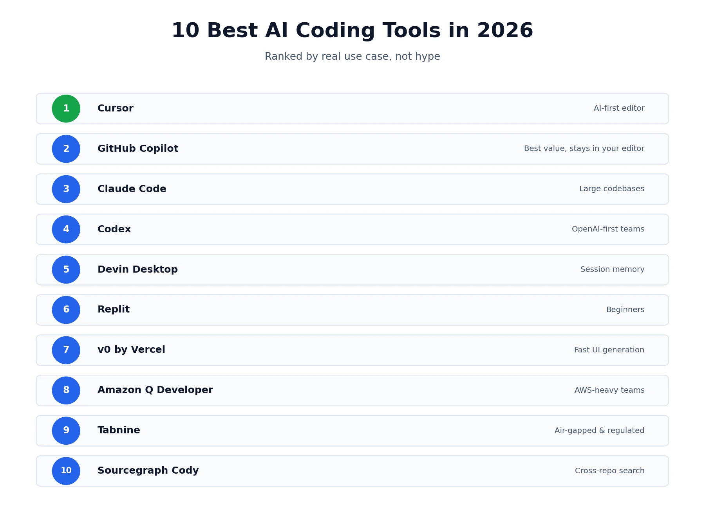
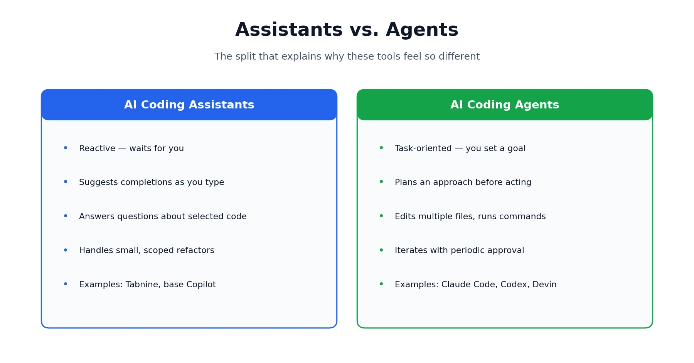
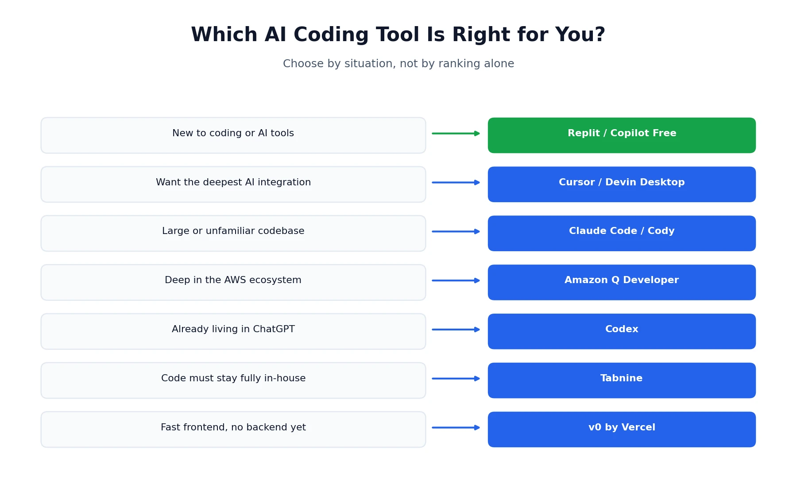

Search for the best AI coding tools and you'll find dozens of "top 10" lists that all recommend roughly the same five tools with the pricing already out of date. The category has genuinely split into two different kinds of tool since last year — assistants that help while you type, and agents that can take a task and run with it — and most roundups still lump everything together without explaining why that distinction actually matters for which tool you should pick. This guide ranks 10 of the strongest options in 2026, covers what free tiers really include, and points you toward the right pick based on your codebase, budget, and experience level rather than a single "best overall" that ignores how differently people actually code. If you're building out AI tools for other parts of your workflow too, our [best AI music video generators](/best-tools/best-ai-music-video-generators/) roundup covers a completely different category worth a look.

## AI Coding Assistants vs. AI Coding Agents

Before the list, it's worth understanding the split, since it explains a lot about why these tools feel so different to use.

**AI coding assistants** are reactive. They suggest completions as you type, answer questions about code you've selected, and help with quick, scoped refactors — but they wait for you to drive. Tabnine and GitHub Copilot's core autocomplete both fit here.

**AI coding agents** are task-oriented. Give one a goal — "add pagination to this API endpoint" — and it can inspect your repository, plan an approach, edit multiple files, run tests, and iterate on its own, checking in for approval at key points rather than every keystroke. Claude Code, Codex, and Devin Desktop all lean this way.

A lot of tools now blur the line deliberately. Cursor and GitHub Copilot both ship an assistant mode and a full agent mode in the same product, letting you choose per task. Keep that distinction in mind as you read the list below — a tool ranked lower overall might still be the better assistant, or the better agent, for what you're actually trying to do.

## How We Compared These Tools

This list is built from public pricing and documentation, hands-on testing reported across multiple independent sources, and cross-referenced reviews, current as of August 2026. AI coding tools ship new pricing tiers and model updates constantly, so treat the rankings and prices below as a strong starting point rather than a permanent scoreboard — always check a tool's current pricing page before committing to a paid plan.

## Best AI Coding Tools Compared

| Tool | Type | Best For | Entry Price |
|---|---|---|---|
| Cursor | AI-first editor | Multi-file editing, deep context | Free / $20/mo |
| GitHub Copilot | Assistant + agent | Staying in your current editor | Free / $10/mo |
| Claude Code | CLI agent | Large, unfamiliar codebases | Free / $17/mo |
| Codex | Cloud/CLI agent | OpenAI-first teams | Included with ChatGPT Plus |
| Devin Desktop (Windsurf) | AI-first editor | Session memory across projects | Free / $20/mo |
| Replit | Browser IDE | Beginners, zero setup | Free / $17/mo |
| v0 by Vercel | UI generator | Fast frontend prototyping | Free / $20/mo |
| Amazon Q Developer | Cloud assistant | AWS-heavy teams | Free / $19/user/mo |
| Tabnine | Enterprise assistant | Air-gapped, regulated environments | Free / $39/user/mo |
| Sourcegraph Cody | Code search assistant | Cross-repo semantic search | Free / $19/user/mo |

## 1. Cursor — Best AI-First Editor for Multi-File Work

[Cursor](https://cursor.com) rebuilds the editor itself around AI rather than adding it as an extension, giving it the deepest multi-file context and the most flexible agent autonomy of any tool on this list. Composer can plan and execute changes across an entire project, and a dial-able autonomy setting lets you decide how much oversight you want per task.

**Where it falls short:** it's a separate editor, not a plugin, so switching means leaving VS Code, JetBrains, or whatever you use now — and its premium usage runs on a credit system that can drain faster than expected once you lean on frontier models heavily. We've covered both the pricing mechanics and a full head-to-head against Copilot in detail: see our [Cursor pricing review](/reviews/cursor-ai-pricing-review/) and [Cursor vs. GitHub Copilot](/compare/cursor-vs-github-copilot/) comparison, and our [how-to guide](/how-to/how-to-use-cursor-ai/) if you want to get productive in it quickly.

**Pricing:** Free Hobby plan, Pro from $20/month, scaling to $200/month for Ultra.

## 2. GitHub Copilot — Best for Staying in Your Current Editor

[GitHub Copilot](https://github.com/features/copilot) is the tool most developers reach for first, since it installs as a plugin into VS Code, JetBrains, Neovim, Xcode, or Visual Studio rather than asking you to change how you already work. Inline completions, chat, and an increasingly capable Agent Mode all live inside the editor you're already comfortable in.

The catch: its cross-repository context still lags dedicated AI-first editors — several independent testers report it handling single-file changes cleanly but missing callers when a refactor should have touched more than one file. If you're weighing it directly against Cursor, our dedicated comparison covers pricing, IDE support, and agent autonomy in full.

**Pricing:** Free tier available, Pro at $10/month, Business at $19/user/month, Enterprise at $39/user/month.

## 3. Claude Code — Best for Large, Unfamiliar Codebases

[Claude Code](https://claude.com/product/claude-code) is Anthropic's terminal-first coding agent, built around a large context window that can map an entire repository without you manually selecting files. It explores dependencies, traces data flow, plans fixes, and runs tests, making it especially strong for onboarding onto a codebase you didn't write or safely refactoring something large and tangled.

On the downside, it's CLI-first, so there's a real learning curve if you've never worked from a terminal, and the free tier is too limited for serious daily use.

**Pricing:** Free plan with minimal access, Pro from $17/month billed annually, Max from around $100/month.

## 4. Codex — Best for OpenAI-First Teams

[Codex](https://openai.com/codex/) is OpenAI's dedicated coding agent, built for delegating real chunks of work rather than quick suggestions — it reads a repository, plans, edits, runs commands, and returns results for review, available through the ChatGPT interface, a CLI, or IDE extensions.

The tradeoff is that it's locked to OpenAI's own models, and heavier usage tends to push you toward ChatGPT Pro or metered API pricing rather than staying inside a flat plan.

**Pricing:** Included with ChatGPT Plus ($20/month) and Pro ($200/month); API usage billed separately by token.

## 5. Devin Desktop (formerly Windsurf) — Best for Session Memory

[Devin Desktop](https://devin.ai/desktop) is another AI-first, VS Code-based editor, and it gets compared to Cursor constantly for good reason — they solve similar problems. Its standout feature is Devin Local, an agent mode that remembers project context across sessions, so you spend less time re-explaining your codebase every time you open a new conversation.

It's not without rough edges, though — the community and learning resources around it are smaller than Cursor's or Copilot's, and some workflows still show real friction.

**Pricing:** Free plan with unlimited autocomplete, Pro at $20/month, Teams at $40/user/month.

## 6. Replit — Best for Beginners

[Replit](https://replit.com) runs entirely in the browser, so there's no local install, no terminal configuration, and no deciding on a stack before you've written a line of code. Describe the app you want, and its Agent asks clarifying questions before building — a small habit that's actually useful for anyone not yet sure exactly what they're asking for.

The flip side: it makes a lot of decisions on your behalf, which is convenient early on but can feel limiting once you have real opinions about your stack, and it offers less model choice than a local editor.

**Pricing:** Free Starter plan, Core from $17/month billed annually.

## 7. v0 by Vercel — Best for Fast UI Generation

[v0](https://v0.app) turns a plain-English description into production-ready React components with Tailwind styling, and it shows its work — a breakdown of pages and structure before any code gets written, which makes it easy to steer or hand off to a developer for cleanup.

Just don't expect it to go beyond that: it's explicitly a frontend tool, and complex backend logic isn't in its lane, so most people prototype UI here and then move the project into a full editor to wire up the rest.

**Pricing:** Free tier with limited monthly credits, Premium from $20/month.

## 8. Amazon Q Developer — Best for AWS-Heavy Teams

[Amazon Q Developer](https://aws.amazon.com/q/developer/) draws on AWS documentation, your account context, and common infrastructure patterns to give suggestions that are specific to how you actually deploy — understanding IAM roles, CloudFormation resources, and Lambda handlers in a way generic tools don't.

Step outside the AWS ecosystem, though, and it reverts to a fairly generic assistant, so multi-cloud or non-AWS teams get much less out of it.

**Pricing:** Free tier with capped agentic requests, Pro at $19/user/month.

## 9. Tabnine — Best for Regulated, Security-Sensitive Teams

[Tabnine](https://www.tabnine.com) is built around a single premise: your code shouldn't have to leave your infrastructure to get AI assistance. It supports full air-gapped deployment, zero code retention, and fine-tuning on proprietary codebases entirely inside your own environment — a distinct value proposition from any cloud-first tool on this list.

Where it comes up short is depth: it leans toward completion-style assistance rather than real architectural reasoning, and it's one of the pricier options here for what you actually get in raw capability.

**Pricing:** Free tier for basic completions, Code Assistant Platform from $39/user/month billed annually.

## 10. Sourcegraph Cody — Best for Cross-Repo Code Search

[Sourcegraph Cody](https://sourcegraph.com) leans on Sourcegraph's code intelligence infrastructure to answer questions grounded in your actual codebase, spanning multiple repositories rather than just the open file — ask where a specific value gets validated, and it can surface the answer along with every call site.

One limit to know going in: it doesn't drive autonomous multi-file edits the way an agent does — you still review changes and write the glue code yourself — and full enterprise-scale indexing requires a separate Sourcegraph subscription.

**Pricing:** Free tier available, Business at $19/user/month, Enterprise at $39/user/month.

## Best Free AI Coding Tools

If budget is the priority, several tools on this list are genuinely usable without paying anything. Cursor's Hobby plan, GitHub Copilot's free tier, Claude Code's limited free access, Replit's Starter plan, and Devin Desktop's free plan with unlimited autocomplete all let you evaluate real fit before spending a dollar. None are "unlimited" in the way ads sometimes imply — expect monthly caps on completions or premium-model requests — but they're solid enough to build something real and decide if a tool clicks with how you work.

## Which AI Coding Tool Is Right for You?

Rather than one "best overall" pick, here's how to narrow it down by what actually matters to your situation:

- **New to coding or AI tools entirely** → Replit or GitHub Copilot's free tier
- **Experienced developer, want the deepest AI integration** → Cursor or Devin Desktop
- **Working in a large, unfamiliar, or legacy codebase** → Claude Code or Sourcegraph Cody
- **Already deep in the AWS ecosystem** → Amazon Q Developer
- **Team already living inside ChatGPT for other work** → Codex
- **Need to keep code fully in-house for compliance** → Tabnine
- **Want a fast, polished frontend without touching backend logic yet** → v0
- **Tight budget, need something that just works in your current editor** → GitHub Copilot's free or $10/month tier

## Is ChatGPT Good for Coding?

Worth answering directly, since it's one of the most common related questions. Plain ChatGPT is genuinely useful for explaining code, debugging a specific error, or talking through an architectural decision — but it doesn't have direct access to your repository the way Cursor or Claude Code does, so you're copying code back and forth rather than letting it work in place. If you want an actual coding agent inside the same ecosystem, Codex is the better tool for that job; ChatGPT itself is better thought of as a knowledgeable second opinion than a coding tool in the same category as the rest of this list.

## What Does Reddit Say About AI Coding Tools?

Given how often this shows up as its own search, it's worth summarizing honestly rather than pretending there's one clean consensus. Sentiment is split and tool-specific rather than pointing at one universal winner: Cursor users frequently mention getting surprised by how fast a credit pool drains during heavy agent sessions, Copilot users tend to cite low switching cost and GitHub-native workflows as their main reason for staying, and Claude Code comes up often in developer threads specifically for handling large, messy codebases better than expected. A common resolution across these discussions, rather than picking one tool and sticking with it forever, is running two tools side by side and routing tasks by strength — the same pattern that shows up in real usage data across this entire category.

## Best AI Coding Tools for Game Development

None of the tools on this list are purpose-built for game engines specifically, but several handle game-development languages comfortably. Cursor and GitHub Copilot both work well with C++, C#, and Lua, covering Unreal Engine, Unity, and Godot projects respectively. For sprawling game codebases with a lot of interconnected systems, Claude Code's large context window is genuinely useful for tracing how a change in one system ripples into another.

## Using Two AI Coding Tools Together

A pattern worth naming explicitly: a meaningful number of developers don't pick one tool and stop there. A common setup is GitHub Copilot for everyday inline completions inside whatever editor you're already using, paired with Cursor or Claude Code for heavier, agent-driven refactors and multi-file feature work — routing tasks by which tool is actually strongest at that specific job rather than forcing one tool to do everything. If you want the deeper mechanics of running both at once, including real combined pricing, that's covered in the Cursor comparison linked above.

*This roundup reflects publicly available pricing and feature information, along with independently reported testing, as of August 2026. Pricing, model access, and features across this category change frequently — always confirm current details directly on each platform before subscribing. Browse more of our AI tool guides from the [homepage](/).*

## Affiliate Disclosure
This article may contain affiliate links. If you sign up for a tool through a link on this page, we may earn a commission at no extra cost to you. This helps support the research and testing that goes into guides like this one. Our opinions and recommendations are based on independent research and, where possible, hands-on use of each platform — affiliate relationships don't influence which products we cover or how we rate them.