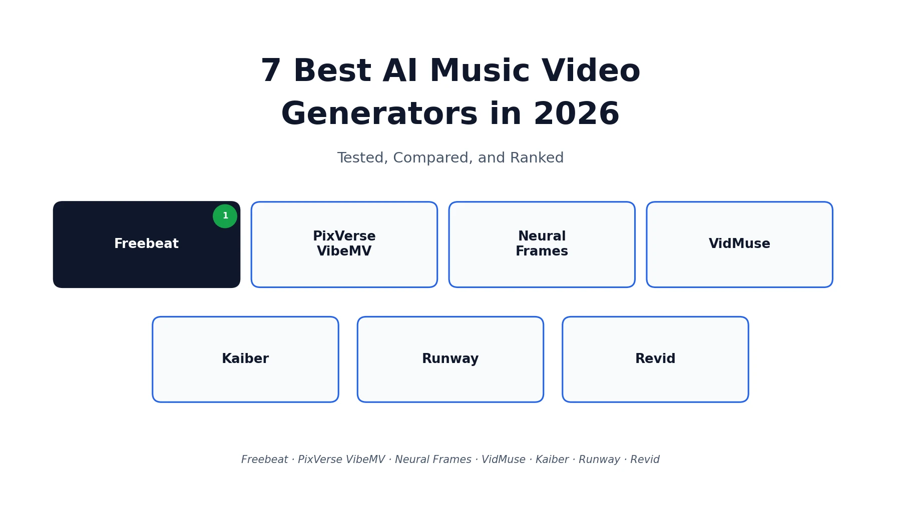
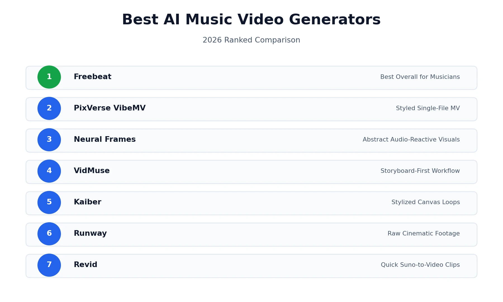
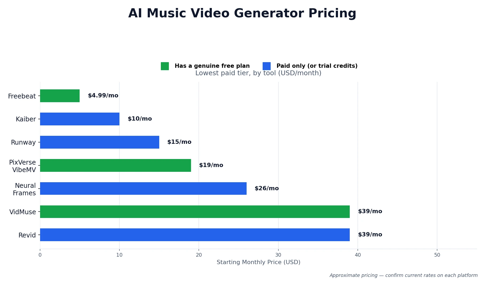
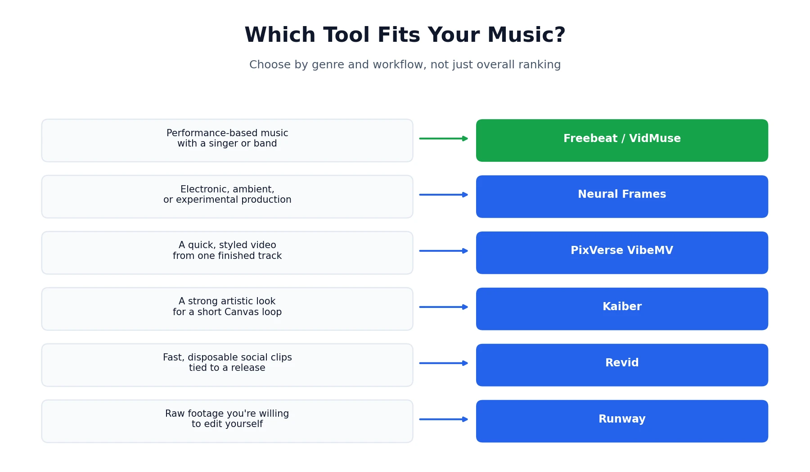

Anyone who's finished mixing a track knows the next problem: Spotify wants Canvas loops, YouTube wants a real video, and TikTok is basically a video platform now — and hiring a director isn't in most independent musicians' budgets. That's the gap the best AI music video generators are built to fill in 2026, turning a finished song into a real video without a camera, an editor, or a production team. Some actually deliver on that promise. A lot of others are general-purpose video tools wearing a music-video costume, with no real understanding of your track's structure at all. This guide tests and compares seven of the strongest options on the market, covers what free tiers actually include, and gives an honest read on where this technology holds up and where it still doesn't. If you're also looking into AI avatar tools for talking-head content rather than music specifically, our [HeyGen pricing and review](/reviews/heygen-pricing-review/) covers that adjacent category in depth.

## What Makes a Good AI Music Video Generator

Before ranking anything, it's worth being clear about what actually separates a music-first tool from a general video generator that happens to accept an MP3.

- **Audio input.** Direct upload support for MP3 and WAV at minimum, ideally with the option to paste a link from Suno, Udio, or YouTube instead of requiring a download-then-upload step.
- **Song-to-scene logic.** The single biggest differentiator in this category. Does the tool actually analyze BPM, structure, and song sections — verse, chorus, drop — or does it just play your track underneath generic, unrelated visuals?
- **Lip-sync and character consistency.** If your video needs a performer on screen, this is where most tools fall apart. A face that drifts or morphs between cuts breaks the illusion instantly.
- **Lyric subtitles.** Auto-detected, editable lyric timing for a clean karaoke or lyric-video format, without manually typing out every line.
- **Export formats and resolution.** 16:9, 9:16, and 1:1 coverage for YouTube, TikTok, Reels, and Shorts, ideally at 1080p rather than capped at 720p.
- **Pricing clarity and watermark rules.** Transparent free tiers and credit systems, with clear rules on what triggers a watermark and what counts as commercial use.

## How We Compared These Tools

This comparison is built from public pricing and feature pages, independent hands-on testing from musicians who fed the tools their own tracks, and cross-referenced third-party reviews, reviewed as of August 2026. It's a buyer's shortlist meant to narrow your options quickly, not a frame-by-frame benchmark of the exact same song run through all seven tools. Output quality in this category shifts with model updates, genre, source audio quality, and how many times you regenerate a scene — so treat rankings here as a strong starting point, and always check the current in-app pricing and watermark terms before committing to a paid plan for a real release.

## Best AI Music Video Generators Compared

Here's how the seven best AI music video generators stack up side by side before the detailed breakdown below.

| Tool | Best For | Audio Input | Lip-Sync / Character | Pricing Snapshot |
|---|---|---|---|---|
| Freebeat | Musicians, lip-sync, character consistency | Upload or Suno/Udio/YouTube link | Yes, 90%+ lip-sync accuracy | Free / $4.99/wk / $24.99/mo |
| PixVerse VibeMV | Styled, subtitled MV from one file | Upload only | Yes, via character photo | Free trial / from $19/mo |
| Neural Frames | Abstract, audio-reactive visuals | Track upload | No lip-sync | From $26/mo (annual) |
| VidMuse | Storyboard-first approval workflow | Upload or Suno/Spotify link | Yes, character lock | Free (1,000 credits) / from $39/mo |
| Kaiber | Stylized artistic Canvas loops | Audio upload | Limited | $5 trial / from $10/mo |
| Runway | Raw cinematic footage | None — text-prompt only | N/A | From $15/mo |
| Revid | Quick Suno-to-video clips | Upload or Suno link | Limited | From $39/mo |

## 1. Freebeat — Best Overall for Musicians

[Freebeat](https://freebeat.ai) is built specifically as a music video generator rather than a general video tool adapted to accept audio. Upload a WAV or paste a Suno link, and it analyzes BPM, bars, and full song structure before generating anything — meaning it actually knows where your chorus lands and when a breakdown kicks back in, and every scene decision is built around that structure rather than a generic timeline.

Two modes matter most here. Stage Performance gives you a digital performer who stays visually consistent across cuts and lip-syncs to your actual vocals at a reported 90%+ accuracy — real phoneme-level sync rather than an approximate mouth shape. Storytelling mode handles narrative videos with up to two persistent characters across the full runtime without the drift or morphing that plagues weaker tools. Freebeat also functions as a release-day toolkit beyond just the video: it generates matching static cover art and animated Spotify Canvas loops in the same session, which covers three separate release assets a lot of independent artists would otherwise pay a freelancer for individually.

**Pricing:** Free plan available with no credit card required. Basic runs $4.99 billed weekly, Standard is $9.99/month, and Pro is $24.99/month for faster generation and higher output quality.

**Best for:** Independent musicians, dancers and choreographers, and content creators who need a consistent on-screen performer synced to real vocals rather than an approximate visualizer.

## 2. PixVerse VibeMV — Best for a Styled Single-File MV

[PixVerse VibeMV](https://pixverse.ai) is a purpose-built Mini App inside the broader PixVerse platform, focused specifically on turning one audio file into a styled, subtitled music video. Upload an MP3, WAV, M4A, or AAC file between 10 seconds and 6 minutes, choose a Video Style and Music Style across genres from Pop to Classical, and optionally upload a single character photo to keep a consistent performer across the video.

The subtitle system stands out here — rather than blindly auto-generating lyrics, it includes a verification step where you review and correct detected lyrics before the final render, which avoids the embarrassing lyric errors that plague some competitors' auto-caption features. Exports cover five aspect ratios (16:9, 9:16, 1:1, 4:3, 3:4) at 720p or 1080p, so the same upload can become a landscape YouTube video and a vertical Shorts clip without starting over.

**Pricing:** Free trial credits to start. Public plans list Hobby at $19/month (600 credits), Pro at $49/month (1,700 credits), and Studio at $99/month (3,800 credits).

**Best for:** Creators who want one clean, styled video from a single track without juggling multiple modes or a complex editor.

## 3. Neural Frames — Best for Abstract, Audio-Reactive Visuals

[Neural Frames](https://neuralframes.com) takes a different technical approach altogether from the rest of this list: it separates your track into individual stems — kick, bass, vocals, and more — and maps each one to a distinct visual layer, so the kick drum triggers one behavior and the bassline drives another. For electronic, ambient, and experimental producers, the result feels composed for the track rather than dropped on top of it.

Here's the honest limitation: there is no character system, no lip-sync, and no narrative capability whatsoever. If your music centers on a performer or tells a story, Neural Frames simply isn't built for that job, and no amount of prompt tweaking will get it there. This is a visualizer, not a music-video generator in the traditional sense — excellent at that one job, but a narrower job than most of the other tools on this list attempt.

**Pricing:** Yearly-billed plans starting at $26/month (Knight, 2,400 credits), scaling to $66/month (Ninja) and $199/month (Nirvana) for higher-volume producers.

**Best for:** Electronic, techno, and ambient artists who want an intelligent visualizer, not a performance-based video.

## 4. VidMuse — Best for Storyboard-First Workflows

[VidMuse](https://vidmuse.ai) frames itself as an AI director that drafts a full script and storyboard from your track before rendering a single frame — you review and approve the plan first, rather than generating blind and hoping the result works. It accepts audio uploads plus links from Suno, Udio, and YouTube, supports character references and lip-sync, and exports 1080p video ready for YouTube, TikTok, and Instagram.

The approval step is a genuine differentiator for anyone who's been burned by other tools generating an entire video only to discover the pacing or narrative direction is wrong. It costs a bit of upfront time compared to fully automatic tools, but it saves you from wasting a full generation credit run on a concept that was never going to work.

**Pricing:** Free tier includes 1,000 one-time credits. Pro runs $39/month ($33/month billed yearly) with 4,000 monthly credits; Studio is $159/month ($133/month annual) with 18,000 monthly credits.

**Best for:** Creators who want narrative control and a preview step before committing to a full render.

## 5. Kaiber — Best for Stylized Artistic Canvas Loops

[Kaiber](https://kaiber.ai) built its reputation on stylized, often dreamlike visuals — feed it a track and pick an aesthetic (anime, cyberpunk, illustrated, and more), and it generates a distinct-looking loop fast. For an 8-second atmospheric Spotify Canvas loop sitting behind your song, it does the job well with minimal setup and a recognizable visual signature of its own.

Where it struggles is arrangement awareness. Kaiber reads general energy levels rather than song structure, so it has no real concept of verse versus chorus and no awareness of exactly where a drop or breakdown lands. Characters can shift and warp noticeably between frames, which rules it out for anyone who needs a stable, recognizable performer on screen throughout a full video.

**Pricing:** $5 five-day trial with 500 credits, Starter at $10/month (500 credits), Creator at $29/month (1,500 credits), Pro at $99/month (5,000 credits).

**Best for:** Spotify Canvas loops and short stylized clips where a distinct artistic look matters more than structural accuracy.

## 6. Runway — Best Footage Quality, Not a Complete Workflow

This entry comes with an important honesty caveat that most purely promotional roundups skip entirely: [Runway](https://runwayml.com) produces beautiful footage, full stop — realistic lighting, convincing camera movement, cinematic texture that few AI video tools can match. But it has zero audio-input awareness. It generates silent clips from text prompts alone, typically five to ten seconds each, with no mechanism for reading or reacting to your track at all.

To build an actual music video with Runway, you'd generate dozens of separate clips, export each one, and manually cut and beat-match them in a traditional editor like Premiere or Final Cut. That's not really a music-video generator workflow — it's a raw footage source that still requires real video-editing skill and time on your end. Worth including here because the footage quality is genuinely that good, but worth being upfront that it solves a different problem than the other six tools on this list.

**Pricing:** Plans start around $15/month for individual creators, scaling up for higher-volume and team use.

**Best for:** Sourcing high-quality raw clips for a video you're willing to edit together yourself, not a one-step music video solution.

## 7. Revid — Best for Quick Suno-to-Video Social Clips

[Revid](https://revid.ai) focuses on converting a Suno link or uploaded track into short-form video with synced captions and effects, aimed squarely at TikTok, Reels, and Shorts rather than a full-length YouTube release. For AI musicians working entirely inside Suno who just need something postable fast, it's a fast, convenient bridge from song to short clip.

It's worth being transparent that hands-on testing of tools in this exact category — including direct testing of Revid — has surfaced real frustration: results that amount to little more than a slideshow with an audio visualizer rather than anything resembling a directed music video, plus a paywalled export step. That's not to say Revid has no place here — for quick, disposable social content tied to a release announcement, the speed and Suno integration actually help. But if you're expecting a polished, full-length music video, this isn't the tool built for that job.

**Pricing:** Hobby at $39/month, Growth at a promotional $39/month with 2,000 credits, Ultra at $199/month with 12,000 credits.

**Best for:** Fast, short-form social clips tied to a Suno release, not full-length or performance-driven music videos.

## Free AI Music Video Generators: What You Actually Get

Given how often "free" shows up alongside this search, it deserves an honest, direct answer rather than a vague "yes, some are free."

Freebeat, PixVerse VibeMV, and VidMuse all offer a genuine no-cost way to test the platform — no credit card required in most cases. What "free" actually includes varies a lot: expect a watermark on exported video, a cap on video length (often under a minute), and resolution limited to 720p rather than full HD. None of these free tiers are realistic for a final public release; they're built for evaluation, so you can confirm a tool actually understands your genre and workflow before paying anything.

If avoiding a watermark specifically is the priority, check each platform's current terms directly rather than assuming — watermark policies on free tiers change fairly often as these companies adjust their funnels, and what's true today may not hold in a few months.

## How to Choose the Right Tool for Your Genre

The best tool really does depend on what you're making, more than any overall ranking can capture:

- **Performance-based music with a singer or band on screen** → Freebeat or VidMuse, since both handle character consistency and real lip-sync
- **Electronic, ambient, or experimental production** → Neural Frames, for a visualizer that's actually intelligent about audio, no performer needed
- **A quick, styled video from one finished track** → PixVerse VibeMV
- **A strong artistic aesthetic for a short Canvas loop** → Kaiber
- **Fast, disposable social clips tied to a Suno release** → Revid
- **Raw cinematic footage you're willing to edit yourself** → Runway

## Is the Technology Actually Good Yet?

This deserves an honest answer rather than pure hype, since it's the question most roundups avoid entirely. The category has matured a real amount — tools like Freebeat and VidMuse now analyze real song structure and produce usable, on-beat results without requiring editing skill. That's a real shift from where this space was even a year or two ago.

That said, results still vary significantly by genre, and "fully automatic, release-ready video" isn't a uniformly true promise across every tool here. Vocal-heavy, performance-driven music tends to get the best results from purpose-built tools; abstract and instrumental work often looks better on visualizer-style tools like Neural Frames; and general-purpose video generators like Runway, despite beautiful output, simply aren't built for this workflow at all without real manual editing on your end. Expect to regenerate a scene or two even with the strongest tools, and don't assume the first render is your final one.

## Final Verdict

There's no single best AI music video generator for every artist — there's a best fit for your genre, your budget, and how much manual editing you're willing to do. For most independent musicians who want a consistent on-screen performer and real lip-sync without touching a timeline editor, Freebeat is the strongest starting point based on both structured comparison and real hands-on testing. If your music is instrumental or electronic, Neural Frames earns its place instead. And if you just need fast social content tied to a release, Revid or Kaiber cover that narrower job well enough.

Test the free tier of whichever tool matches your use case before committing to a paid plan — a few minutes with your own track will tell you more than any comparison table, including this one.

*This roundup reflects publicly available pricing and feature information, along with independent hands-on testing, as of August 2026. Pricing, credit systems, and watermark policies change periodically across this entire category — always confirm current terms directly on each platform before publishing or monetizing a video. Browse more of our AI tool guides from the [homepage](/).*

**Affiliate Disclosure:** This article may contain affiliate links. If you sign up for a tool through a link on this page, we may earn a commission at no extra cost to you. This helps support the research and testing that goes into guides like this one. Our opinions and recommendations are based on independent research and, where possible, hands-on use of each platform — affiliate relationships don't influence which products we cover or how we rate them.