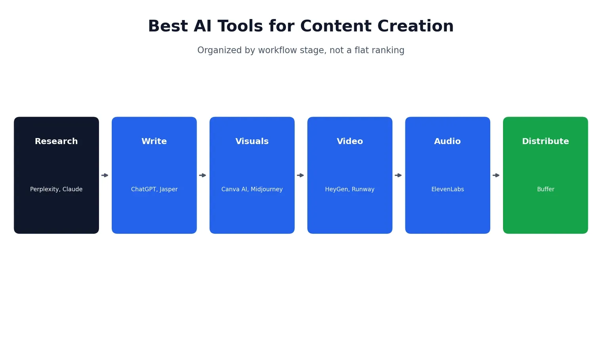
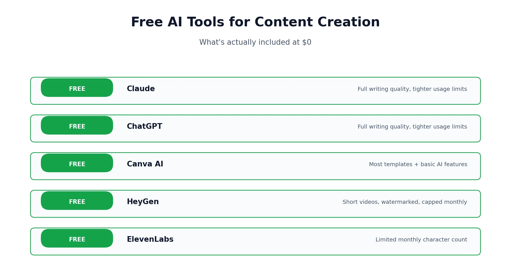
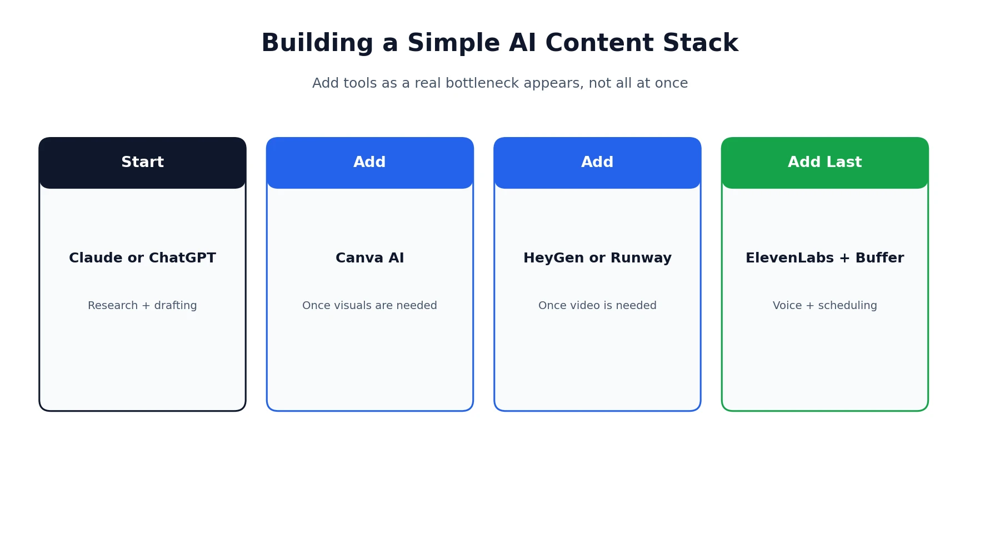

Searching for the best AI tools for content creation turns up dozens of near-identical "top 10" lists, most organized as a flat ranking that doesn't actually help you figure out what to use when. The more useful question isn't "what's the single best tool" — it's "what tool solves the specific bottleneck I have right now." This guide is organized around that idea: by the actual stage of the content process, from research through publishing, so you can find the right tool for the job you're stuck on rather than scrolling through ten options that don't apply to you. It also corrects something several competing roundups still get wrong: a few still list OpenAI's Sora as a current video option, months after it was discontinued — more on that in the video section below. If you're building out a broader AI toolkit beyond content creation specifically, our [homepage](/) has guides across coding, video, and productivity tools as well.

## How We Evaluated These Tools

Every tool below was assessed against three things: output quality and reliability (does it produce something usable without heavy rework), how well it fits into a real workflow relative to its cost, and basic compliance factors like commercial usage rights and data handling. Pricing and feature details are current as of August 2026 — this category moves fast, so it's worth double-checking a tool's own pricing page before committing to a paid plan, especially given how much competitor pricing data we found conflicting each other during research for this piece.

## Best AI Tools for Content Creation, by Workflow Stage

| Stage | Tool | Best For | Entry Price |
|---|---|---|---|
| Research | Perplexity | Cited, verifiable answers | Free / $20/mo |
| Research & Writing | Claude | Long-form, research-heavy content | Free / $17/mo |
| Writing | ChatGPT | Flexible drafting and ideation | Free / $8/mo |
| Writing at Scale | Jasper | Brand-voice-consistent marketing copy | $59/mo |
| Visuals | Canva AI | Social graphics, slides, non-designers | Free / $13/mo |
| Visuals | Midjourney | High-end artistic imagery | $10/mo |
| Video | HeyGen | Avatar-led presenter videos | Free / $29/mo |
| Video | Runway | Cinematic video with real editing control | $15/mo |
| Audio | ElevenLabs | Realistic voiceover and narration | Free / $5/mo |
| Distribution | Buffer | Scheduling across social platforms | Free / $6/mo per channel |

## Research and Ideation

Before any writing happens, most content starts with research — and this is where a lot of creators either waste time or accidentally publish something inaccurate. Getting this stage right matters more than it gets credit for, since a factual error caught after publishing costs far more time to fix than it would have taken to verify upfront.

### Perplexity

[Perplexity](https://perplexity.ai) answers questions with cited, checkable sources rather than an unsourced summary, which makes it the safer starting point for anything where factual accuracy matters — statistics, current events, anything you'd need to defend if a reader pushed back. Its Pro tier adds deeper research modes that can pull from dozens of sources in a single query, which is genuinely useful for background research on an unfamiliar topic. It's less useful for creative brainstorming than a general assistant, since it's built to answer, not to riff, and citation-heavy answers can read a bit dry if you're looking for something more conversational.

### Claude

For research that needs to turn into actual writing — a long article, a script, a detailed brief — Claude tends to hold context better across a long session and produces prose that reads as more considered than templated. It's particularly strong at synthesizing a pile of loose notes or a messy outline into something coherent, which is a genuinely different skill from just answering a question well. If you want the deeper picture on what makes Claude distinct and what it costs, our [Claude AI review](/reviews/claude-pricing-review/) covers that in full.

## Writing and Drafting

### ChatGPT

[ChatGPT](https://chatgpt.com) remains the most flexible general-purpose writing assistant, particularly once you've set up a Custom GPT or given it clear, specific instructions about tone and format. It's a strong generalist rather than a specialist in any one content type, which is exactly why it works as a default starting point for most people — it handles a blog draft, a product description, and a social caption equally competently without needing a different tool for each. If you're deciding between ChatGPT and Claude specifically, our [ChatGPT vs Claude](/compare/chatgpt-vs-claude/) comparison breaks down where each one actually wins.

### Jasper

[Jasper](https://jasper.ai) is built for teams producing a high volume of on-brand marketing content — blog posts, ad copy, landing pages — and its brand-voice training genuinely holds up better across a large content library than most competitors, since it can be fed existing brand guidelines and past content to match tone consistently across dozens of writers. It's a heavier tool than a solo creator typically needs, and the $59/month entry price reflects that; it makes the most sense once you're coordinating content across a team rather than writing solo, where consistent brand voice across multiple contributors becomes a real, ongoing problem worth paying to solve.

## Visuals and Design

### Canva AI

[Canva](https://canva.com)'s AI features — Magic Design, background generation, layout suggestions — are aimed squarely at people without design training, and they close that gap well. For social graphics, presentation slides, and quick visual assets, it remains one of the lowest-friction tools in this entire list, since it starts from a template and lets AI handle the parts — resizing, color matching, copy suggestions — that used to require actual design skill to get right.

### Midjourney

For a more distinctive, artistic look — illustration, concept art, stylized imagery that doesn't read as generic AI output — [Midjourney](https://midjourney.com) still leads the category, though it has a steeper learning curve around prompting than Canva's guided interface. It runs primarily through Discord rather than a standalone web app, which is itself a minor barrier for anyone expecting a typical software interface, but the visual quality ceiling is genuinely higher than most alternatives once you've learned to prompt it well.

## Video Content

### HeyGen

For presenter-led video — training content, explainer videos, personalized outreach — HeyGen's avatar and voice system remains one of the strongest options, and its translation feature is a genuine standout for anyone localizing content across languages. We've covered it in depth, including [how to actually use it](/how-to/how-to-use-heygen/) and [how it compares to Synthesia](/compare/heygen-vs-synthesia/).

### Runway

For cinematic, prompt-driven video with real editing control — Motion Brush, Director Mode, multi-shot consistency — Runway is the strongest active option in this category. It's worth flagging directly here: several competing roundups still list OpenAI's Sora as a top video pick, but Sora was discontinued in 2026, with the web and app shut down in April and the API following in September. If Sora is what you were expecting to find recommended, our [Runway vs Sora](/compare/runway-vs-sora/) comparison covers exactly what Runway does and doesn't replace from it. For music-driven video specifically, a different set of tools applies — our [best AI music video generators](/best-tools/best-ai-music-video-generators/) roundup covers that use case in more depth than either Runway or HeyGen address.

## Audio and Voice

### ElevenLabs

[ElevenLabs](https://elevenlabs.io) remains the clearest leader for realistic AI voiceover — narration, dubbing, and voice cloning that holds up well even on close listening, with enough emotional range and pacing control that it no longer has the flat, robotic quality older text-to-speech tools were known for. It pairs naturally with almost every video tool above, since none of them handle audio as convincingly on their own, and a growing number of creators use it purely for narrating written content into a podcast-style audio version without recording anything themselves.

## Distribution

### Buffer

Once content is actually made, [Buffer](https://buffer.com) handles the less glamorous but equally necessary job of scheduling and publishing it across platforms, with AI-assisted suggestions for post timing and light copy adjustments per platform. It's not a content-generation tool so much as the final step that makes everything above actually reach an audience on schedule, and its per-channel pricing structure means small creators managing just one or two platforms pay considerably less than agencies juggling a dozen client accounts.

## Free AI Tools for Content Creation

If budget is the priority, five tools on this list are genuinely usable without paying anything: Claude, ChatGPT, Canva AI, HeyGen, and ElevenLabs all offer real free tiers, not just time-limited trials. Expect caps on usage volume, resolution, or monthly generations rather than full functionality — enough to confirm a tool fits your workflow before upgrading, not necessarily enough to run a full content operation long-term.

A few specifics worth knowing: Claude and ChatGPT's free tiers both give full access to their core writing capability, just with tighter usage limits than paid plans rather than a reduced feature set — meaning the actual writing quality doesn't drop on the free tier, only how much of it you can generate before hitting a wall. Canva's free tier covers the bulk of its design templates and basic AI features, with premium stock assets and some advanced Magic Studio tools reserved for paid plans. HeyGen and ElevenLabs both cap free usage more tightly — short video length and a limited monthly character count for voice generation, respectively — which makes them better suited to testing than to a real free workflow. For a broader look at no-cost options specifically, a dedicated free-tools list is worth checking against your exact use case, since "free" means something different for a writing assistant than it does for a video generator.

## Which Tools Should You Reconsider?

Not every tool on a "best of" list fits every reader, and it's worth being direct about that rather than presenting all ten as equally good for you specifically. Jasper's pricing makes little sense for a solo creator producing occasional content — that budget is better spent on Claude or ChatGPT plus a cheaper design tool. Midjourney's prompting learning curve means casual users are often better served by Canva's guided AI features, even though Midjourney's raw output quality is higher. And if you only need occasional video rather than a regular production schedule, HeyGen or Runway's entry tiers may still be more than you actually need — several of the free tiers across this list cover genuinely occasional use without ever requiring a paid plan.

## What Do Real Users Actually Say?

Independent review platforms tell a genuinely useful, if occasionally contradictory, story about most tools on this list. On [G2](https://www.g2.com), reviews tend to skew toward feature depth and day-to-day usability, written by people already using a tool as part of their job. On more general consumer review sites like [Trustpilot](https://www.trustpilot.com), a larger share of reviews focus specifically on billing clarity, cancellation friction, and pricing surprises rather than the product itself. That gap isn't a contradiction — it reflects who's motivated to leave a review and why. A satisfied daily user has less reason to write a review than someone frustrated by an unexpected charge. Reading across a few platforms rather than anchoring on one score gives a far more accurate picture of any tool on this list than trusting a single rating in isolation.

## Does AI-Written Content Sound Like AI?

It can, and that's worth addressing directly rather than pretending every tool on this list produces indistinguishable-from-human output by default. Left on autopilot, most writing assistants gravitate toward the same tells — heavy use of em dashes, a habit of restating the question before answering it, and a certain evenness of tone that reads as competent but impersonal. None of that is fixed or unavoidable; it's a default behavior that shifts noticeably once you give a tool real examples of your own writing, specific instructions about sentence length and tone, and treat the first draft as a starting point rather than a finished piece. The creators who get the most natural-sounding results tend to be the ones who edit AI output rather than publish it verbatim, using these tools to clear the blank-page problem and handle structure, then doing a real pass themselves to make sure it actually sounds like them.

## How to Build a Simple AI Content Stack

Rather than adopting all ten tools at once, most creators build up a stack gradually as specific bottlenecks appear. A reasonable starting sequence looks like: begin with Claude or ChatGPT for research and drafting, add Canva AI once visuals become a regular need, bring in HeyGen or Runway once video becomes part of your output, and add ElevenLabs and Buffer last, once you're producing consistently enough that voice and scheduling become their own real time costs. Layering tools in as an actual need appears tends to work better than committing to a full stack before you know which parts of your workflow genuinely need automating.

## Affiliate Disclosure

This article may contain affiliate links. If you sign up for a tool through a link on this page, we may earn a commission at no extra cost to you. This helps support the research and testing that goes into guides like this one. Our opinions and recommendations are based on independent research and, where possible, hands-on use of each platform — affiliate relationships don't influence which products we cover or how we rate them.