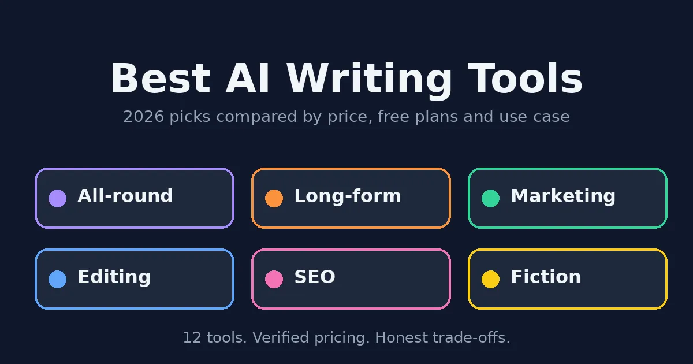
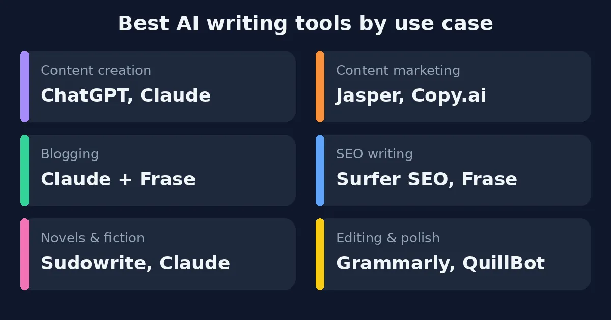
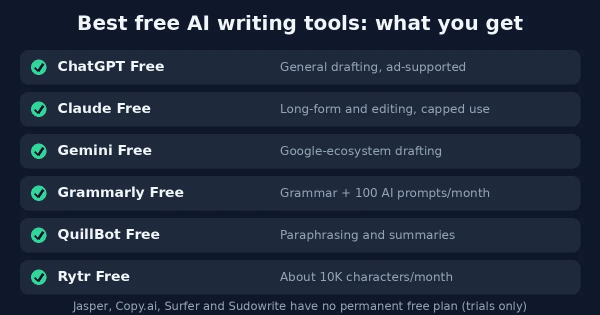
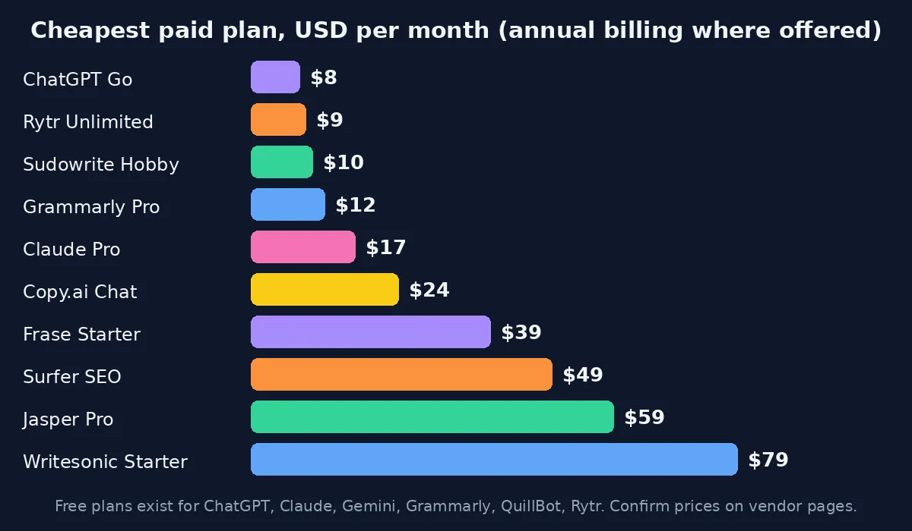

The best AI writing tools in 2026 depend on what you write. ChatGPT is the best all-rounder. Claude usually wins on natural long-form prose, Jasper fits marketing teams, and Grammarly cleans up what you've already written. Surfer SEO and Frase handle SEO content, and Sudowrite is the one built for fiction. If you're a beginner, the free plans from ChatGPT, Claude, Gemini and Grammarly will take you further than you'd expect.

Now for the messy part. Dozens of tools promise faster, cheaper, better writing, and a lot of them run on the same few models with a different coat of paint. So this guide sorts the best AI writing tools into plain categories, puts real prices next to each one, and calls out the places where the marketing gets ahead of the product. Can't choose between the two famous names? The [ChatGPT vs Claude](/compare/chatgpt-vs-claude/) comparison is about exactly that. And if text is only part of what you make, the roundup of the [best AI tools for content creation](/best-tools/best-ai-tools-content-creation/) covers the rest.

## Best AI Writing Tools at a Glance

Here's the short version. Every price was checked against vendor pages and recent reviews in October 2026. Some will be out of date by the time you read this, because vendors change plans constantly.

| Tool | Best for | Free plan | Paid from |
|---|---|---|---|
| ChatGPT | All-round drafting | Yes (ad-supported) | $8 (Go), $20 (Plus) |
| Claude | Long-form, natural tone | Yes | $20/mo ($17 annual) |
| Gemini | Google-ecosystem writing | Yes | $19.99 (AI Pro) |
| Jasper | Marketing teams, brand voice | No (7-day trial) | $59/seat annual |
| Copy.ai | Sales and GTM workflows | Not for new users | $24 annual ($29 monthly) |
| Grammarly | Editing and polish | Yes | $12 annual ($30 monthly) |
| QuillBot | Paraphrasing, summaries | Yes | About $8.33 annual |
| Writesonic | AI search (GEO) visibility | Limited | $79 (Starter) |
| Surfer SEO | SERP-driven SEO writing | No | From about $49 |
| Frase | Briefs and budget SEO | No (trial) | From about $39 annual |
| Rytr | Cheap draft volume | Yes | $9 (Unlimited) |
| Sudowrite | Fiction and novels | No (free trial) | $10 annual ($19 monthly) |

## How These Best AI Writing Tools Were Compared

A quick note on method, since most lists skip it. Nothing here comes from lab benchmarks. The picks rest on public pricing pages, vendor documentation and what recent reviewers say. When something is a matter of taste (which tool "sounds" more natural, say), it's labeled as opinion.

Four things drove the order: what a tool does best, whether the free plan is real, how the bill grows once a team joins, and how much editing the output needs afterward. That last one gets ignored a lot. Every tool below still needs a human to check facts and add something true.

## The 12 Best AI Writing Tools in 2026

### 1. ChatGPT: Best All-Rounder

[ChatGPT](https://chatgpt.com) is where most people start, and plenty never leave. It drafts posts, emails, outlines and scripts, answers research questions, and has a Canvas view for editing beside the chat. The free plan works but shows ads. Go is $8 a month. Plus at $20 is the plan most regular users end up on, because it opens the full toolset and drops the ads. The weak spot is voice. Left alone, it tends to write like a polite stranger, so prompts and a firm edit do real work here.

### 2. Claude: Best for Natural Long-Form Writing

Ask around and [Claude](https://claude.ai) comes up a lot when the subject is tone. Reviewers credit its long context window and its habit of actually following style instructions, which pays off on reports, essays, chapters and rewrites that need a light touch. There's a free plan, and Pro is $20 a month, or $17 billed annually. "More natural" is still opinion, though, so run your own material through it. For a side-by-side, the [ChatGPT vs Claude](/compare/chatgpt-vs-claude/) breakdown is the place to look.

### 3. Google Gemini: Best for Google Workspace Users

[Gemini](https://gemini.google.com) earns its spot mainly through Google. If your drafts already live in Google's apps, it slots in without friction. The free plan handles drafting, summaries and brainstorming fine, and AI Pro costs about $19.99 a month. Away from Google's ecosystem, most reviewers put it a step behind ChatGPT and Claude.

### 4. Jasper: Best for Marketing Teams

[Jasper](https://www.jasper.ai)'s whole pitch is memory. Jasper IQ keeps your brand voice, audiences and company knowledge on file, so a new draft starts closer to "us" and further from "generic marketing." That matters when five people publish under one name. There's no free plan, only a 7-day trial. Pro is $59 per seat on annual billing ($69 monthly), and the better features hide behind the custom-priced Business plan. The details are in the [Jasper vs Copy AI](/compare/jasper-vs-copy-ai/) guide.

### 5. Copy.ai: Best for Sales and Go-to-Market Workflows

[Copy.ai](https://www.copy.ai) used to be a copywriting helper. Now it's a go-to-market platform, and its Workflows are the reason to care: feed in a lead list, get personalized outreach out. New users don't get a free plan anymore, according to recent sources, and Chat starts at $24 a month billed annually ($29 monthly). Fullcast bought the company in October 2025, so the roadmap now follows Fullcast's. For ordinary blog writing, it's seldom the first choice.

### 6. Grammarly: Best for Editing and Polish

[Grammarly](https://www.grammarly.com) won't write your article. What it does is tidy the one you wrote, inside your email, your docs and your browser. The free plan is better than most people expect, with 100 AI prompts a month. Pro gives 2,000 prompts plus team style tools for $12 a month if you pay annually. Pay month to month and it's $30. That gap is the only real trap.

### 7. QuillBot: Best for Paraphrasing and Summaries

[QuillBot](https://quillbot.com) is for the moment when one sentence refuses to cooperate, or a source runs ten pages too long. It's cheap, with Premium from about $8.33 a month on annual billing, and the free plan covers the basics. It won't draft a whole article from nothing, so pair it with a general assistant.

### 8. Writesonic: Best for AI Search Visibility

This is the one older lists keep getting wrong. [Writesonic](https://writesonic.com) has pivoted to generative-engine optimization, meaning it tracks how a brand shows up in ChatGPT, Gemini and Google AI Overviews. Plenty of comparison pages still quote a $16 tier that's gone. Starter is $79 a month on annual billing, and there's a limited free plan. Shopping on a budget? Look elsewhere. Worried about AI search visibility? Take a look.

### 9. Surfer SEO: Best for SERP-Driven SEO Writing

[Surfer SEO](https://surferseo.com) scores a draft against the pages already ranking and tells you which terms to cover, live, while you type. Teams publishing often on competitive keywords get the most from it. It's also the pricier of the SEO pair. Recent sources put plans at about $49 a month on annual billing, though older ones say $89, so check the pricing page. There's no free plan. A solo blogger with a few posts a month may never use enough of it to justify the bill.

### 10. Frase: Best Budget SEO Tool

[Frase](https://www.frase.io) is the cheaper route into SEO content. It builds research briefs, helps with drafting, and scores content for search and for AI-answer visibility. Starter is around $39 a month on annual billing, with a 7-day trial. Its scoring is less detailed than Surfer's. For most small teams, that's a trade worth making.

### 11. Rytr: Best Budget Writer

[Rytr](https://rytr.me) is cheap and plain, and it knows it. The free plan gives roughly 10,000 characters a month. Unlimited is $9, which is the whole appeal: no word cap at that price. Short drafts, product descriptions and social posts come out fine. Long-form needs more cleanup.

### 12. Sudowrite: Best for Novels and Fiction

[Sudowrite](https://www.sudowrite.com) is for people writing stories. Its planning tools help keep characters, settings and plot threads straight across a long manuscript, which is exactly where general chatbots start drifting. There's a free trial but no free plan. Hobby is $10 a month on annual billing ($19 monthly), Professional is $22 ($29), and Max is $44 ($59). It's a narrow pick, but if you write fiction, it's the obvious one to try first.

## Best AI Writing Tools by Use Case

### Best AI Writing Tools for Content Creation

For everyday content creation, the best AI writing tools are ChatGPT and Claude, mostly because they need almost no setup. Outlines, drafts, rewrites and repurposing all happen in one chat. Add Grammarly for typos and QuillBot for stubborn sentences. Once the content goes beyond text, the guides to the [best AI tools for content creation](/best-tools/best-ai-tools-content-creation/) and the [best AI music and video generators](/best-tools/best-ai-music-video-generators/) cover the rest of the pipeline.

### Best AI Writing Tools for Content Marketing

Content marketing is where the best AI writing tools actually earn a subscription. Jasper suits teams that need one voice across many writers. Copy.ai suits sales-led teams that want outreach automated. Smaller teams often manage with Claude or ChatGPT, an SEO tool and a careful editor. Torn between the first two? Start with [Jasper vs Copy AI](/compare/jasper-vs-copy-ai/).

### Best AI Writing Tools for Bloggers and Blog Writing

Most bloggers end up with a three-piece stack. Claude or ChatGPT drafts, Frase (on a budget) or Surfer (at volume) handles research and optimization, and Grammarly does the last pass. That's the usual shape of the best AI writing tools for blogging. What no tool supplies is your own experience. Drop in a real example or a screenshot, and the post stops sounding like every other post on the topic.

### Best AI Writing Tools for Novels and Fiction Writing

Fiction is harder for the best AI writing tools than it looks. Characters, timelines and tone have to hold across tens of thousands of words, and chatbots forget. Sudowrite is the most fiction-focused choice, with Claude a popular general option for long chapters. [NovelCrafter](https://www.novelcrafter.com) suits planners who like a detailed story wiki and want to plug in their own AI model. Most authors use AI for brainstorming and stuck scenes, then rewrite in their own voice.

### Best AI Writing Tools for SEO

Surfer SEO and Frase lead here. Surfer digs deeper into SERP analysis and live scoring. Frase costs less and adds briefs and AI-search scoring. Neither replaces judgment, because they show what ranking pages cover, not what readers still need. If tracking AI-answer visibility matters, Writesonic belongs on the shortlist too.

### Best AI Writing Tools for Beginners

New to this? Skip the specialist platforms. Open ChatGPT, Claude or Gemini on a free plan and add Grammarly Free. There's nothing to configure. Within a week it'll be obvious which task you keep repeating, and that's the moment to think about paying for anything.

### Best Free AI Writing Tools

Plenty of the best AI writing tools have usable free plans, and the best free AI writing tools often cover a beginner completely. All of them have caps on usage or features. Jasper, Copy.ai, Surfer and Sudowrite are the exceptions, with trials but no permanent free tier.

| Free plan | What you get | Main limit |
|---|---|---|
| ChatGPT Free | General drafting and Q&A | Usage caps, ads |
| Claude Free | Long-form writing and editing | Usage caps |
| Gemini | Drafting and summaries | Fewer advanced tools |
| Grammarly Free | Grammar, spelling, tone | 100 AI prompts a month |
| QuillBot Free | Paraphrasing, summaries | Word and mode limits |
| Rytr Free | Short drafts | About 10K characters a month |

## Best AI Writing Tools Comparison: Pricing

Across the best AI writing tools, entry prices run from $8 to $79 a month, and the cheapest isn't automatically the best value. Check these details before paying:

| Tool | Where to check | Watch out for |
|---|---|---|
| ChatGPT | [chatgpt.com/pricing](https://chatgpt.com/pricing) | Go is ad-supported, Plus has no annual discount |
| Grammarly | [grammarly.com/plans](https://www.grammarly.com/plans) | $12 needs annual billing, monthly is $30 |
| Jasper | [jasper.ai/pricing](https://www.jasper.ai/pricing) | Per-seat pricing, best features on custom Business plan |
| Sudowrite | [sudowrite.com/pricing](https://www.sudowrite.com/pricing) | Credit-based, annual billing is cheaper |
| Surfer SEO | [surferseo.com](https://surferseo.com) | Sources disagree on entry price |
| Writesonic | [writesonic.com](https://writesonic.com) | Old $16 tier no longer offered |

One rule holds up: pay for a specialist only when it removes a step a general assistant can't. Otherwise, a $20 plan and a good editing habit go a long way.

## Which of the Best AI Writing Tools Fits Your Situation?

Still stuck? Match your situation to a starting point, and add tools only when a real gap appears.

| If you are... | Start with | Add later if needed |
|---|---|---|
| A beginner on a zero budget | ChatGPT, Claude or Gemini Free | Grammarly Free |
| A solo blogger | Claude or ChatGPT Plus | Frase, then Grammarly Pro |
| A content marketing team | Jasper | Surfer SEO |
| A sales or RevOps team | Copy.ai | A general assistant for long-form |
| A fiction author | Sudowrite | Claude for brainstorming |
| An SEO-focused publisher | Surfer SEO or Frase | Writesonic for AI-search tracking |

## Common Mistakes When Using AI Writing Tools

Even the best AI writing tools can backfire in careless hands. Most problems trace back to a handful of habits:

- **Publishing drafts untouched.** Models sound sure of themselves even when they're wrong, so check every claim, date and statistic.
- **Buying a specialist too soon.** A general assistant covers most beginner needs, and it's cheaper to find out what's missing first.
- **Reusing one prompt for everything.** Give the tool your audience, your tone and a sample of your writing. The output improves fast.
- **Missing the billing fine print.** Several prices only apply on annual billing, so the monthly reality can be much higher.
- **Leaving your own voice out.** Generic copy blends in. A personal example or a hard-won opinion doesn't.

## How to Choose the Right AI Writing Tool

Before paying for any of the best AI writing tools, ask yourself four things:

- **What do you write most?** Blog posts, emails, ads and fiction all point to different tools.
- **Do several people write under one brand?** Then Jasper-style memory is worth testing.
- **Does SEO scoring matter?** If it does, add Surfer or Frase. If it doesn't, skip them.
- **How much editing can you stomach?** A tool that saves drafting time but adds fact-checking time isn't saving much.

Then run one short task through two or three tools, say a 500-word post intro in your voice, and see how much cleanup each draft needs. It takes an hour and beats any ranking, this one included.

## Can AI-Written Content Still Rank on Google?

Yes, with a catch. Google's guidance on [generative AI content](https://developers.google.com/search/docs/fundamentals/using-gen-ai-content) says it rewards helpful, original content however it's produced, and it goes after content made mainly to manipulate rankings. So the method isn't the problem. Thin, unedited, generic pages are.

Use the best AI writing tools for the grunt work, then add what a model can't: your own testing, real examples, sources you checked and a clear point of view. And if your work involves code more than prose, the [best AI coding tools](/best-tools/best-ai-coding-tools/) guide covers the developer side of the same decision.

## Final Verdict: Which of the Best AI Writing Tools Should You Pick?

There's no single winner, and any list that crowns one is simplifying. Pick ChatGPT or Claude for flexible drafting, Jasper or Copy.ai for team-based marketing and sales, Grammarly for polish, Surfer or Frase for SEO, and Sudowrite for fiction. Just starting out? Free plans are plenty for learning what you actually need. For many creators, writing is only step one, so once the words are done, the [best AI music and video generators](/best-tools/best-ai-music-video-generators/) are a natural next stop.

*This guide reflects publicly available pricing pages and independent reviewer feedback as of October 2026. Pricing, plans and features change often, so confirm current details with each company before subscribing.*

## Affiliate Disclosure
This article may contain affiliate links. If you sign up for a tool through a link on this page, we may earn a commission at no extra cost to you. This helps support the research that goes into guides like this one. Our opinions and recommendations are based on independent research and, where possible, hands-on use of each platform. Affiliate relationships don't influence which products we cover or how we rate them.