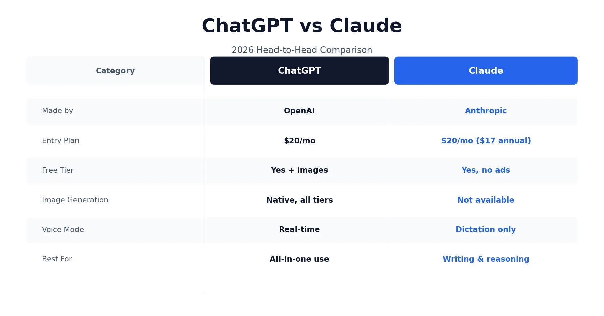
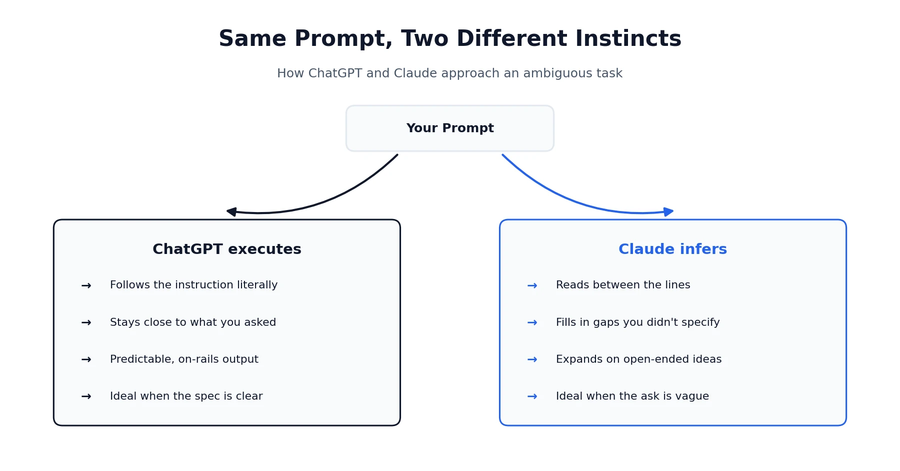
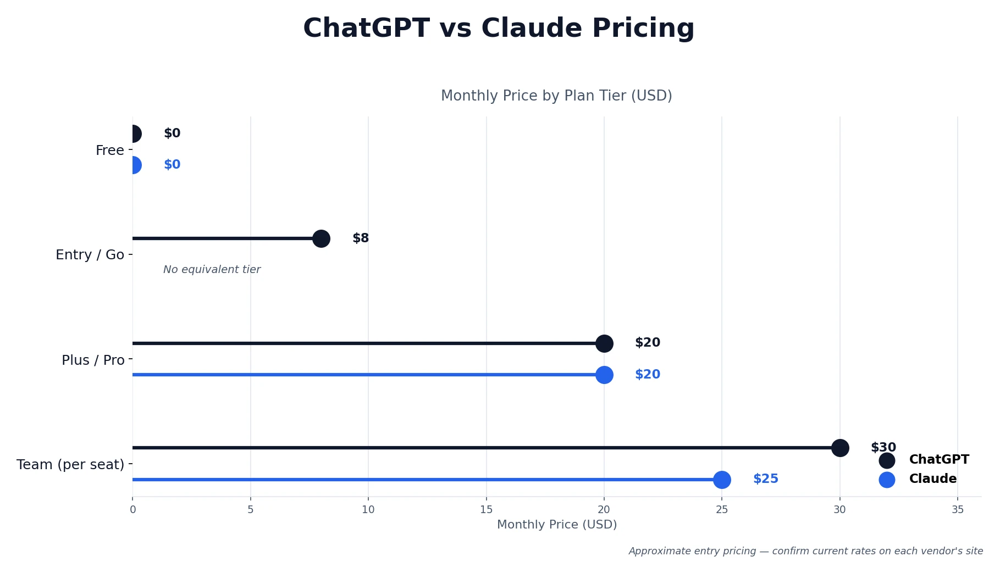

Anyone who's spent real time with AI assistants eventually asks the same question: ChatGPT vs Claude — which one should I actually be using? Both are excellent, both keep shipping new models, and neither one wins across the board no matter what a headline claims. ChatGPT tends to be the broader, faster all-in-one tool, with images, voice, and a wider feature set built right in. Claude tends to write more naturally and hold up better across long, ambiguous, or high-context work. The honest answer isn't "pick a winner" — it's understanding how each one actually thinks, so you know which to reach for and when. This guide walks through pricing, writing, coding, usage limits, and what real users say, so you can make the call based on your own workflow instead of someone else's benchmark screenshot. Browse our other AI tool guides from the [homepage](/), including our recent [HeyGen vs. Synthesia](/compare/heygen-vs-synthesia/) breakdown if you're also evaluating AI video tools.

## What Is ChatGPT?

ChatGPT is an AI assistant built by OpenAI that handles writing, coding, research, image generation, and voice conversation, all inside one product. It's designed to feel like a complete AI workspace rather than just a chat window — you can switch from drafting an email to debugging code to generating a visual without leaving the platform.

## What Is Claude?

Claude is an AI assistant built by Anthropic, built around careful reasoning and natural, considered writing. Its behavior is shaped by an approach Anthropic calls [Constitutional AI](https://www.anthropic.com/news/claudes-constitution), which trains the model against a written set of principles rather than relying purely on after-the-fact human correction. If you want the full picture on what makes Claude distinct — including its model lineup — we've covered that in depth in our [Claude AI review](/reviews/claude-pricing-review/).

## ChatGPT vs Claude at a Glance

A quick note before the table: some of these rows are verified facts pulled from each company's own pricing and product pages (price, context window, image generation). Writing quality and "which feels better" are genuinely subjective and based on reviewer and user consensus, not a hard number — worth keeping that distinction in mind as you read any AI comparison, not just this one.

| Category | ChatGPT | Claude |
|---|---|---|
| Made by | OpenAI | Anthropic |
| Best for | Versatile, all-in-one daily use | Writing, reasoning, long documents |
| Entry paid plan | $20/month (Plus), $8/month Go tier available | $20/month, ~$17/month billed annually |
| Free plan | Yes, includes limited image generation | Yes, no ads, includes memory and search |
| Image generation | Yes, native, every tier including Free | No |
| Voice mode | Yes, real-time conversation | No, dictation input only |
| Context window | Large | Very large, holds long documents well |
| Coding tool | Codex, included on paid tiers and Free | Claude Code, included with paid plans |
| Team plan | $30/user/month | $25/user/month |

## The Real Difference: How Each One Actually Thinks

Specs only tell you so much. The thing that actually determines which tool feels better for a given task is how each one handles a request that isn't perfectly specified.

ChatGPT tends to follow instructions literally. Give it a clear brief with defined steps, and it executes on rails — predictable, direct, and it generally won't wander past what you asked for. That's genuinely useful when you already know exactly what you want and just need it produced quickly.

Claude tends to do something different: it infers what you're probably after and fills in the gaps. Give it a half-formed idea, and it'll often expand on it, add context you didn't explicitly request, or restructure things in a way that's closer to what a thoughtful colleague would hand back. If you had a very specific shape in mind, that can occasionally feel like more than you asked for. If you didn't know exactly what you wanted yet, it can feel like the tool is doing real thinking alongside you.

Neither approach is objectively better. The more precisely you already know what you want, the more ChatGPT's literalness works in your favor. The less defined your starting point is, the more Claude's habit of filling gaps turns from a quirk into the actual value.

## ChatGPT vs Claude for Writing

This is one of the most debated parts of the whole comparison, and it's worth being honest that it isn't fully settled. The balance of opinion across reviewers and everyday users does lean toward Claude here — its prose tends to read as more natural and less like a bulleted outline dressed up as paragraphs, and it generally needs less editing to remove that recognizably "AI-sounding" tone.

That said, it's a real debate, not a landslide. Some users report the opposite friction with Claude: short, punchy sentence fragments used for effect, or a noticeable overuse of em dashes that needs cleaning up just as much as ChatGPT's tendency toward bullet points. If writing quality genuinely matters to your workflow, the only way to know which fits your voice is to run the same prompt through both on your own material and compare the raw output side by side.

## ChatGPT vs Claude for Coding

Both platforms now ship a dedicated coding tool — Codex for ChatGPT, Claude Code for Claude — and both perform well enough on standard coding benchmarks that the score gap matters less than how each one approaches the work.

ChatGPT tends to execute a precisely specified task efficiently. Hand it a clear ticket with defined requirements, and it moves quickly without much back-and-forth. Claude tends to explain its reasoning more as it works, breaking logic into cleaner structure and occasionally flagging things you didn't explicitly ask about — closer to a second developer thinking through the problem with you than a tool executing a spec.

For well-defined, repeatable engineering tasks, ChatGPT's directness tends to save time. For ambiguous problems, unfamiliar codebases, or genuinely exploratory debugging, Claude's habit of reasoning out loud tends to be more useful.

## ChatGPT vs Claude Features Compared

Beyond writing and coding, a handful of feature gaps show up consistently.

**Image generation and voice.** ChatGPT includes native image generation on every tier, including Free, plus a real-time voice mode for spoken conversation. Claude has neither — it can analyze and describe an image you upload, but it can't create one, and voice input is limited to dictation rather than a two-way spoken conversation.

**Memory and projects.** Both platforms offer memory that carries context across conversations, and both offer a way to organize ongoing work — Projects and Custom GPTs on ChatGPT's side, Projects and Artifacts on Claude's.

**Connectors and integrations.** ChatGPT has a broader third-party integration and plugin ecosystem overall. Claude supports connectors as well, including Microsoft 365 and Outlook integration, but the surrounding ecosystem is thinner.

## ChatGPT vs Claude Pricing: What You'll Actually Pay

The consumer pricing ladders mirror each other closely, which makes the differences at the edges easier to spot. Figures below are current best estimates — always confirm the latest numbers directly on [OpenAI's pricing page](https://openai.com/chatgpt/pricing/) and [Anthropic's pricing page](https://www.anthropic.com/pricing), since both companies adjust tiers periodically.

| Plan | ChatGPT | Claude |
|---|---|---|
| Free | Limited flagship model usage, includes image generation, ads in some regions | Standard model, memory and search included, no ads |
| Entry tier | Go: $8/month, includes ads | — |
| Mid tier | Plus: $20/month | Pro: $20/month ($17/month billed annually) |
| Higher tier | Pro: $200/month | Max: $100/month or $200/month |
| Team | $30/user/month | $25/user/month |
| Enterprise | Custom | Custom |

One gap worth naming: neither platform has a mid-range option between $20 and $100+. That jump is one of the most commonly cited frustrations in user discussions on both sides, since there's no obvious "I need a bit more, not 5x more" tier to step into. For a deeper breakdown of Claude's specific plans and what each one includes, see our full [Claude pricing and review](/reviews/claude-pricing-review/).

## Usage Limits: The Part Nobody Puts in the Headline

Sticker price only tells part of the story, since both platforms throttle how much you can actually use before hitting a wall.

ChatGPT generally counts usage by message volume within a rolling time window, then falls back to a lighter model rather than cutting you off entirely once you hit the cap. Claude meters usage more by computing over a session, with limits that reset on a rolling window rather than a simple daily or monthly count. In practice, many users find Claude's limits less predictable to plan around, since two conversations of similar length can draw down the allowance very differently depending on how much context and reasoning each one requires.

Neither company publishes exact numbers that stay accurate for long — both adjust limits periodically, so the specific figures are less useful than understanding the shape of each system: ChatGPT throttles by count, Claude throttles by compute. If usage limits have ever interrupted a heavy work session for you on either platform, that difference in mechanics is usually why.

## What People Say After Switching

A distinct genre of writing has built up around this exact comparison: personal accounts of people switching from ChatGPT to Claude and describing what changed. It's worth acknowledging honestly rather than ignoring, since it reflects real, repeated experience rather than marketing. That sentiment shows up in structured reviews too — see [G2's Claude reviews](https://www.g2.com/products/claude/reviews) for a broader sample beyond individual essays.

The recurring theme across these accounts is fairly consistent: writing feels less like it needs heavy editing, responses feel less like a bulleted outline and more like something a person would actually say, and there's less need to "perform" elaborate prompt engineering to get a usable result. Several also mention Claude pushing back on a request rather than complying immediately, which some describe as mildly annoying at first and genuinely useful in hindsight.

The friction shows up just as consistently, though. The most common complaint across these same accounts is running into usage limits mid-session, right when momentum matters most. A second common thread is the real cost of switching tools entirely — rebuilding context, re-explaining brand voice or preferences, and losing the accumulated setup you'd built in the other tool. Not everyone who tries this switch stays switched; a real, if quieter, group of people goes back to ChatGPT or ends up running both rather than committing to one.

## What Does Reddit Say About ChatGPT vs Claude?

Given how often "chatgpt vs claude reddit" shows up as a search itself, it's worth summarizing honestly rather than inventing a tidy consensus. Two themes come up consistently across discussion threads, and they largely track with what shows up in more structured reviews on sites like [G2's ChatGPT reviews](https://www.g2.com/products/chatgpt/reviews) as well.

First, tone: a meaningful share of users describe Claude's responses as more natural and less repetitive, with ChatGPT's tendency toward agreeable, overly affirming responses ("you're absolutely right") being one of the more commonly cited frustrations in the opposite direction. Second, and even more consistently: Claude's usage limits at the $20 tier are the single most common reason people cite for leaving it, downgrading their usage, or splitting work between both tools rather than relying on Claude alone.

That second point connects directly to a pattern worth naming explicitly: a real number of regular users simply pay for both platforms — Claude for writing and long-document work, ChatGPT for brainstorming, images, voice, or coding from a precise spec — rather than trying to force one tool to do everything. At roughly $40/month combined, that's a genuinely common resolution rather than an edge case.

## ChatGPT vs Claude: Which Is Better?

Pulling everything together, the real answer depends on what you're actually doing day to day.

**Choose ChatGPT if:**
- You want one tool that handles writing, coding, images, and voice without switching apps
- You already know exactly what you want and prefer a tool that executes literally
- Image generation or real-time voice conversation matters to your workflow
- You want a cheaper entry point via the $8/month Go tier

**Choose Claude if:**
- Writing quality and natural-sounding prose matter more than raw feature breadth
- You regularly work with long documents, research material, or open-ended problems
- You'd rather have a tool that infers intent from a vague ask than one that needs a precise spec
- Data privacy and a safety-first company culture matter to how you choose software

Neither tool is the wrong choice, and both offer genuine free plans worth testing on your own real work before committing to either. If your budget allows it, running both for a month and routing tasks by strength — the way a lot of regular users already do — is often the most honest answer of all.

*This comparison reflects publicly available information and independent user feedback as of 2026. Pricing, features, and usage limits change periodically — always confirm current details directly with each company before subscribing.*

**Affiliate Disclosure:** This article may contain affiliate links. If you sign up for ChatGPT, Claude, or another product through a link on this page, we may earn a commission at no extra cost to you. This helps support the research and testing that goes into guides like this one. Our opinions and recommendations are based on independent research and, where possible, hands-on use of each platform — affiliate relationships don't influence which products we cover or how we rate them.