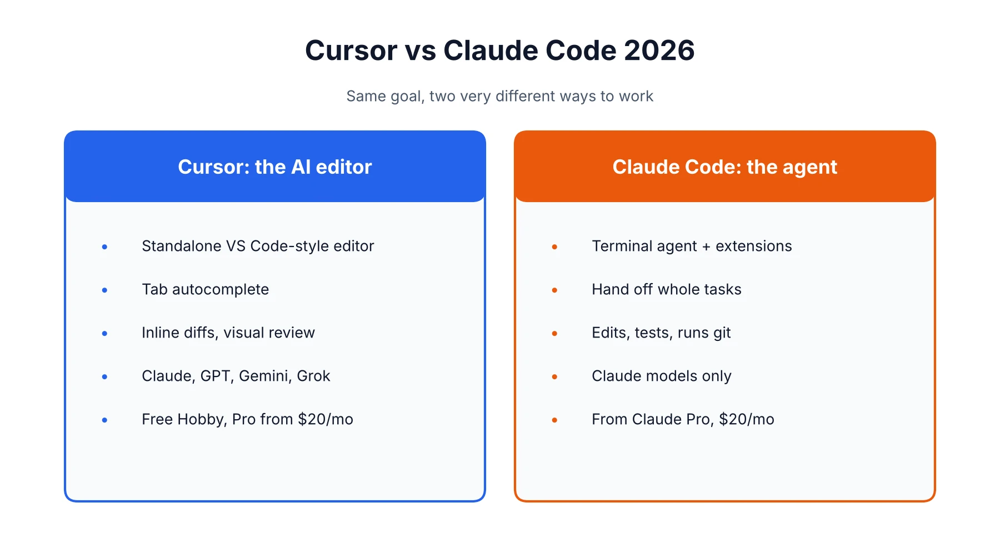
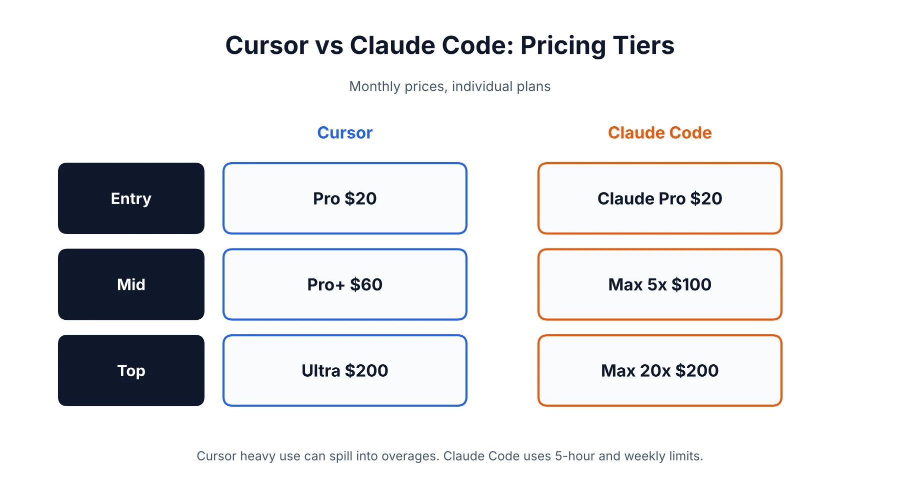
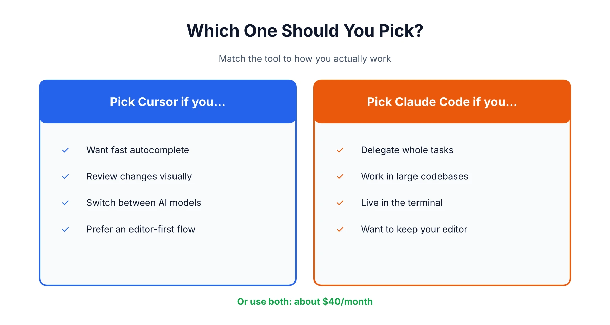

Cursor or Claude Code? People frame it as a contest of intelligence, and that's the wrong way in. The better question is where you want the AI to sit. Cursor is an editor, and the AI is baked into everything you do there. Claude Code is closer to a colleague you hand a job to, usually through a terminal, and you look over the result when it's done. If you've read our [Cursor vs GitHub Copilot](/compare/cursor-vs-github-copilot/) piece, this is the next step up in autonomy. It's also a closer call than most articles admit. Below: pricing, usage limits, how each one plays with VS Code, what the SpaceX deal means, and who should pick which. Much of what's out there is already stale, so we checked details against current sources. The [homepage](/) has the rest of our coverage if you want to wander.

## Cursor vs Claude Code at a Glance

Short version: Claude Code is better when you hand off a big job, Cursor is better when you want to keep your hands on the wheel. The table fills in the rest.

| | Cursor | Claude Code |
|---|---|---|
| Form factor | Standalone editor (a VS Code fork) | Terminal agent, plus VS Code and JetBrains extensions |
| Models | Multiple: Claude, GPT, Gemini, plus Cursor's own Composer and Grok-based models | Claude models only |
| Autocomplete | Yes, Tab completions | No |
| Entry price | Free Hobby, then Pro at $20/month | Included from Claude Pro at $20/month |
| Heavy-use tiers | Pro+ $60, Ultra $200 | Max $100 or $200 |
| Usage model | Credit pools, then overages | 5-hour windows plus a weekly cap |
| Best for | Editor-first, visual, step-by-step work | Delegating large, multi-file tasks |

## The Real Difference: Editor vs. Terminal Agent

Cursor puts the AI where you type. Claude Code stands off to the side of your project and does the work itself. Pretty much every other difference grows out of that. In Cursor you watch suggestions pop up as you write, accept or reject diffs inline, and never really let go. In Claude Code you say what you want, the agent reads through the codebase, edits files, runs the tests, and comes back with something to review.

Neither is better in the abstract. Some people like watching every change land. Others would rather write a decent brief and judge the outcome, and for them Claude Code just feels faster.

### Is Cursor a VS Code extension?

Nope, and it trips up a surprising number of people. Cursor is its own editor, built on a fork of VS Code. It looks familiar and most VS Code extensions run in it, but you download and open Cursor itself instead of adding something to VS Code. GitHub Copilot is the reverse, an extension. Setting Cursor up for the first time? Our [guide to using Cursor AI](/how-to/how-to-use-cursor-ai/) starts at the first launch.

### Cursor vs Claude Code in VS Code: can you run both?

You can, and lots of developers do. Claude Code has an official VS Code extension, and you can also type `claude` in Cursor's built-in terminal. One rule: don't point both agents at the same files at once. They don't share context, so you'll get conflicts. The extension also skips a few things the terminal version has (Tab autocomplete, some slash commands, accepting part of a diff), which is why many people keep a terminal open anyway. And if an editor update breaks the extension, which happens in forked editors, reloading the window usually fixes it.

## Which Is Better for Coding in 2026?

Neither, flat out. It depends on the job in front of you. A practitioner roundup from June 2026 split it neatly: Claude Code pulls ahead when you give it a substantial task and it goes off to explore, edit, test and retry with little hand-holding, and Cursor pulls ahead when you want to stay close to the code.

### Where Claude Code wins

Big, multi-file jobs are its home turf. You give it a goal and it keeps going without needing a nudge at every step. If your day already runs through a shell, git and scripts, there's almost nothing new to learn. It's also easier to automate than an editor, thanks to hooks, subagents and an SDK you can wire into CI. And on efficiency, one practitioner comparison had Claude Code finishing the same task in roughly 33,000 tokens against about 188,000 for Cursor. That's a single test, so take it as a hint, not a rule.

### Where Cursor wins

Tab autocomplete, first of all. Claude Code has nothing that replaces fast, predictive completions as you type. Inline diffs with accept and reject buttons make small edits painless. You can also pick between Claude, GPT, Gemini or Cursor's own models depending on the task, and the VS Code-style interface is easy to roll out across a team.

### Why do people like Claude Code better than Cursor?

Mostly because it matches how they already think. If you'd rather describe a result and review it, the agent loop beats steering line by line. Others like keeping their current editor. A few point to the Max plans being easier to budget for. One caution: the loudest people online are usually heavy users, and they feel the limit differences far more than someone coding a couple of hours a day.

## Cursor vs Claude Code Pricing: What You'll Actually Pay

Both start around $20 a month, and the real gap opens up once you use them hard. The numbers below come from [Cursor's pricing page](https://cursor.com/pricing) and [Claude's pricing page](https://claude.com/pricing). Check them before you subscribe, because both companies shuffle tiers often.

| Plan | Cursor | Claude Code |
|---|---|---|
| Free | Hobby: limited usage | Not included on the free Claude plan |
| Entry | Pro: $20/month ($16 annual) | Claude Pro: $20/month |
| Mid-tier | Pro+: $60/month (about 3x Pro) | Max 5x: $100/month |
| Top individual | Ultra: $200/month (about 20x Pro) | Max 20x: $200/month |
| Team | Teams: $40/user/month, Premium $120 | Team plans, priced per seat |

Two things change the math. Cursor now keeps two usage pools, one for its own models and a second for third-party ones like Claude and GPT, which is billed at each model's API price. And Claude Code can run on an API key with pay-as-you-go billing instead of a subscription, handy if your usage swings a lot. Our [Claude AI review](/reviews/claude-pricing-review/) explains what each Claude plan includes, and the [Cursor pricing review](/reviews/cursor-ai-pricing-review/) goes deep on the credit system, since the same logic applies here.

### Which is cheaper, Cursor or Claude Code?

At $20, neither. After that it comes down to you. Someone who mostly takes autocomplete and sticks to Cursor's lighter models can sit happily in Pro all month. Someone who runs frontier models on every agent request can drain either plan in a hurry. Cursor Pro plus Claude Pro is about $40 a month together, and bumping Claude up to Max 5x lands you near $120.

### Why is Cursor so expensive?

At $20 it isn't, but it can feel that way once you start choosing premium models by hand. Those draw from a pool billed at API rates, so a handful of long agent sessions on an expensive model can wipe it out. Then your options are Auto mode, waiting for the reset, or turning on on-demand billing at real API rates. Developers have reported surprise overages from exactly this. Take a minute to set a spend limit in the usage dashboard.

### Is Cursor free if I have a Claude Code subscription?

No. Different products, different bills. Cursor's free Hobby tier lets you try it without paying, and Claude Pro gets you Claude Code, but neither unlocks the other.

## Usage Limits: How Each Tool Runs Out

Cursor runs out of credits. Claude Code runs out of time. With Cursor you get a pool of included usage, and when it's gone you switch to cheaper models or pay on demand. Claude Code works on a rolling five-hour session limit plus a weekly cap, and Anthropic gives relative multipliers instead of token counts: Max 5x means five times Pro's per-session usage, Max 20x means twenty times.

That vagueness is the most common gripe. You can't see an exact balance, so a heavy session can hit the wall with little warning. Anthropic has also raised these limits several times this year, so a figure from a few months back may be out of date. Instruction files, memory and tool definitions count against your usage on every turn as well, which is why long sessions burn faster than you'd guess.

## Can I Use Claude Code Instead of Cursor?

You can, and for some people it's the better setup. If most of your coding is describing tasks, reviewing diffs and running tests, Claude Code handles all of that without a separate editor. Lots of developers pair it with whatever they already use, whether that's VS Code, JetBrains or Neovim. What you give up is Tab completions, easy model switching and visual diff review. If any of those are part of your daily rhythm, you'll feel the gap inside a week.

## Is Cursor Owned by Elon Musk? What the SpaceX Deal Changes

Cursor belongs to SpaceX now, not to Elon Musk personally. SpaceX agreed to buy Anysphere, Cursor's maker, for $60 billion in an all-stock deal, and [TechCrunch reported it closed around August 15, 2026](https://techcrunch.com/2026/08/15/spacex-officially-closes-its-cursor-acquisition/). SpaceX took over xAI earlier this year, and since Musk founded and leads SpaceX, you can see why people keep asking.

For you, today, not much has changed. Cursor still offers Claude, GPT and Gemini at API rates alongside its own Composer and Grok-based models, and Cursor still sets its own pricing. What comes next is murkier. Some analysts expect Grok-based models to get a bigger push and pricing to be reworked around SpaceX's compute costs, but none of it is confirmed. If you work under strict data terms, reread Cursor's policies and ask in writing how your code is handled. Don't assume nothing moved.

## Is Cursor Failing? Does Anyone Still Use It?

No, and a lot of people do. Third-party trackers estimate Cursor's annualized revenue at roughly $4 billion by May 2026, up from about $1 billion in late 2025, with over a million paying customers and more than 50,000 enterprise teams. Those numbers come from outside estimates and Cursor's own claims, and annualized revenue is a run rate, not audited income, so hold them loosely. Still, it's hard to square a failing product with SpaceX writing a $60 billion check.

The complaints that do exist are narrower: billing surprises, premium models eating credits, and not knowing what the new ownership means for model access. Some developers have also moved their heaviest work over to Claude Code, which is part of why so many end up running both.

## Is Cursor Worth It in 2026?

For most developers who want AI inside an editor, yes. The $20 Pro tier is a sensible place to start, and the free Hobby plan lets you test it first. It's worth the most if you love autocomplete and visual review, and the least if you spend your day delegating whole tasks to an agent anyway. In that case Claude Code might cover everything without a second subscription. The best test is cheap: spend a week on each and notice which features you actually reach for.

## Cursor vs Claude Code vs Antigravity

Google's Antigravity is the newcomer, and it's built differently again. Antigravity 2.0 launched on May 19, 2026 as an agent-first desktop app with a command-line tool and an SDK, designed around running many agents in parallel. It defaults to Google's Gemini models and has a free tier, with paid access through Google's AI plans. Reviews tend to put it ahead on parallel multi-agent work and scheduling, and behind on polish and model flexibility. If it sounds interesting, [Google's Antigravity site](https://antigravity.google) has the current plans. For most developers choosing right now, Cursor and Claude Code are still the safer bets.

## Cursor vs Claude Code vs Copilot

GitHub Copilot is the cheapest of the three and the easiest to adopt, since it plugs into the editor you already have. It's less autonomous than Claude Code and less deeply built around AI than Cursor. We cover that matchup properly in the Cursor and Copilot comparison linked earlier, so no need to repeat it. Quick version: Copilot if budget and IDE choice come first, Cursor if you want the strongest AI editor, Claude Code if you want to delegate.

## Cursor vs Claude Code for Vibe Coding

Vibe coding, where you describe what you want and keep nudging without reading every line, works with both, but they suit different people. Cursor is kinder to beginners because you can see the files, preview changes and undo easily. Claude Code gets more powerful as a project grows, though a terminal-first workflow can feel intimidating if you've never opened one. Not a developer, just want to ship an app? A browser-based builder may be an easier first step, and our [best AI coding tools](/best-tools/best-ai-coding-tools/) roundup covers those too.

## What Does Reddit Say About Cursor vs Claude Code?

Limits and cost dominate. Cursor users talk about credits vanishing faster than expected, while people writing about Claude Code often mention murky usage windows and hitting the cap mid-session. Builder.io's comparison reports the same pattern: heavy Cursor users running into daily overages, and Claude Code's limits being hard to predict. Remember that the loudest voices are usually heavy users, so if you're coding casually you may never hit these walls. For a live read, browse [r/cursor](https://www.reddit.com/r/cursor/) and compare it with the Claude Code threads.

## Which One Should You Pick?

Choose by how you work, not by hype.

**Go with Cursor if:**
- You want AI inside your editor with fast autocomplete
- You like to review changes visually, one step at a time
- You want to switch between several AI models
- Your team needs an easy, familiar way in

**Go with Claude Code if:**
- You're comfortable in a terminal and want to hand off whole tasks
- You work in large or unfamiliar codebases
- You want scripting, hooks or automation around your agent
- You'd rather keep your current editor

**Or use both**, if about $40 a month fits your budget. A common setup is Cursor for everyday editing and Claude Code for the big refactors. And if you're still weighing the models underneath, our [ChatGPT vs Claude](/compare/chatgpt-vs-claude/) comparison covers how they differ.

*This comparison reflects pricing and features as of October 2026. Both tools change quickly, and Cursor's ownership changed recently, so check each company's official pages before you subscribe. Anthropic's [Claude Code documentation](https://docs.claude.com/en/docs/claude-code/overview) is the best source for current setup and limits.*

## Affiliate Disclosure

This article may contain affiliate links. If you sign up for Cursor, Claude, or another product through a link on this page, we may earn a commission at no extra cost to you. This helps support the research and testing behind guides like this one. Our opinions and recommendations are based on independent research and, where possible, hands-on use of the platforms. Affiliate relationships don't influence which products we cover or how we rate them.