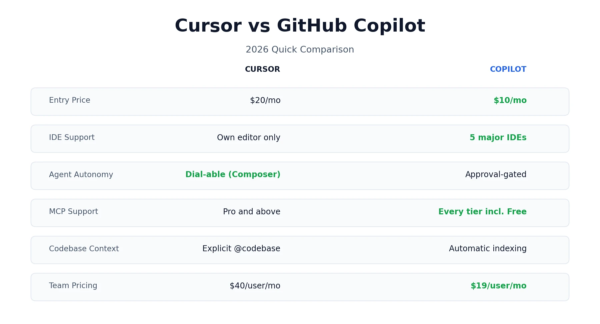
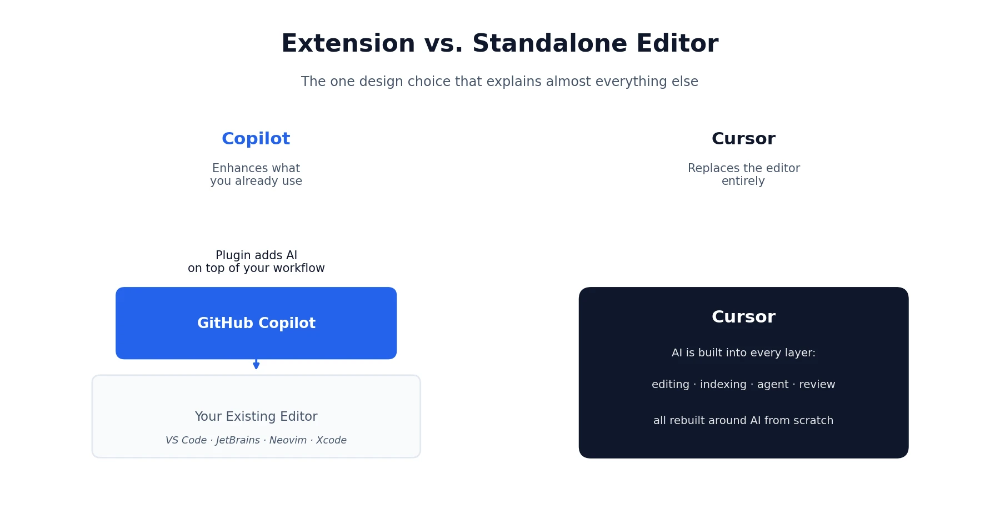
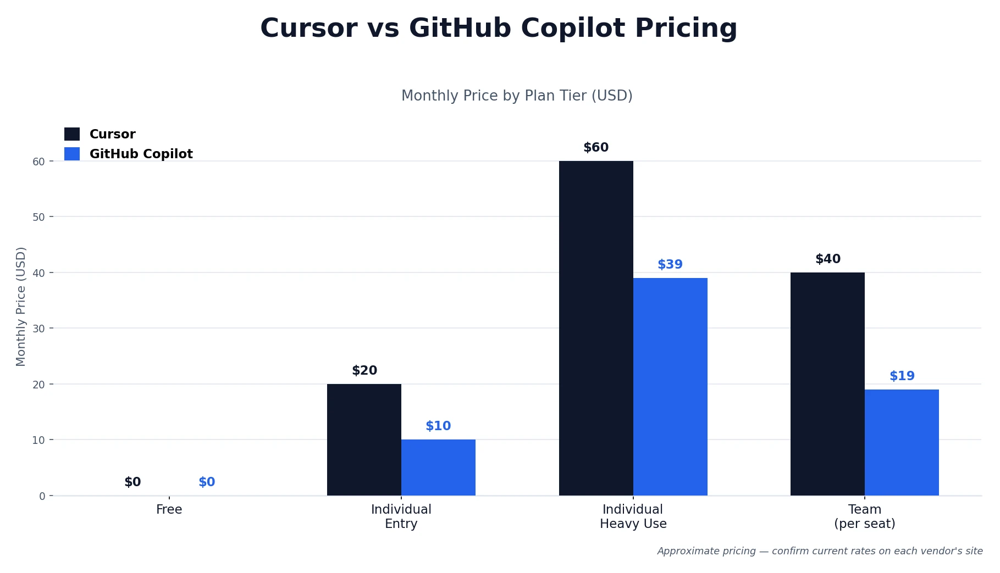

Anyone shopping for an AI coding assistant eventually lands on the same two finalists, and the cursor vs github copilot question comes up constantly for good reason: both tools do genuinely different jobs even though they compete for the same budget line. GitHub Copilot is an extension that plugs AI into the editor you already use — VS Code, JetBrains, Neovim, wherever you already live. Cursor is a standalone editor that rebuilds the entire experience around AI from the ground up. That one architectural choice explains almost everything else about how these two tools differ, from price to IDE support to how much autonomy you can hand the agent. This guide walks through pricing, coding capability, real feature gaps, and what actual developers say, so you can pick based on your workflow instead of a marketing page. If you've been through our [Cursor pricing review](/reviews/cursor-ai-pricing-review/), some of this will feel familiar — this piece puts that research head-to-head against Copilot specifically.

## What Is Cursor?

Cursor is an AI-first code editor built by Anysphere as a fork of Visual Studio Code, rebuilt around multi-file editing, codebase-wide context, and an AI agent (Composer) that can plan and execute work across your project with a dial-able level of autonomy. If you're weighing several AI coding tools at once, our [homepage](/) has the full lineup of guides we've put together so far.

## What Is GitHub Copilot?

GitHub Copilot is an AI coding assistant built by GitHub and OpenAI, available as a plugin across VS Code, JetBrains, Neovim, Xcode, and Eclipse. It started as an autocomplete tool in 2021 and has since grown into a full agent capable of planning and executing multi-file changes, opening pull requests, and working natively inside GitHub's ecosystem.

## Cursor vs GitHub Copilot at a Glance

A quick note before the table: some of these rows are verified facts pulled straight from each company's pricing and product pages — price, IDE support, MCP availability. Which tool "feels" more capable in daily use is genuinely subjective and based on reviewer consensus, not a hard number, so it's worth keeping those two categories separate in your own head as you read.

| Category | Cursor | GitHub Copilot |
|---|---|---|
| Made by | Anysphere | GitHub / OpenAI |
| IDE support | Own editor only (VS Code fork) | VS Code, JetBrains, Neovim, Xcode, Eclipse |
| Entry paid plan | $20/month | $10/month |
| Free tier | Yes (Hobby) | Yes |
| Agent mode | Composer, with an autonomy slider | Agent mode, approval-gated |
| MCP support | Pro and above | Every tier, including Free |
| Codebase context | Explicit @codebase semantic search | Automatic GitHub indexing |
| Model choice | Multiple frontier models, user-selected | Multiple vendors, including Anthropic models |
| Team pricing | $40/user/month | $19/user/month |

## The Real Difference: Extension vs. Editor

Almost every other difference between these two tools traces back to one decision made early in each product's design.

Copilot was built to enhance the editor you already use. Your workflow, extensions, keybindings, and muscle memory all stay intact — Copilot just adds AI on top. That's a low-friction choice, and it's why Copilot can support five different IDEs while Cursor supports exactly one.

Cursor took the opposite bet: rebuild the editor itself around AI as a first-class citizen, not a bolted-on feature. That gives Cursor more room to design deep, AI-native workflows — explicit codebase indexing, a Composer agent with a genuine autonomy dial, cloud agents running in parallel — but it comes at the cost of asking you to leave your current editor behind entirely.

Neither choice is objectively right. If your team has heavy VS Code customization, JetBrains loyalty, or just doesn't want to relearn an editor, Copilot's plugin model removes that friction entirely. If you're willing to switch and want the deepest possible AI integration, Cursor's from-scratch approach tends to go further.

## Cursor vs GitHub Copilot for Coding

Both tools now ship real agent capability, not just autocomplete, and both perform well enough that the gap comes down to how each one approaches a task rather than a clean winner.

On [SWE-bench Verified](https://www.swebench.com/), a widely used public coding benchmark, GitHub Copilot has been reported to solve around 56% of tasks compared to Cursor's roughly 51.7% — but Cursor tends to complete each task about 30% faster. Read that as "Copilot leans more accurate on isolated tasks, Cursor leans faster on multi-step workflows" rather than a flat win for either side. Benchmark numbers like this also shift with model updates on both sides, so treat it as a snapshot rather than a permanent ranking.

In daily use, the difference shows up most in multi-file refactors. Copilot tends to be more conservative in scope — ask it to rename something across your codebase and it'll find the obvious spots, propose them, and stop. Cursor tends to go further, catching related tests, docs, and config files too, which is useful when it's right and messier when it isn't.

That same pattern shows up in how each tool feels to sit next to for a full working session. Copilot surfaces decisions sooner and checks in more often, which makes it feel safer when you're not fully sure what the right change looks like yet. Cursor, especially with the autonomy slider turned up, tends to disappear for longer stretches and come back with more done — faster when you already know the shape of the task, riskier when you don't.

Both tools now support MCP (Model Context Protocol) for connecting to external tools and data sources — Copilot ships it on every tier including Free, while Cursor includes it from Pro upward. This has become a genuine 2026 baseline expectation rather than a differentiator, so don't let either tool's marketing make it sound like a unique advantage.

## Cursor vs GitHub Copilot Features Compared

Beyond the agent and coding capability, a handful of structural differences are worth knowing.

**IDE support.** Copilot works across VS Code, JetBrains, Neovim, Xcode, and Eclipse. Cursor is its own editor — full stop. If your team is spread across multiple IDEs, Copilot is the only one of the two that meets everyone where they already are.

**Codebase context.** Copilot relies on automatic GitHub-powered indexing — you don't explicitly control what's included, it's inferred from your query and current file. Cursor's `@codebase` command runs an explicit semantic search and shows you what it found before sending anything to the model, which trades a bit of speed for real visibility into what the AI is working from.

**GitHub-native workflows.** This is Copilot's clearest structural advantage. Because it's built by GitHub, it has deep, native access to PR review, issue tracking, and GitHub Actions — automation that would take real custom scripting to replicate on Cursor's side.

**Learning curve.** Copilot's onboarding is close to zero, since it's a plugin dropped into an editor you already know. Cursor asks more of you upfront — new keybindings, a new interface, and time spent learning when to reach for Composer versus a simple inline edit. Most developers report needing one to two weeks before Cursor's workflow feels natural rather than effortful.

## Cursor vs GitHub Copilot Pricing: What You'll Actually Pay

Pricing is where the two tools diverge the most clearly, and it's worth seeing the full ladder side by side rather than just the entry price. Figures below are current best estimates — always confirm the latest numbers directly on [Cursor's pricing page](https://cursor.com/pricing) and [GitHub's Copilot plans page](https://github.com/features/copilot/plans), since both companies adjust tiers fairly often in this category.

| Plan | Cursor | GitHub Copilot |
|---|---|---|
| Free | Hobby: $0 | Free: $0 |
| Individual entry | Pro: $20/month | Pro: $10/month |
| Individual heavy use | Pro+: $60/month, Ultra: $200/month | Pro+: ~$39/month |
| Team | Teams: $40/user/month | Business: $19/user/month |
| Enterprise | Custom | $39/user/month |

Copilot is cheaper at every single published tier, sometimes by more than half. That said, price alone doesn't capture the full picture — Cursor's higher tiers exist because its Composer agent tends to use up premium-model credits quickly once you start delegating real, sustained work to it, the same credit-pool dynamic we covered in detail in our [Cursor pricing review](/reviews/cursor-ai-pricing-review/). If most of your AI usage is inline completions and the occasional chat question, Copilot delivers that at a fraction of the cost. If you're running multi-file agent sessions daily, the calculus shifts toward Cursor being worth the premium.

## Should You Use Cursor and GitHub Copilot Together?

This isn't a niche workaround — it's a genuinely common setup among developers who've tried both. The typical pairing looks like this: Copilot handles daily inline coding inside whatever editor you actually use, while Cursor gets reserved for heavier, agent-driven refactors and multi-file feature work where its deeper autonomy earns its keep.

Combined, that runs about $30/month ($10 Copilot Pro + $20 Cursor Pro) — noticeably less than jumping either tool alone to its next tier up, and it sidesteps the core tradeoff entirely: you keep Copilot's IDE flexibility for daily work and get Cursor's agent depth exactly when a task actually calls for it. If you've read our [ChatGPT vs Claude](/compare/chatgpt-vs-claude/) comparison, this is the same "pay for both, route by strength" pattern that shows up whenever two tools solve genuinely different problems well.

## What Does Reddit Say About Cursor vs GitHub Copilot?

Given how often this exact question gets searched, it's worth answering honestly instead of inventing a tidy consensus. Two themes come up consistently across developer discussion, and they largely echo what shows up in more structured reviews too — see [G2's Cursor reviews](https://www.g2.com/products/cursor/reviews) and [G2's GitHub Copilot reviews](https://www.g2.com/products/github-copilot/reviews) for a broader sample beyond forum threads.

First, Cursor users frequently mention being caught off guard by how quickly a credit pool drains during a heavy agent session — the same friction point we documented in detail in our Cursor pricing research. Second, Copilot users tend to cite GitHub ecosystem loyalty and lower cost as their main reasons for sticking with it, more than any specific capability gap. Neither tool has an obviously dominant reputation online; the sentiment mostly tracks with what shows up in formal reviews rather than diverging sharply from it.

## Cursor vs GitHub Copilot: Real-World Use Cases

Beyond the general "choose X if" framing, here's how the two tools actually stack up against specific day-to-day scenarios.

**Daily feature work.** Either tool handles this well. If your team is on JetBrains or Visual Studio, Copilot wins by default since Cursor isn't an option. If you're on VS Code and want the most aggressive inline completion, Cursor's Tab tends to edge ahead.

**Large refactors and codemods.** Cursor's Composer, with autonomy turned up, is the stronger tool here. Point it at a repo, describe the transformation, and review the diff once it's done — this is the scenario Cursor's architecture was built around.

**Opening PRs from issues.** Copilot's GitHub-native workflow is the cleaner fit. It can turn an issue directly into a pull request without leaving GitHub's ecosystem, especially when paired with GitHub Actions.

**Onboarding new engineers.** Copilot's gentler learning curve and more conservative suggestion style make it the easier tool to hand someone in their first weeks. Cursor's deeper capability assumes you already know what you want to delegate, which asks more of a newcomer.

**Writing tests.** Both tools produce solid tests. Copilot tends to get you from zero to a working test file faster. Cursor, given a full file and asked to cover all branches, tends to produce more thorough coverage since it can see the whole function, error paths included.

## Cursor vs GitHub Copilot: Which Is Better?

Pulling it together, the real answer depends on your setup and workflow more than either tool's raw capability.

**Choose GitHub Copilot if:**
- Your team is spread across multiple IDEs, including JetBrains, Neovim, or Xcode
- Your workflow already lives inside GitHub — issues, PRs, Actions
- Budget matters and your primary use case is inline completions plus occasional chat
- You want to adopt AI assistance without asking anyone to switch editors

**Choose Cursor if:**
- You're comfortable committing to a new editor for deeper AI integration
- Multi-file agent work and codebase-wide context are a real, daily part of your job
- You want granular control over how autonomous the agent is per task
- You're already on VS Code and the switching cost is genuinely low

If you're still not sure, the free tiers on both make this an easy one to test firsthand — a week with each on a real task will tell you more than any comparison table, including this one.

*This comparison reflects publicly available information and independent developer feedback as of 2026. Pricing, features, and benchmark scores change periodically — always confirm current details directly with each company before subscribing. If you're building out a wider AI toolkit beyond coding, see our earlier [HeyGen vs Synthesia](/compare/heygen-vs-synthesia/) comparison as well.*

**Affiliate Disclosure:** This article may contain affiliate links. If you sign up for Cursor, GitHub Copilot, or another product through a link on this page, we may earn a commission at no extra cost to you. This helps support the research and testing that goes into guides like this one. Our opinions and recommendations are based on independent research and, where possible, hands-on use of each platform — affiliate relationships don't influence which products we cover or how we rate them.