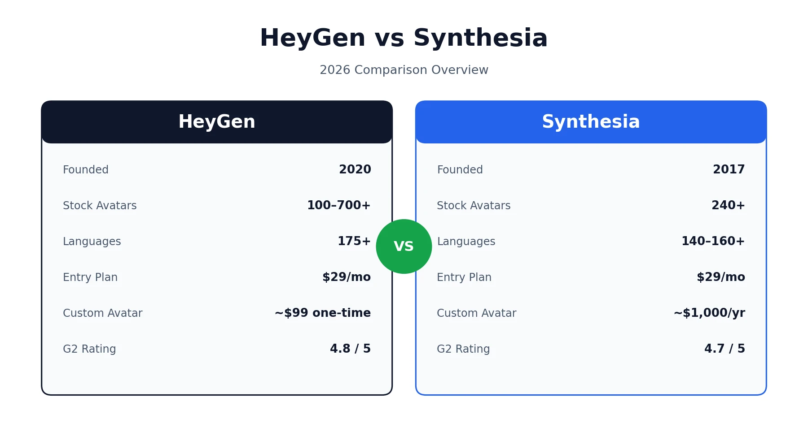
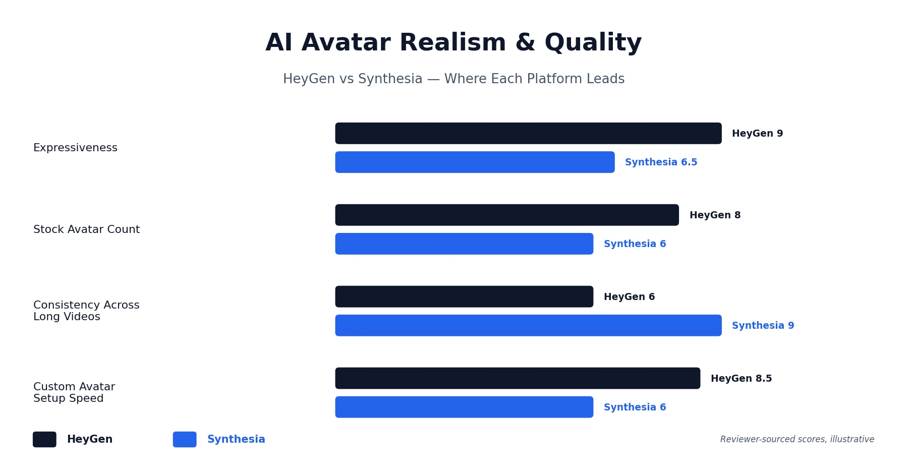
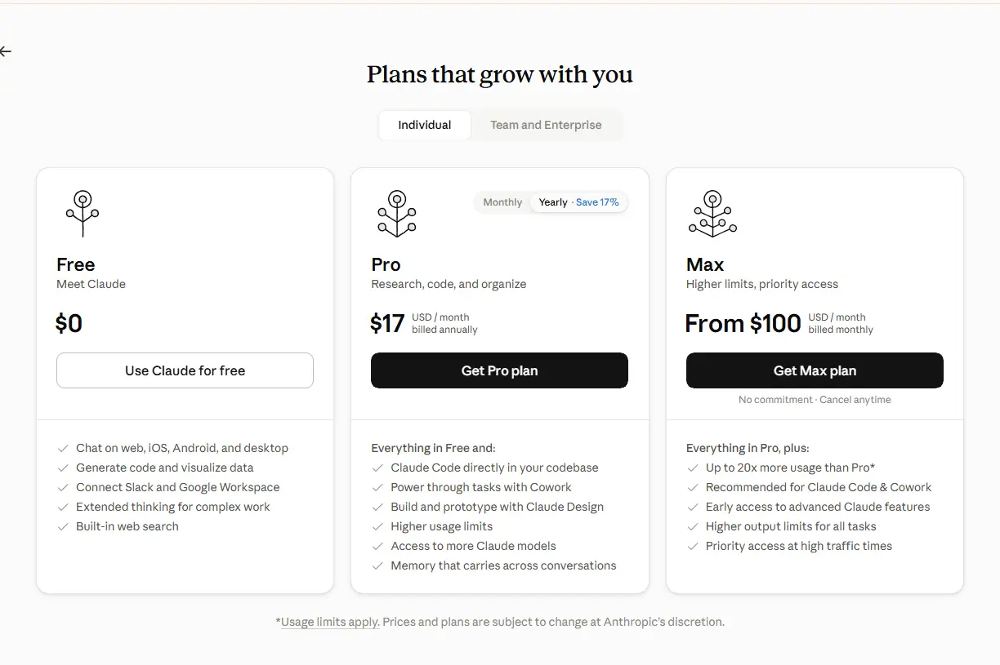

Anyone shopping for an AI avatar video tool eventually lands on the same two names, and the HeyGen vs Synthesia question comes up constantly for good reason: both platforms turn a script into a presenter-led video without a camera, a studio, or an actor, but they're built for genuinely different jobs. HeyGen leans into creative flexibility, avatar realism, and volume — it's the tool most marketers and content creators reach for. Synthesia leans into structure, consistency, and enterprise governance — it's the default for corporate training and L&D teams. Both have real strengths, both have real limitations, and the right answer depends far more on your workflow than on which platform simply has more avatars. This guide walks through pricing, avatar quality, compliance, and what real users actually say, so you can make the call with the full picture instead of a features checklist. Browse our other guides from the [homepage](/) if you're comparing more than one tool this week.

## What Is HeyGen?

HeyGen is an AI avatar video platform that generates presenter-led videos from a script, using either stock avatars or a custom digital twin built from a short video of yourself. It's built around speed and creative flexibility, with a scene-based editor, a large avatar and voice library, and features like face swap and talking photos that lean into marketing and social content rather than formal corporate video.

## What Is Synthesia?

Synthesia is an enterprise-focused AI video platform, founded in 2017, built around structured, on-brand video production for training, onboarding, and internal communications. Its editor works like a slide deck — familiar to anyone who's built a PowerPoint — and it prioritizes visual consistency across large content libraries over maximum avatar realism.

## HeyGen vs Synthesia at a Glance

A quick side-by-side helps before getting into the details. Worth separating out here: some of these rows are verified specs pulled from each vendor's own pricing page (avatar counts, language counts, price), while realism and quality are genuinely subjective and based on reviewer consensus rather than a hard number — worth keeping that distinction in mind as you read comparison tables anywhere, not just this one.

| Category | HeyGen | Synthesia |
|---|---|---|
| Founded | 2020 | 2017 |
| Stock avatars | 100–700+ (varies by tier) | 240+ |
| Languages | 175+ | 140–160+ |
| Custom avatar cost | One-time fee, from around $99 | Add-on, roughly $1,000/year |
| Entry paid plan | $29/month ($24/month annual) | $29/month ($18–22/month annual) |
| SCORM export | Business plan and above | Enterprise only |
| SSO | Business/Enterprise | Enterprise |
| G2 rating | 4.8/5 | 4.7/5 |
| Best for | Creators, marketers, social content | Enterprise L&D, compliance, training |

## HeyGen vs Synthesia for AI Avatars: Realism and Quality

This is where the two platforms genuinely diverge, and it's the single most-discussed factor in almost every HeyGen vs Synthesia comparison out there.

HeyGen's newer avatar model, Avatar IV, produces noticeably more natural facial movement, subtler expressions, and more dynamic gestures than older avatar generations. Reviewers consistently describe HeyGen's output as more expressive, especially in short-form, close-up framing where personality and emotion carry the message — think social ads, sales outreach, or personal branding.

Synthesia's avatars take a different approach entirely. They're built for consistency rather than maximum expressiveness, which matters more than it sounds like once you're producing dozens of training videos that all need to feel like they came from the same source. A slightly less expressive avatar that looks identical across 50 modules is often more useful for enterprise training than a more dynamic one that varies session to session.

The honest takeaway: your average video length is a better predictor of which platform will look better in practice than either company's marketing claims. Short clips under 3 minutes tend to favor HeyGen's expressiveness. Longer training modules tend to favor Synthesia's stability.

## HeyGen vs Synthesia Features Compared

Beyond avatars, a handful of feature differences show up again and again across real comparisons.

**Translation and localization.** HeyGen treats lip-synced video translation as a core, first-class feature — it re-times mouth movement to match the new language, available on paid plans across 175+ languages. Synthesia supports multilingual generation well too, but its focus leans more toward creating new on-brand videos in different languages rather than translating existing footage with matching lip movement.

### Editor and Templates

The two editors feel genuinely different to use, and it's worth treating as its own decision point rather than a footnote. HeyGen's editor is scene-based and more flexible — it gives experienced users room to move quickly, but that same flexibility can feel like a lot to a first-time user. Synthesia's editor is deliberately slide-first: if you've ever built a PowerPoint deck, the layout will feel immediately familiar, which is part of why L&D and HR teams tend to pick it up faster with less onboarding.

Templates favor HeyGen by sheer volume, while Synthesia counters with a library of clonable example videos you can customize as a starting point rather than building from a blank scene.

**Interactivity and assessments.** Synthesia includes quizzes and branching video from its Creator plan upward, which matters directly for e-learning use cases. HeyGen has closed some of this gap but doesn't offer built-in quizzes in the same way.

**Voice cloning.** HeyGen offers self-service voice cloning from a short audio sample on paid plans. Synthesia allows uploading pre-recorded audio for lip-sync but doesn't offer the same self-service cloning capability on public plans.

## HeyGen vs Synthesia Pricing: What You'll Actually Pay

Sticker price alone doesn't tell you much here, since the two platforms meter usage completely differently — HeyGen through a credit system, Synthesia through a minutes cap that doesn't roll over.

| Plan | HeyGen | Synthesia |
|---|---|---|
| Free | 3 videos/month, ~1 min each, watermark | 10 min/month or less depending on tier, watermark |
| Entry paid | Creator: $29/month ($24/month annual) | Starter: $29/month ($18–22/month annual) |
| Mid-tier | Pro: from $49/month | Creator: roughly $64–89/month |
| Team/Business | Business: $149/month + $20/seat | Rolled into Enterprise |
| Enterprise | Custom | Custom |

### 12-Month Cost for a 25-Person Team

Team pricing is where the gap widens. A 25-person team on HeyGen's Business plan pays $149/month for the primary seat plus roughly $20/month for each additional seat — landing around $7,500/year before any add-ons. Synthesia doesn't publish Enterprise pricing, but based on third-party reports and vendor discussions, a comparable 25-person team typically lands somewhere between $15,000 and $25,000/year, depending on which enterprise features are included.

That gap is real, but it isn't the whole story. HeyGen's Creator plan gives you unlimited standard videos, but Avatar IV usage draws down a monthly credit pool — heavy users of the premium avatar model can burn through that allowance faster than expected. Synthesia's minute-based cap is simpler to budget against but doesn't roll over unused minutes month to month. If you've read our [HeyGen pricing and review](/reviews/heygen-pricing-review/) breakdown, this same credit-versus-cap tension is the central theme there too — it's worth understanding before committing to either platform's paid tier.

## HeyGen vs Synthesia: Security, Compliance, and the HIPAA Gap

Both platforms hold SOC 2 Type II certification and support GDPR compliance, and both offer SSO on their higher tiers. That's a solid baseline for most business use.

Where it gets genuinely important — and where most comparisons only mention this in passing — is healthcare and financial services buyers specifically. As of 2026, neither HeyGen nor Synthesia has published HIPAA compliance documentation or offers a signed Business Associate Agreement on their public security pages. That matters a lot if your training or marketing content references patient workflows, medication protocols, or anything that could touch protected health information: SOC 2 and GDPR certifications don't substitute for a BAA, and processing PHI on a platform without one carries real regulatory exposure regardless of how secure the platform otherwise is. Organizations in regulated industries should request explicit compliance documentation directly from either vendor's sales team before any evaluation moves forward — don't rely on a comparison page (including this one) as a substitute for that conversation.

## Synthesia vs HeyGen: Which Is Better for Beginners and Small Teams?

For a first-time user, HeyGen tends to be the easier starting point. Its free plan gives you three complete videos a month with no credit card required, and most people can produce a polished avatar video within half an hour of signing up. Synthesia's free tier is more limited in minutes, which shortens how much you can explore before deciding whether to pay.

That said, Synthesia's onboarding resources — a dedicated learning academy, dozens of clonable example videos, and structured tutorials — are genuinely strong if you'd rather follow a guided path than experiment freely. Small teams without a dedicated video person often find that structure valuable precisely because it reduces the guesswork.

## What Does Reddit Say About HeyGen vs Synthesia?

Given how often "heygen vs synthesia reddit" comes up as a search itself, it's worth answering honestly rather than inventing a tidy consensus that doesn't exist. There isn't one dominant Reddit thread that settles this debate — discussion is scattered across smaller threads, comments on tool-recommendation posts, and passing mentions rather than a single authoritative comparison.

What does surface consistently, though, tracks closely with what shows up in more formal reviews: people using HeyGen mention getting caught off guard by how fast credits disappear once they start using premium avatar features regularly, while people discussing Synthesia tend to frame it in trust-and-safety terms — a "safer" enterprise choice even when it costs more. Neither platform has an obviously dominant reputation on Reddit specifically; the sentiment mirrors what you'd find on G2 and Trustpilot rather than diverging from it.

## HeyGen Pros and Cons

**HeyGen pros:**
- More expressive, realistic avatar motion, particularly with Avatar IV
- Self-service voice cloning included on paid plans
- Lower custom avatar cost, generally a one-time fee rather than a recurring add-on
- Broader language coverage at 175+
- Unlimited standard video output on paid plans
- Genuinely free entry point with no credit card required

**HeyGen cons:**
- Credit-based pricing adds complexity, especially for premium avatar features
- Per-seat costs scale quickly for teams above 10 users
- No published HIPAA documentation
- Editor's flexibility can feel like a steeper learning curve for first-time users

## Synthesia Pros and Cons

**Synthesia pros:**
- Consistent, on-brand avatar rendering across large video libraries
- Slide-style editor with a low learning curve for non-technical teams
- Built-in quizzes and branching video from the Creator plan
- Strong onboarding resources, including a dedicated learning academy
- Solid enterprise governance tools on higher tiers

**Synthesia cons:**
- Custom avatar add-on costs significantly more per year than HeyGen's one-time fee
- No self-service voice cloning on public plans
- Minute-based usage caps that don't roll over
- SCORM export and 1-click translation locked behind Enterprise pricing
- Enterprise pricing isn't published, making budgeting harder upfront

## HeyGen vs Synthesia: Who Should Choose Which

Pulling everything together, the decision mostly comes down to what you're actually making and who's making it.

**Choose HeyGen if:**
- You're a creator, marketer, or small team producing high-volume social or campaign content
- Avatar realism and expressiveness matter more than perfect consistency
- You want a lower, more predictable custom avatar cost
- Multilingual reach across a broad language set is a priority

**Choose Synthesia if:**
- You're producing corporate training, onboarding, or compliance content at scale
- Your team already thinks in slides and wants a familiar, low-learning-curve editor
- Built-in quizzes and structured e-learning features matter to your workflow
- Enterprise governance and vendor-standard security are a procurement requirement

Neither platform is the wrong choice, and both offer genuine free plans worth testing before committing to either. Run the same script through both, see how the credit or minute math holds up against your real usage, and let the workflow — not the avatar count — make the final call.

*This comparison reflects publicly available information and independent user feedback as of 2026. Pricing, features, and compliance certifications change periodically — always confirm current details directly with [HeyGen](https://www.heygen.com/pricing) and [Synthesia](https://www.synthesia.io/pricing) before subscribing. For more on either vendor's user sentiment, see their reviews on [G2's HeyGen page](https://www.g2.com/products/heygen/reviews) and [G2's Synthesia page](https://www.g2.com/products/synthesia/reviews). For guidance on healthcare-related compliance, see the [U.S. Department of Health and Human Services' overview of Business Associate Agreements](https://www.hhs.gov/hipaa/for-professionals/covered-entities/sample-business-associate-agreement-provisions/index.html).*

## Affiliate Disclosure

This article may contain affiliate links. If you sign up for HeyGen, Synthesia, or another product through a link on this page, we may earn a commission at no extra cost to you. This helps support the research and testing that goes into guides like this one. Our opinions and recommendations are based on independent research and, where possible, hands-on use of each platform — affiliate relationships don't influence which products we cover or how we rate them.