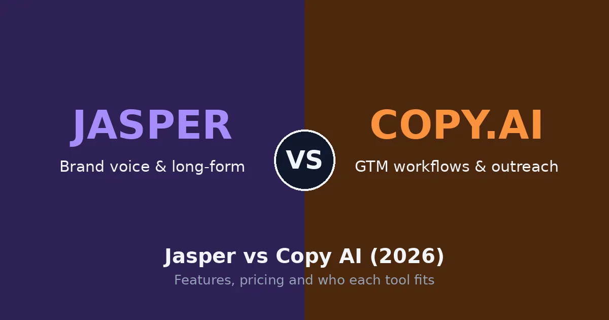
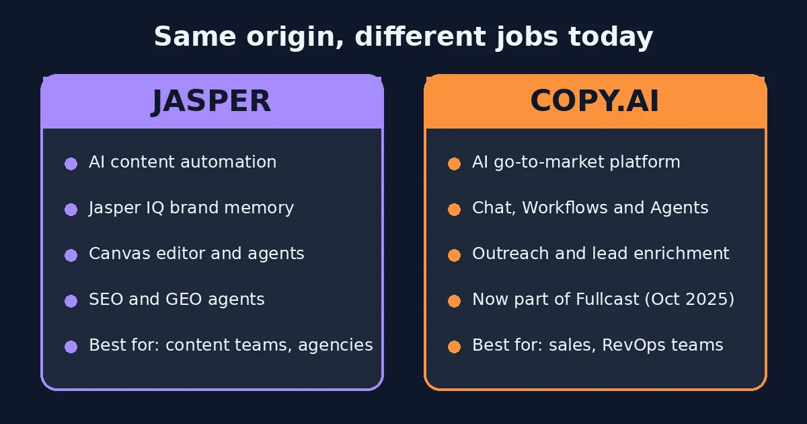
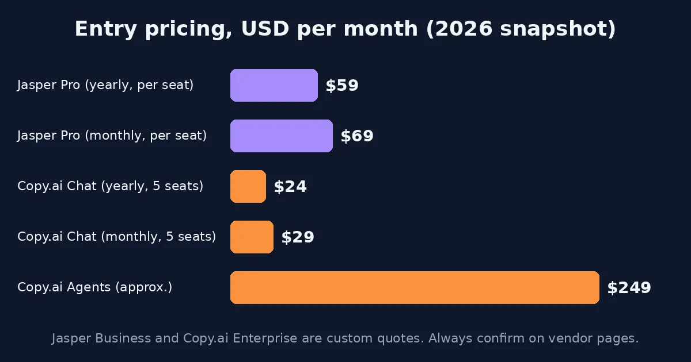
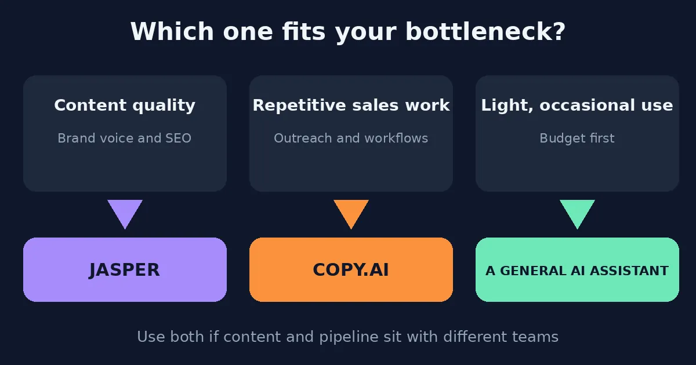

In the Jasper vs Copy AI matchup, Jasper is the better pick for marketing teams that need on-brand, long-form, SEO-friendly content, while Copy.ai suits sales and revenue teams that want to automate go-to-market work. Jasper wins on brand voice and writing depth. Copy.ai wins on workflow automation and a cheaper entry price. Which one is "better" comes down to what's actually slowing you down: content quality, or a mountain of repetitive sales tasks.

A few years ago nobody could tell these two apart, and the Jasper vs Copy AI choice felt like a coin flip. Both began as GPT-powered writing helpers, and people picked whichever dashboard looked nicer. Then each company grew up and went its own way, which made the Jasper vs Copy AI question a lot more interesting. This guide covers what they do now, what they cost, and who tends to be happier with which. Planning a wider AI toolkit beyond Jasper vs Copy AI? Our [Cursor vs GitHub Copilot](/compare/cursor-vs-github-copilot/) comparison covers the coding side of the same decision.

## What Is Jasper in the Jasper vs Copy AI Debate?

Jasper launched in 2021 as a copywriting assistant and now describes itself as an agent workspace for marketers. Its pitch is simple: stop re-explaining your brand to the AI every single time.

That idea lives in **Jasper IQ**, a layer that stores brand voice, style rules, audiences and company knowledge. Brand Voice can study writing samples, files or URLs and build a profile that follows you across the editor, agents and chat. If your editor keeps muttering "this doesn't sound like us," this is the feature that tends to win them over.

The rest of the toolkit includes:

- **Canvas**, a document-style editor with AI built in
- **Agents** for research, personalization, SEO and GEO work
- **Studio**, a no-code builder for custom agents (Business plan)
- **Grid**, a spreadsheet-style view for bulk content (Business plan)
- Image generation, a browser extension and support for 30+ languages

The downsides are fairly plain. It's priced per seat, so a growing team feels the bill fast. Pro limits you to two Brand Voices, five Knowledge assets and three Audiences, and the best extras sit behind a sales call. And like any AI tool, it can state wrong facts with great confidence, so a human has to read everything. You can see the current feature list on [Jasper's official site](https://www.jasper.ai).

## What Is Copy.ai?

Copy.ai was one of the first AI copywriters most people heard about, and it has changed more than almost anyone predicted. These days it calls itself an AI-native go-to-market platform.

Most small teams begin with **Chat**, a shared assistant for up to five people. The more distinctive part is **Workflows**: reusable, multi-step automations that turn structured inputs into finished outputs. Picture a spreadsheet of leads going in and a personalized email for each contact coming out. **Agents** extend that idea to other repeatable sales and marketing jobs, and the tool connects to other apps, including through Zapier.

Sales development reps, RevOps managers and performance marketers get the most from it. If your pain is the manual stretch between "we have a list" and "the emails went out," that's the gap it targets.

There's one more thing worth knowing. Fullcast acquired Copy.ai on 15 October 2025, and the product is being rebranded as "Fullcast Propel (powered by Copy.ai)." The company explains the deal on its own page, [Fullcast acquires Copy.ai](https://www.copy.ai/fullcast-acquires-copy-ai). It still works and still sells. But its roadmap now belongs to a revenue-operations company, and anyone planning to depend on it for years should factor that in.

## Jasper vs Copy AI at a Glance

A quick note before the Jasper vs Copy AI table. Rows like price and plan structure come straight from each vendor's public pages and recent reviews. Which tool "feels" better for a given task is more subjective, so keep those two kinds of information separate as you read.

| Category | Jasper | Copy.ai |
|---|---|---|
| Positioning | AI content automation for marketing teams | AI go-to-market (GTM) platform for sales and marketing |
| Strongest at | Brand voice, long-form, SEO/GEO content | Workflow automation, outreach, short-form copy |
| Entry paid plan | Pro: $59 per seat/month billed yearly ($69 monthly) | Chat: $24/month billed yearly ($29 monthly), 5 seats |
| Free plan | No, 7-day trial only | Not offered to new users, per recent sources |
| Bigger tier | Business, custom quote | Higher workflow tiers and Enterprise |
| Owned by | Jasper | Fullcast (since Oct 2025) |
| Best for | Content teams, agencies, brand-led marketers | Sales, RevOps, performance marketers |

Pricing in this category changes constantly, so treat the numbers as a snapshot.

## The Real Difference: Content vs. Go-to-Market

Most of the differences in the Jasper vs Copy AI comparison trace back to one decision each company made. [Zapier's comparison](https://zapier.com/blog/jasper-vs-copy-ai/) notes that both apps moved upmarket: Copy.ai became a go-to-market app for sales and marketing teams, and Jasper narrowed its focus to marketing.

That's why older Jasper vs Copy AI articles from 2023 or 2024 feel off, and why we rebuilt this one for 2026. They compare two writing tools. Today you're comparing a content engine with a sales-automation engine. [Layer3 Labs](https://www.layer3labs.io/comparisons/jasper-vs-copy-ai) frames it as a simple rule: content bottleneck, lean Jasper; go-to-market workflow bottleneck, lean Copy.ai. It's hard to argue with.

## Jasper vs Copy AI for Writing and Content

| Category | Jasper | Copy.ai | Edge |
|---|---|---|---|
| Long-form writing | Built around an editor and brand context | Can lose the thread on long pieces | **Jasper** |
| Short-form copy | Good, but more structure than you may need | Fast and punchy for ads, subject lines, captions | **Copy.ai** |
| Brand voice | Voice profiles, audiences, knowledge assets | Lighter brand-voice support for GTM messaging | **Jasper** |
| SEO and GEO | SEO and GEO-focused agents | Basic keyword support, little native SEO tooling | **Jasper** |
| Workflow automation | Studio and Grid, Business only | Core strength, multi-step workflows | **Copy.ai** |
| Ease of use | Needs setup before it shines | Easier starting point | **Copy.ai** |
| Collaboration | Shared voices, SSO, roles on Business | Shared workspaces, sales-stack focus | Depends on team |
| Integrations | Browser extension, content tools, API on Business | CRM and sales platforms, Zapier | Depends on stack |

A few rows in this Jasper vs Copy AI breakdown deserve more than a cell.

**Long-form.** This is Jasper's turf in any Jasper vs Copy AI test. When a blog series has to hold together across twenty posts, stored brand context and a proper editor make a visible difference. One comparison says Copy.ai can lose context over long pieces, repeat itself and drift between sections. That may reflect older versions, so test it yourself before treating it as fact.

**Short-form.** Five ad variations before lunch? Copy.ai tends to feel quicker. Jasper can do it too, but the extra structure can feel like carrying a toolbox over to hang one picture.

**SEO and GEO.** Jasper has agents aimed at SEO and at GEO, which means shaping content for AI-generated answers. Copy.ai covers the basics and not much more. Neither handles internal linking for you, and neither replaces a real SEO platform. Use them to get a draft down, then check rankings somewhere else.

**Workflows.** No contest. Copy.ai's workflow engine is the reason many sales teams pick it. Jasper has workflow features, but they're gated to Business and built for content production rather than sales operations.

**Ease of use.** Copy.ai is the gentler way in. Jasper wants homework first, since Brand Voice, Knowledge and Audiences need real input. Do the homework and the drafts usually need less cleanup.

## Jasper vs Copy AI Pricing: What You'll Actually Pay

Pricing is where older Jasper vs Copy AI articles slip up most. Figures below are current best estimates from recent reviews. Confirm the latest on [Jasper's pricing page](https://www.jasper.ai/pricing) and [Copy.ai's pricing page](https://www.copy.ai/prices), since both companies change tiers often.

**Jasper**

| Plan | Price | Seats | What's included |
|---|---|---|---|
| Pro | $69/seat monthly, or $59/seat billed yearly ($708/year) | 1 | Canvas, core agents, 2 Brand Voices, 5 Knowledge assets, 3 Audiences |
| Business | Custom, usually an annual contract | Custom | Advanced agents, Studio, Grid, API, SSO, unlimited IQ customization |
| Free plan | None, 7-day trial only | N/A | N/A |

**Copy.ai**

| Plan | Price | Seats | Notes |
|---|---|---|---|
| Chat | $29 monthly, or $24 billed yearly | 5 | Unlimited chat words |
| Agents | About $249/month | Varies | Listed in Copy.ai's help center per a September 2026 review |
| Workflow tiers | Some sources list around $1,000/month and up | Larger teams | Sources disagree, so ask for a current quote |
| Enterprise | Custom | Custom | API, bulk workflows, support |

### Is Copy.ai Free?

For new users, it looks like no. Recent reviews say the old free plan was sunset, and the live pricing page lists no free option. A few directories still advertise a 2,000-word free tier, which is a big reason buyers keep getting confused. If a free plan matters to you, check the pricing page the same day you plan to sign up.

### What It Costs for Real Teams

| Who you are | Jasper | Copy.ai | Takeaway |
|---|---|---|---|
| Solo blogger | $59–$69/month | $24–$29/month | Copy.ai is cheaper for light writing |
| 3-person content team | About $177/month (3 Pro seats, annual) | $24–$29/month for up to 5 seats | Copy.ai costs far less, Jasper gives much better brand controls |
| Sales or RevOps team | Not the right tool | Chat to test, workflows by quote | Copy.ai's real cost is in Workflows |

In Jasper vs Copy AI pricing terms, the cheap Chat plan and the workflow tiers sit a long way apart, and some reviewers describe a gap with no rung in between. If you're eyeing Copy.ai for automation, budget for that jump early.

## Should You Use Jasper vs Copy AI as an Either-Or Choice?

It doesn't have to be either-or. Plenty of teams run both. [Slate's comparison](https://slatehq.com/blog/jasper-vs-copy-ai) notes that agencies and SaaS companies often split the work: Jasper handles content production, Copy.ai handles pipeline and outreach.

It's the same "route by strength" habit developers use when they pair tools in our [Cursor vs GitHub Copilot](/compare/cursor-vs-github-copilot/) guide. Pay for each tool where it's genuinely better, instead of forcing one to do everything. The catch is cost and complexity, so only do it if two separate teams own those two jobs.

## Jasper vs Copy AI Reviews: What Do Users Say?

In Jasper vs Copy AI reviews, the two sit close together on rating sites, and the numbers depend on where you look. One editorial review gives Jasper 4.3 out of 5 and Copy.ai 4.2. [Capterra's side-by-side page](https://www.capterra.co.uk/compare/217242/1019087/jasper/vs/copyai) lists different scores again, so check it directly.

The themes repeat across reviews. Jasper gets praise for brand voice, collaboration and drafts that need less editing once it's set up. Complaints are about price, per-seat costs and features locked behind Business. Copy.ai earns credit for a fast start, a cheap entry point and strong workflows. It takes heat for pricing jumps, the learning curve and some uncertainty since the acquisition.

Want the unfiltered stuff? Search "Jasper vs Copy AI Reddit" and you'll find plenty of opinions. Look at the dates first. A thread from 2023 may describe a product that no longer exists.

## Jasper and Copy.ai vs ChatGPT, Claude, Perplexity and Copilot

Fair question: does a general assistant make the whole Jasper vs Copy AI decision pointless? Sometimes, yes.

ChatGPT and Claude are flexible, often cheaper, and good at one-off drafts, brainstorming and editing. What they don't do by default is remember your brand. Once Jasper's Brand Voice and Knowledge assets are set up, that context applies on its own. That gap is what Jasper charges for.

The other names in related searches do different jobs:

- **[Perplexity](https://www.perplexity.ai)** is built for research with sourced answers, not publish-ready marketing copy.
- **Microsoft Copilot** fits teams already living in Microsoft 365.
- **[ElevenLabs](https://elevenlabs.io)** is a voice and audio tool, so it isn't a writing platform at all.

If your content work stretches into video, that's a different category entirely. Our [HeyGen vs Synthesia](/compare/heygen-vs-synthesia/) and [Runway vs Sora](/compare/runway-vs-sora/) guides cover the AI video side.

A rough rule of thumb: if you write now and then and nobody obsesses over consistency, a general assistant is probably enough. If many people publish under one brand, Jasper earns its keep. If the work is repeatable sales automation, Copy.ai fits better.

## Jasper vs Copy AI: Real-World Use Cases

**Blog series and SEO content.** Jasper. Brand context, the Canvas editor and SEO/GEO agents are built for this.

**Ad copy and social captions.** Copy.ai tends to be quicker, and the cheaper Chat plan covers a small team.

**Cold outreach at scale.** Copy.ai. Workflows can enrich a lead list and draft personalized emails in one pass.

**Agency work across several brands.** Jasper. Separate voices and shared knowledge are the whole point.

**Onboarding a new marketer.** Copy.ai is the gentler start. Jasper rewards people who invest time in setup.

**Light, occasional writing.** Honestly, neither. A general assistant plus a careful edit may cost far less.

## Jasper vs Copy AI: Which Is Better?

Pulling it together, the Jasper vs Copy AI answer depends on the problem you're paying to fix.

**Choose Jasper if:**
- You're a content marketer, SEO team or agency juggling several brand voices
- Consistency across many writers matters more than speed
- You want SEO and GEO-focused agents alongside your editor
- You can afford per-seat pricing and a sales call for the advanced features

**Choose Copy.ai if:**
- You run sales, RevOps or performance marketing and want multi-step workflows
- Outreach and lead enrichment are your biggest time sinks
- You want a low-cost shared AI chat, with five seats for less than one Jasper seat
- You're comfortable with a product now owned by Fullcast

**Use both if** content and pipeline are handled by different teams. **Skip both if** your needs are light and occasional.

### How to Test Both Before You Pay

A short trial beats any Jasper vs Copy AI review, this one included. Give both tools the same three jobs:

1. A 600-word blog intro in a specific brand tone
2. Five ad headline variations
3. A personalized cold email for a named prospect

Compare tone, repetition, speed and how much editing each draft needed. Note how long setup took, since Jasper's depth costs more upfront time. Then fact-check everything before it goes live. Even the better tool can be confidently wrong.

*This Jasper vs Copy AI comparison reflects publicly available information and independent reviewer feedback as of 2026. Pricing, features and ownership details change periodically, so confirm current details directly with each company before subscribing. If you're building out a wider AI toolkit, see our [Runway vs Sora](/compare/runway-vs-sora/) and [HeyGen vs Synthesia](/compare/heygen-vs-synthesia/) comparisons as well.*

## Affiliate Disclosure
This article may contain affiliate links. If you sign up for Jasper, Copy.ai, or another product through a link on this page, we may earn a commission at no extra cost to you. This helps support the research and testing that goes into guides like this one. Our opinions and recommendations are based on independent research and, where possible, hands-on use of each platform. Affiliate relationships don't influence which products we cover or how we rate them.