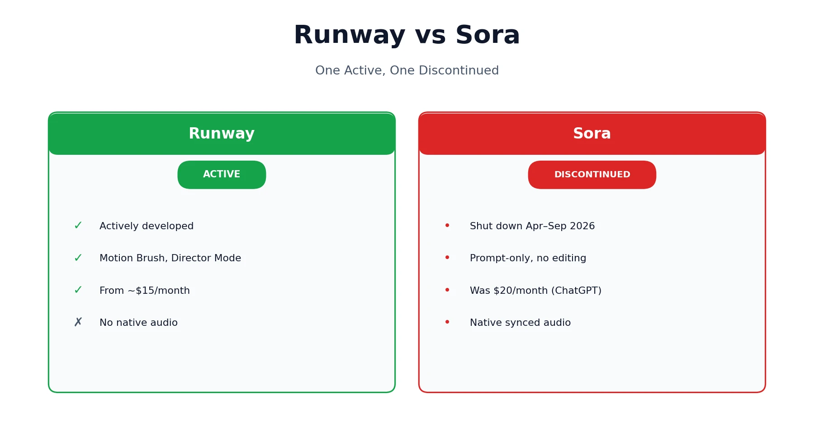
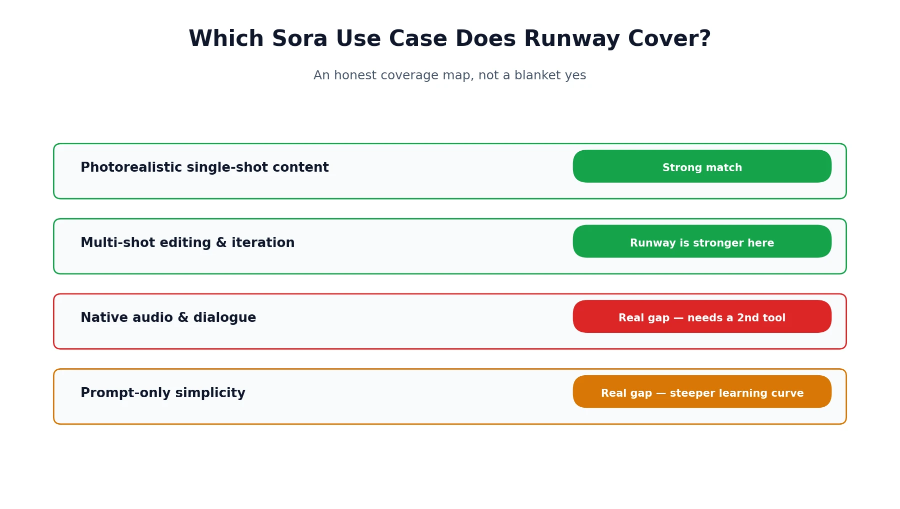
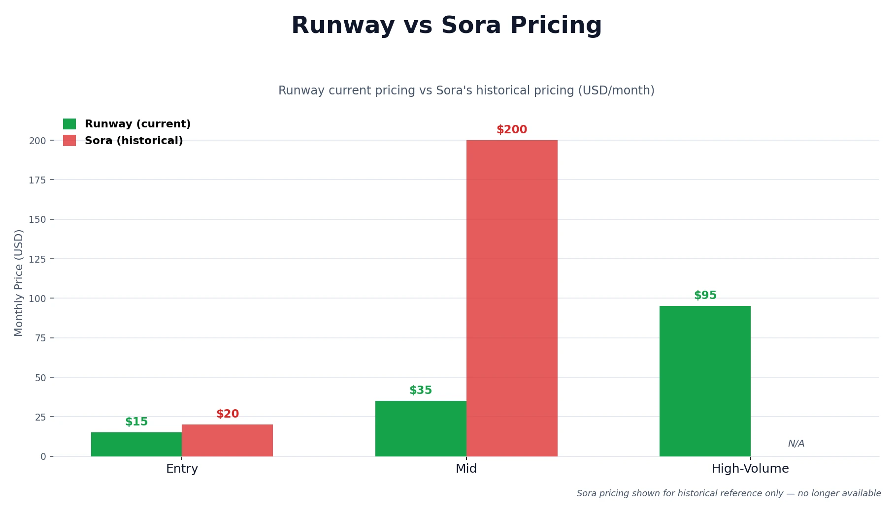

Searching "Runway vs Sora" in 2026 turns up dozens of comparison pages, and nearly all of them have the same problem: they're comparing Runway against a product that no longer exists. OpenAI discontinued Sora's web and app experiences on April 26, 2026, with the API following on September 24, 2026 — yet several of these comparison pages have been updated as recently as June 2026 and still describe Sora as a live, purchasable tool. This page takes a different, more honest approach: it covers what Sora offered while it was around, what Runway actually costs and does today, and — the question that actually matters if you landed here — which of Sora's old use cases Runway genuinely covers. If you want the full story on Sora's shutdown and pricing history, our [Sora AI pricing review](/reviews/sora-ai-pricing-review/) covers that in depth.

## Is This a Fair Comparison Anymore?

Not in the way most competitor pages present it, no — this needs to be a comparison between a live tool and a historical one, not two active products. Sora's web and app experiences were shut down on April 26, 2026, and its API is scheduled to follow on September 24, 2026, after which it won't be accessible in any form. That means everything about Sora in this piece is historical reference, sourced from when it was live, while everything about Runway reflects its current, actively developed state. Treating the two as equally "current" — which is exactly what most existing comparison pages still do — gives a misleading picture of what you can actually go sign up for today.

## What Made Sora Different While It Was Live

Sora's standout feature was native audio: it generated synchronized dialogue, sound effects, and ambient sound directly alongside the video in a single pass, something most AI video tools, including Runway, still don't do natively. Paired with a genuinely simple, prompt-only workflow — describe a scene in plain language and get a finished clip with no motion brushes, camera path tools, or manual editing required — it was the most accessible entry point into AI video generation for someone with no editing background at all. That combination of one-step audio and low friction is what made it distinct, and it's the specific gap that anyone migrating away from Sora now has to solve some other way.

## What Runway Offers Now

Runway is a professional AI video platform built around Gen-4 and newer model updates, and unlike Sora, it's still actively developed and improved. Where Sora leaned on prompt simplicity, Runway leans on a full editing toolkit: Motion Brush for targeted movement control, Director Mode for defining camera paths, and Aleph for applying AI-driven edits to footage you've already shot or generated. It supports text-to-video, image-to-video, and video-to-video workflows, plus Adobe Premiere and After Effects plugins that let it slot directly into a professional editing pipeline rather than living as a standalone app.

## Runway vs Sora at a Glance

A quick note before the table: only the Runway column reflects a currently verifiable, live product. The Sora column is historical reference based on its last known pricing and specs before discontinuation, sourced from our full Sora pricing review — treat it as "what it used to be," not "what you can get."

| Category | Runway (current) | Sora (historical, discontinued) |
|---|---|---|
| Status | Active, in development | Discontinued April–September 2026 |
| Made by | Runway | OpenAI |
| Native audio | No | Yes — synchronized dialogue and sound |
| Editing tools | Motion Brush, Director Mode, Aleph | None — prompt-only generation |
| Workflow | Web app, credit-based, Adobe plugins | Bundled inside ChatGPT |
| Entry price | ~$15/month (Standard) | Was $20/month (ChatGPT Plus) |
| Best known for | Character consistency, editing depth | Prompt simplicity, native audio |

## Which Sora Use Case Does Runway Actually Cover?

This is the question that actually matters if you're here because Sora is gone. The honest answer depends on exactly what you used Sora for, so it's worth breaking down by specific use case rather than giving one blanket yes or no.

### Photorealistic Single-Shot Content

Runway's Gen-4-era models cover this well, and independent quality benchmarks generally rate Runway's motion coherence and visual fidelity at or near the top of the category. It's a close, credible substitute here, even if the specific look differs slightly from what Sora produced. Lighting behavior, camera movement, and how convincingly a scene holds together across a single shot are all comparable to what Sora delivered at its best, and in some third-party benchmark comparisons Runway edges ahead on fine detail retention during fast motion.

### Native Audio and Dialogue

This is the real gap. Runway generates silent clips, full stop. If Sora's built-in synchronized audio was central to your workflow — dialogue that matched lip movement, ambient sound that matched the scene, sound effects timed to visible action — Runway alone doesn't replace that. You'll need to pair it with a dedicated audio tool and sync manually in a separate editing pass, which adds real time to a workflow that used to be one step.

### Prompt-Only Simplicity

Also a real gap, in the other direction. Runway's editing suite is powerful, but it comes with a steeper learning curve than Sora's type-a-prompt-and-go approach. If you valued Sora specifically because it required zero editing skill, expect a real adjustment period with Runway's tools — Motion Brush and Director Mode both take some practice before they feel faster than simply describing what you want and waiting.

### Multi-Shot Editing and Iterative Refinement

This is where Runway is arguably the stronger tool, even compared to Sora at its best. Motion Brush, Director Mode, and Aleph give you direct control to refine a shot rather than regenerating blind and hoping for a better result, which was never something Sora offered. For anyone producing a sequence of connected shots rather than a single standalone clip, this level of control is a genuine upgrade over what Sora's prompt-only approach could deliver, since Sora offered no way to nudge a specific element of a generation without starting over completely.

## What Runway Doesn't Replace

To be direct about the limitations rather than overselling Runway as a drop-in substitute: it has no equivalent to Sora's one-step synchronized audio generation, so anything relying on that specific feature needs a second tool and manual work to recreate. It also asks more of a first-time user than Sora did — expect to spend real time learning Motion Brush, Director Mode, and the credit system before Runway starts feeling as fast as Sora's prompt-only flow did.

## Runway Pros and Cons

Independent user sentiment on platforms like [G2's Runway reviews](https://www.g2.com/products/runwayml/reviews) largely echoes what shows up in hands-on testing, so the strengths and weaknesses below track closely with what real users report rather than just vendor marketing claims.

**Runway pros:**
- Actively developed, with regular model updates rather than a fixed, aging feature set
- A genuinely deep editing suite — Motion Brush, Director Mode, and Aleph go well beyond prompt-only generation
- Strong character and scene consistency across multiple shots
- Adobe Premiere and After Effects plugins for slotting into an existing professional pipeline
- Multiple pricing tiers, including an Unlimited option for high-volume users

**Runway cons:**
- No native audio generation — every clip is silent by default
- A real learning curve compared to a prompt-only tool
- Credit-based pricing requires some planning to avoid unexpected costs at scale
- Maximum clip length is shorter than Sora's was at its longest settings

## Runway Pricing: What You'll Actually Pay

Runway's plans are credit-based rather than flat generation counts. The Standard tier starts around $15/month with a set credit allotment, Pro runs around $35/month with a larger pool, and an Unlimited tier sits around $95/month for teams or individuals generating at high volume. A short, standard-resolution clip typically costs a modest number of credits, with 4K or longer renders consuming credits faster — similar in spirit to how Sora's own credit system worked, just under a different company and a different set of numbers. What Sora cost across its lifetime and how its own credit mechanics worked before shutting down is covered in full detail in the Sora review linked above, rather than relying on the many now-outdated comparisons still citing its old pricing as current.

## Should You Pair Runway With Another Tool?

Since Sora's one-tool, audio-included simplicity is gone, most of what it offered now has to be rebuilt from a couple of tools working together rather than found in a single app. Pairing Runway with a dedicated voice and audio tool like [ElevenLabs](https://elevenlabs.io) covers the dialogue and sound design gap, while pairing it with an avatar-led platform like HeyGen makes sense specifically for presenter-style content that needs a consistent on-screen speaker rather than pure B-roll. Neither pairing perfectly replicates Sora's single-pass simplicity, but together they cover most of the ground Sora used to handle alone, at the cost of an extra tool and a manual syncing step. If music-driven video is closer to what you're actually making, our [best AI music video generators](/best-tools/best-ai-music-video-generators/) roundup covers that adjacent corner of the AI video space in more depth than either Runway or Sora ever addressed.

## What This Means for the Future of AI Video

Sora's shutdown is a useful data point for anyone choosing a video tool going forward, not just a historical footnote. The broader lesson, covered in more depth in our Sora review, is that flashy demos and even genuine viral popularity don't guarantee a product survives if the compute cost of generating video at scale outpaces what users are willing to pay. Runway's longer track record and steadier, credit-based pricing model are worth weighing against that backdrop — a tool that's stayed in active development through several model generations carries a different kind of risk profile than one that launched fast and folded within a year.

That risk profile matters practically, not just as an abstract concern. Anyone building a workflow, a course, or a business process around a specific AI tool is implicitly betting on that tool still existing in a year. Runway has now outlasted several well-funded competitors precisely because its pricing model ties revenue more directly to actual usage rather than subsidizing every generation at a loss, the same structural problem that ultimately sank Sora. That doesn't guarantee Runway is immune to the same pressures, but it does mean the economics are at least pointed in a more sustainable direction — worth factoring in the next time a flashy new video tool launches promising more for less than the compute behind it can realistically support.

## Runway vs Sora FAQ

**Is Sora still available to compare against Runway?**
No — Sora's web and app experiences shut down April 26, 2026, with the API following September 24, 2026. This page compares Runway's current offering against Sora's historical one.

**Is Runway better than Sora was?**
They solved different problems. Runway offers deeper editing tools and ongoing development; Sora offered simpler prompting and native audio. Neither is a strict upgrade over the other — it depends on which of those two things mattered more to your workflow.

**What does Runway cost?**
Plans start around $15/month for the Standard tier, scaling to around $35/month for Pro and $95/month for Unlimited, all credit-based rather than flat generation counts.

**Does Runway have built-in audio like Sora did?**
No. Runway generates silent clips only; Sora's synchronized dialogue and sound generation was one of its more distinct, harder-to-replace features.

**What's the closest replacement for Sora's native audio feature?**
Pairing Runway with a dedicated tool like ElevenLabs for voice and audio is the closest workaround currently available, though it requires manual syncing rather than Sora's single-pass generation.

**Can Runway do everything Sora could do?**
Not exactly — it covers photorealistic generation and multi-shot editing as well as or better than Sora did, but it doesn't replicate Sora's native audio or its prompt-only simplicity.

*This comparison reflects publicly available information as of August 2026. Runway's pricing and features are current as of this writing and subject to change — always confirm directly on [Runway's pricing page](https://runwayml.com/pricing) before subscribing. Sora's details reflect its historical, pre-discontinuation state as covered in the review linked above. If you're weighing HeyGen alongside Runway for avatar-led content, our [HeyGen vs. Synthesia](/compare/heygen-vs-synthesia/) comparison covers that adjacent corner of AI video. Browse more of our AI tool guides from the [homepage](/).*

## Affiliate Disclosure

This article may contain affiliate links. If you sign up for Runway or another product through a link on this page, we may earn a commission at no extra cost to you. This helps support the research and testing that goes into guides like this one. Our opinions and recommendations are based on independent research — affiliate relationships don't influence which products we cover or how we rate them.