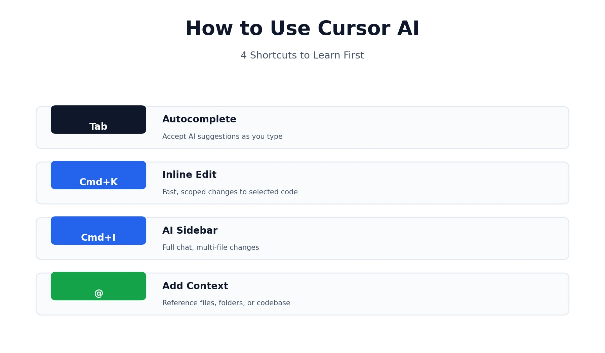
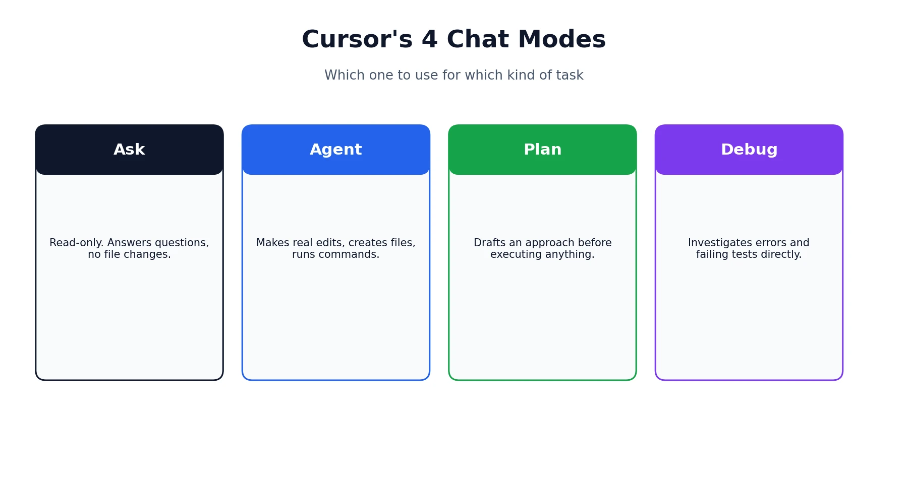
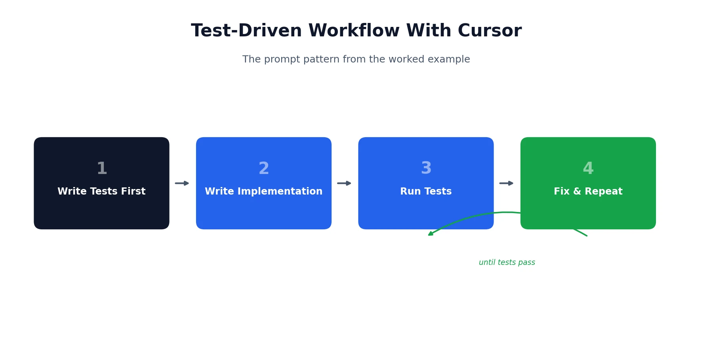

Cursor looks like VS Code, which is exactly why so many people open it for the first time and aren't sure what to actually click. Learning how to use Cursor AI well is less about memorizing every feature and more about learning a handful of shortcuts and habits that make the AI genuinely useful instead of just a fancier autocomplete. This guide is built for beginners and experienced developers alike, and everything in it works whether you're on the free Hobby plan or a paid tier — the core workflow doesn't change, only how much premium-model usage you get. This guide walks through installation, the core features you'll use daily, the honest tradeoffs of features like YOLO mode, and a real example you can follow along with. If you're still deciding whether Cursor is worth paying for, our [Cursor pricing review](/reviews/cursor-ai-pricing-review/) covers every plan and the credit system in detail — this guide picks up from there and focuses purely on getting productive inside the editor itself.

## A Quick Refresher Before You Start

If you've never opened Cursor before, here's the one-sentence version: it's a code editor forked from VS Code, so the layout and shortcuts you already know mostly carry over, but AI is woven directly into how you write and edit code rather than sitting off to the side as an add-on. That's really all the background you need before diving in — the rest of this guide is about the actual workflow, not the theory behind it.

## How to Install Cursor AI

Getting started takes a few minutes:

1. **Download Cursor** from [cursor.com/downloads](https://cursor.com/downloads) for Windows, macOS, or Linux.
2. **Run the installer** — a standard `.exe` on Windows, drag-to-Applications on macOS, or an AppImage on Linux (you'll need to run `chmod a+x` on the file first to make it executable).
3. **Sign in or create an account.** This step is required before any AI features will work, even on the free Hobby plan.
4. **Import your VS Code settings**, if prompted. Cursor can pull in your existing themes, keybindings, and extensions automatically, which is the fastest way to feel at home if you're coming from VS Code.

Once that's done, you're looking at an interface that will feel immediately familiar if you've used VS Code — the real learning curve is in the AI features layered on top, not the editor itself.

## A Quick Tour of Cursor's Interface

Before diving into the AI features, it helps to know where things live:

- **Editor mode** (top-left corner) gives you the closest experience to plain VS Code, if you want to ease in gradually.
- **The AI sidebar** opens with Cmd+I (Mac) or Ctrl+I (Windows/Linux), or by clicking the icon in the top-right corner.
- **The left panel** holds your file explorer, same as any standard code editor.
- **The bottom panel** houses your terminal and source control tab, including a small icon that can generate commit messages for you from your AI Chat.

## Cursor's Core AI Features, One at a Time

Most of what makes Cursor useful comes down to four keyboard shortcuts. Learning what each one is actually for will save you more time than any other single thing in this guide.

### Tab — Autocomplete

As you type, Cursor shows suggestions in grey text for what to write next. Hit Tab to accept it. This is the lowest-friction way to try Cursor's AI without committing to a full conversation — it's especially good at repetitive changes, like updating a pattern across similar lines, and at jumping your cursor to the next place that needs the same edit. Press Tab again on that jump and it'll often complete the next occurrence too. It takes a little time to get a feel for what it will and won't predict well.

### Cmd+K / Ctrl+K — Inline Edit

Select a piece of code, hit Cmd+K (or Ctrl+K on Windows/Linux), and type what you want changed. This is the fastest way to make a small, scoped edit — renaming a variable's usage, adjusting a function's logic, fixing a specific bug — without opening a full conversation. Because you've already selected the exact code, Cursor doesn't need to guess what you're referring to, which makes it quicker than the sidebar for narrow changes.

### Cmd+I / Ctrl+I — The AI Sidebar

This opens the main chat interface, where you can ask questions, request changes across multiple files, or just talk through a problem the way you might in a Slack message to a colleague. If you highlight code first, that snippet gets added as context automatically. This is where you'll spend most of your time once you're past the basics.

### The @ Symbol — Adding Context

Inside the sidebar, typing `@` lets you reference specific files, folders, or your entire codebase with `@codebase`. You can also drag and drop files or folders straight from the file explorer into the chat. The more precisely you point Cursor at the right context, the less it has to guess — and guessing is where most bad AI-generated code comes from.

## Cursor's Modes: Ask, Agent, Plan, and Debug

Click the mode selector in the chat sidebar and you'll find four options, each suited to a different kind of task.

- **Ask mode** is read-only. It answers questions and suggests changes without touching a single file. Good for when you want an explanation, not an edit.
- **Agent mode** can actually make changes — editing files, creating new ones, and running terminal commands. This is the default most experienced users leave themselves in, since most real work involves actual changes, not just questions.
- **Plan mode** has Cursor draft an approach before executing anything, which is worth reaching for on genuinely complex, multi-step tasks where you want to sanity-check the plan before any code gets touched.
- **Debug mode** is the newest of the four, purpose-built for troubleshooting. Point it at a failing test or an error message, and it investigates the cause rather than jumping straight to generating new code.

## Giving Cursor Better Context

Beyond the `@` symbol, a few other context tools are worth knowing:

- **`@Web`** lets Cursor pull in current information from the internet rather than relying only on its training data — useful for questions about a library's latest API or a recent framework change.
- **`@Docs`** lets you add a URL to a library's documentation so Cursor can reference it directly, which matters most for smaller or private libraries that weren't part of its training data in the first place.
- **Highlighting code** before opening the sidebar automatically includes that snippet as context, which is often faster than typing `@filename` for something you're already looking at.

## Setting Up Project Rules

If you find yourself correcting Cursor for the same style issue more than once, Project Rules solve that. They're persistent instructions — coding conventions, preferred frameworks, formatting preferences — that Cursor references on every request rather than something you have to repeat each time.

A genuinely useful habit: after Cursor makes a mistake and you fix it, ask it directly — *"Can you suggest what I should add to my Project Rules so you don't make this same mistake again?"* — and let it draft the rule itself. It saves you the effort of translating your own correction into a formal instruction, and it tends to phrase things in a way the model responds to reliably. Full documentation on the current rules system is available in [Cursor's own docs](https://docs.cursor.com/context/rules-for-ai).

## Connecting an MCP Server (Optional, Advanced)

For anyone who wants Cursor to reach beyond your local codebase — pulling data from GitHub, Notion, or a database directly into a conversation — an MCP (Model Context Protocol) server is how that connection gets made. It's genuinely optional; most people never need to touch this. If you do want to go further, [the official MCP documentation](https://modelcontextprotocol.io) covers the protocol in depth, and Cursor's own settings include a Models tab where servers get configured.

## Build Something With Cursor: A Worked Example

Reading about features only gets you so far — here's a small, complete example you can actually follow.

Say you want a simple command-line tool that renames files in a folder by adding today's date as a prefix. Open the AI sidebar (Cmd+I / Ctrl+I), make sure you're in Agent mode, and try a prompt like:

> Write a Python script that takes a folder path as an argument and renames every file inside it by adding today's date as a prefix, in YYYY-MM-DD format. Write tests first, then the implementation, then run the tests and fix anything that fails.

That last instruction matters more than it looks. Asking for tests before the implementation gives you a real check on whether the code actually works, rather than code that merely looks plausible. Cursor will typically create a test file, write the implementation, and — if you have YOLO mode on — run the tests itself and iterate until they pass.

Once it's done, try a follow-up in Cmd+K on just the renaming function: *"Handle the case where a file with that name already exists."* That's the inline-edit workflow in action — small, scoped, fast.

## Practical Tips for Getting Better Results

A few habits separate people who find Cursor genuinely useful from people who bounce off it after a rough first week.

**Ask it to play back your requirements first.** Before a complex task, try: *"Before writing any code, tell me what you're planning to do, and I'll confirm before you start."* This catches misunderstandings before they turn into wasted generations.

**Give it a reference when you can.** If you've found a Stack Overflow answer, a tutorial page, or an existing file that does something similar to what you want, point Cursor at it directly. It follows a concrete example far better than an abstract description.

**Understand YOLO mode before switching it on.** Turning it on lets the agent run commands — tests, builds, file creation — without stopping to ask permission each time, which makes iterative workflows like the test-driven example above much faster. The tradeoff is real: it also means the AI is making and running changes with less of your oversight in the loop. Most people are better off leaving it off until they've built a feel for how Cursor behaves on their specific codebase.

**Know where it struggles.** Cursor tends to do well on generating boilerplate, working with well-known frameworks and languages, and fixing clearly described bugs in small-to-medium codebases. It's noticeably less reliable on large, unfamiliar codebases with a lot of implicit, undocumented conventions — the kind of context a human engineer picks up over months that simply isn't written down anywhere for the AI to reference.

## What to Do When Cursor Gets It Wrong

AI-generated code isn't always right, and Cursor has a real safety net for when it isn't. As the agent works, it creates checkpoints — scroll back through the chat history and you'll find a Restore option that rolls your code back to an earlier state. This makes it genuinely safe to let Agent mode run further than you might otherwise be comfortable with, since a bad batch of changes is never more than one click away from undone.

The other half of this is knowing when to stop iterating and step in yourself. If you've corrected Cursor on the same misunderstanding two or three times in a row, that's usually a sign to take over manually rather than trying a fourth prompt — at that point you're spending more time explaining than you'd spend just writing the fix.

## Cursor AI vs. Other Tools

If you're trying to decide whether Cursor is the right AI coding tool for your workflow in the first place — as opposed to already having picked it and wanting to use it well — that's a separate question from this guide. Our full [Cursor vs. GitHub Copilot](/compare/cursor-vs-github-copilot/) comparison breaks down the real tradeoffs: pricing, IDE support, agent autonomy, and which one fits which kind of developer.

## Final Thoughts

Learning how to use Cursor AI well rewards a specific kind of habit: use Tab for the small stuff, reach for Cmd+K when you know exactly what needs to change, and save the full sidebar conversation for anything that needs real back-and-forth. Layer in Project Rules once you notice yourself repeating the same corrections, and don't be afraid of Agent mode once you understand what Restore Checkpoint protects you from. None of this takes long to learn — most of it clicks within a first real project, not a tutorial.

*This guide reflects Cursor's features and interface as of August 2026. Cursor updates frequently, so exact menus, shortcuts, and mode names may shift over time — check [Cursor's changelog](https://cursor.com/changelog) if something in this guide doesn't match what you're seeing. Browse more of our AI tool guides from the [homepage](/).*