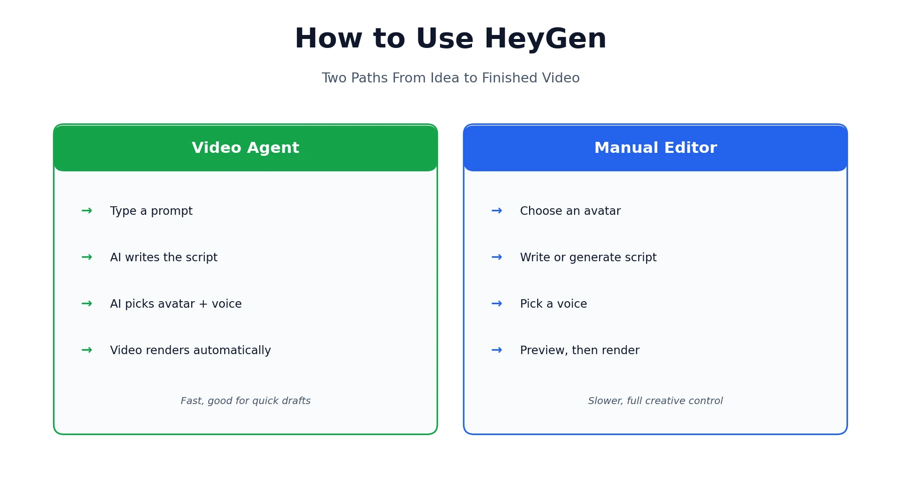
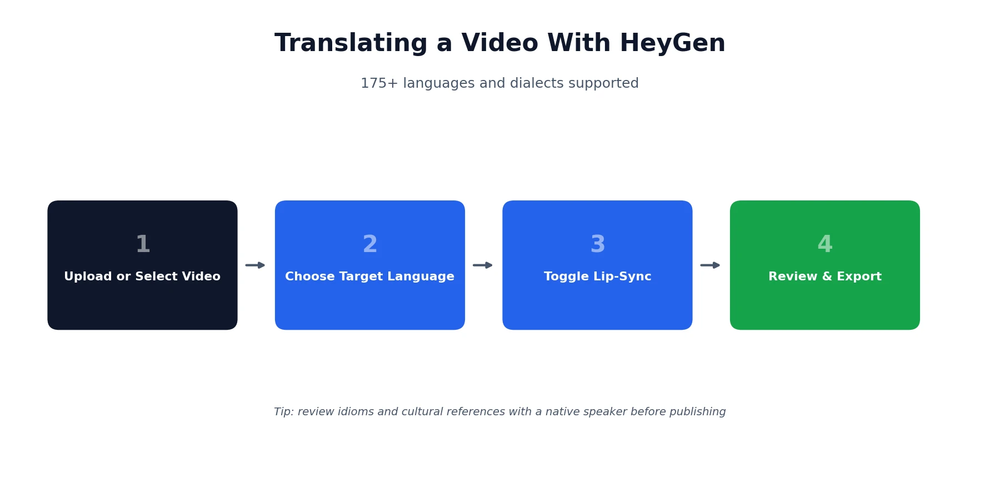
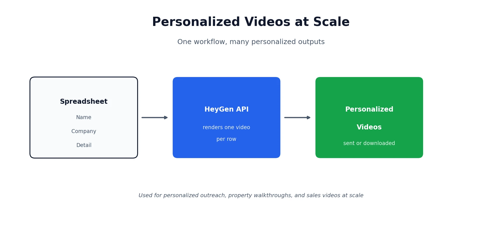

HeyGen can feel like two different products depending on how you approach it: type a prompt and get a finished video in minutes, or build one piece by piece with full control over the avatar, script, and voice. Neither way is wrong — they just suit different situations. This guide walks through both paths, plus translating existing footage, one real way to automate personalized videos at scale, and a newer, more technical HeyGen product most people haven't heard of yet. If you're still comparing plans, our [HeyGen pricing review](/reviews/heygen-pricing-review/) covers every tier and the credit system in detail — this guide picks up from there and stays focused on actually making videos.

## Before You Start

If this is your first time in HeyGen, here's the short version: it turns a script, prompt, or existing recording into a presenter-led video using AI avatars, generated voices, and translation — no camera, actor, or studio required. That's really all the context this guide needs to give you, since the goal here is showing you how to actually use it, not re-explaining what it is from scratch.

## How to Create Your First HeyGen Account

Signing up takes a couple of minutes and doesn't require a credit card. Head to HeyGen's site, create an account with an email or a Google/Microsoft login, and you'll land on the free plan by default. That gives you a small number of short videos with a watermark — enough to get a real feel for the interface, the avatar library, and how a script turns into a finished video before deciding whether to upgrade.

Once you're in, take a minute to look around before jumping into your first video. The main dashboard shows recent projects, a library of stock avatars and voices, and a prompt box for Video Agent right up top. Getting oriented here first saves you from hunting for features mid-project later. If you want the exact numbers on what each paid tier unlocks beyond the free plan, that's covered fully in our pricing review rather than repeated here.

## The Fastest Way: Using Video Agent

If you just want a video and don't need to fine-tune every detail, Video Agent is the quickest route from idea to finished output. Type a description of what you want — something like "a presenter explaining our product launch in 30 seconds" — and it handles the rest: writing the script, selecting a fitting avatar and voice, and rendering the video without you touching a timeline.

The quality of what you get back tracks closely with how specific your prompt is. A vague request produces a generic result; naming your product, your tone, roughly how long you want the video to run, and who it's for gets you much closer to something usable on the first try. Compare "make a marketing video" against "a 30-second energetic video introducing our new budgeting app to young professionals, ending with a call to download" — the second version gives Video Agent enough to work with that you'll likely need only minor edits rather than a full rewrite.

Video Agent is well-suited to quick internal videos, social content, or a first draft you'll refine later, since it removes the blank-page problem entirely. For anything requiring exact brand language, a specific avatar you've already built, or precise timing down to the second, the manual approach below gives you more control over every piece.

## The Manual Way: Building a Video Step by Step

When you need more control than a prompt allows, HeyGen's standard editor breaks the process into a few clear steps.

**Choose an avatar.** You can pick from HeyGen's library of stock avatars, spanning different appearances, outfits, and settings, or build a custom digital twin from a short video of yourself. Custom avatars require an on-camera identity verification step and are available starting on paid plans — full pricing on that is in our review, linked above. If you're producing regular content under a consistent brand identity, a custom avatar is usually worth the setup time; for one-off or varied content, the stock library alone covers most needs.

**Write or generate a script.** Type your own script directly, or let HeyGen draft one from a short prompt that you can then edit line by line. Either way, you'll see the full text before anything renders, so it's easy to catch anything that reads awkwardly out loud. This is also the point to decide on pacing — HeyGen estimates runtime as you type, so you can trim or expand before committing to a render.

**Pick a voice.** Choose from HeyGen's stock voice library, filterable by language, tone, and gender, or use a cloned voice if you've set one up. Voice and avatar don't have to match a stereotype — you can pair any voice with any avatar, which is useful if you've found a voice that fits your brand but not the exact avatar you'd normally pick.

**Preview, then render.** HeyGen shows a preview before committing to a final render, which is worth actually watching in full rather than skipping — catching a script or pacing issue here saves you a wasted render and, depending on your plan, real credits.

## How to Translate a Video with HeyGen

Translation is one of HeyGen's strongest, most distinct features, and it deserves its own walkthrough rather than a footnote. Upload an existing video, or select one you've already made inside HeyGen, choose your target language from a list covering 175+ languages and dialects, and decide whether to turn on lip-sync — which adjusts mouth movement to match the new audio rather than leaving the original lip movement mismatched with translated speech.

Machine translation of a script generally handles straightforward, literal content well — instructions, product descriptions, and factual explanations tend to come through cleanly. Where it can wobble is idiom, humor, and anything culturally specific — a joke or turn of phrase that lands in English doesn't always translate cleanly, so it's worth having a native speaker review anything customer-facing before it goes out, especially for markets where tone matters as much as accuracy. A useful habit: write your original script in plain, direct language from the start if you know it's headed for translation, since simpler source material tends to translate more reliably than anything relying on wordplay or cultural references.

## Using HeyGen for Personalized Videos at Scale

One workflow worth knowing about, even if you never build it yourself: HeyGen's API accepts a script and returns a rendered video, which means it's possible to loop through a list of names, companies, or details and generate a personalized video for each one automatically, rather than manually building dozens of near-identical videos by hand.

The shape of it usually looks like this — a spreadsheet with a row per person (name, company, whatever detail you want to personalize), a script template with those fields swapped in per row, an API call that renders each version, and a final step that sends or downloads the result. Real estate agents have used this exact pattern to send a personalized property walkthrough to each lead by name, and sales teams use it for outreach that feels individually made rather than templated, since a video addressed to someone by name and company tends to get noticed far more than a generic template.

You don't need to be a developer to use HeyGen day to day, but if this kind of automation is something your team wants, it's a genuinely achievable project with a bit of API and spreadsheet work, or through a no-code automation tool that connects to HeyGen's API directly without writing custom code at all. The main tradeoff to plan around is credits — each rendered video in a batch draws from the same pool as videos you create manually, so a campaign of a few hundred personalized videos needs a plan tier with enough headroom to cover it.

## HyperFrames: HeyGen's Newer, More Technical Tool

Separate from the main HeyGen app, HyperFrames is a newer product worth knowing exists, even though it's not for everyone. It's free, open-source, and generates motion-graphics video — think animated product intros or explainer-style graphics rather than avatar-led presentation videos — through a coding agent, a CLI, or a Studio interface. Rendering locally with HyperFrames doesn't draw from your HeyGen credit balance at all.

The honest framing here: this is built for developers comfortable working from a terminal or directing a coding agent, not a general HeyGen user just looking to make a presenter video. If that's not you, there's no need to touch it — the main HeyGen app covers everything most people need. Where HyperFrames does make sense for a non-developer is if you're already working alongside a technical teammate who wants to generate branded intro or outro graphics programmatically, since it can plug into an existing content pipeline without anyone touching HeyGen's main video editor at all.

## HeyGen for Game Studios and Creators

Outside marketing and training, HeyGen has picked up real use among game developers and studios, mostly for work that isn't the final cinematic product. Quick pitch videos, mocked-up character dialogue to test a concept before full production, localized marketing material, and internal training content are all places where an avatar-led video saves real time compared to a full production pipeline. It isn't a substitute for in-engine cinematic rendering, but as a fast way to validate an idea or produce supporting content, it holds up well.

For a small studio pitching a publisher, a rough avatar-led walkthrough of a game concept can communicate tone and pacing well before anyone commits to a real trailer, and translated versions of the same pitch make it easier to test interest with international publishers without re-recording anything from scratch.

## Practical Tips for Better HeyGen Videos

A handful of habits make a real difference in output quality:

**Write for the ear, not the eye.** Read your script out loud before rendering. Sentences that look fine on a page often sound stiff or run-on when spoken — short sentences and natural pauses read as far more human once an avatar is actually saying them.

**Always preview before rendering.** It costs nothing extra and catches pacing or script issues before you spend a full render on something you'll just redo.

**Give custom avatars clean source footage.** Good lighting, a steady camera, and a clear, unobstructed view of your face during the training video all translate directly into a more convincing final avatar — rushed or poorly lit source footage is the most common reason a custom avatar looks noticeably artificial.

**Match voice pacing to the avatar's energy.** A fast, clipped voice paired with a calm, still avatar can feel oddly mismatched on screen. If your script has a lot of energy, either pick a voice with matching pace or expect to trim a few lines so the avatar doesn't look like it's rushing to keep up with the audio.

*This guide reflects HeyGen's features and interface as of August 2026. Features, pricing, and available tools change over time — check [HeyGen's official site](https://www.heygen.com) if something here doesn't match what you're seeing. Browse more of our AI tool guides from the [homepage](/).*

## Affiliate Disclosure

This article may contain affiliate links. If you sign up for HeyGen or another product through a link on this page, we may earn a commission at no extra cost to you. This helps support the research and testing that goes into guides like this one. Our opinions and recommendations are based on independent research and, where possible, hands-on use of the platform — affiliate relationships don't influence which products we cover or how we rate them.