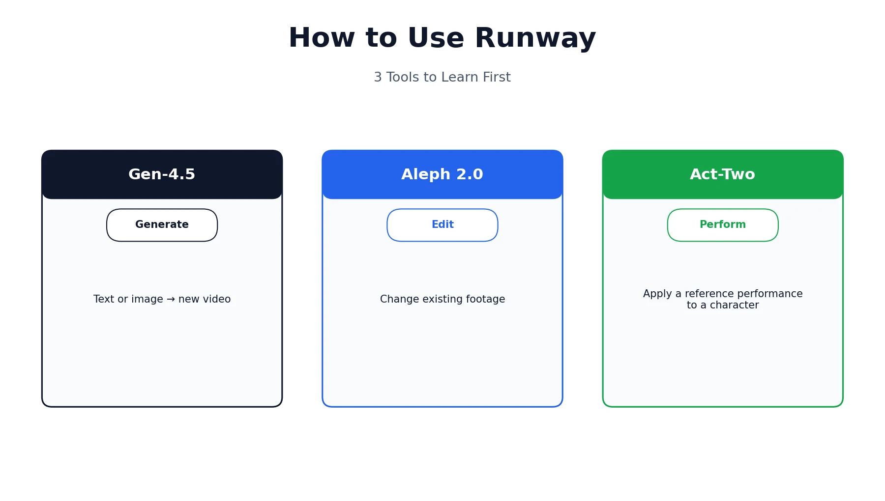
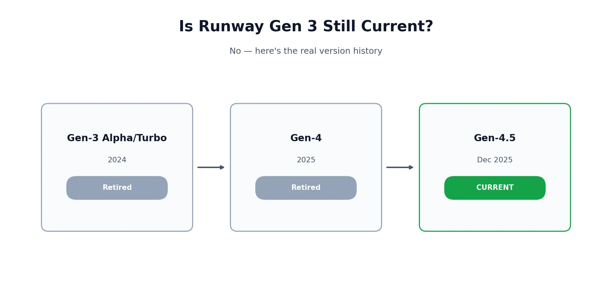
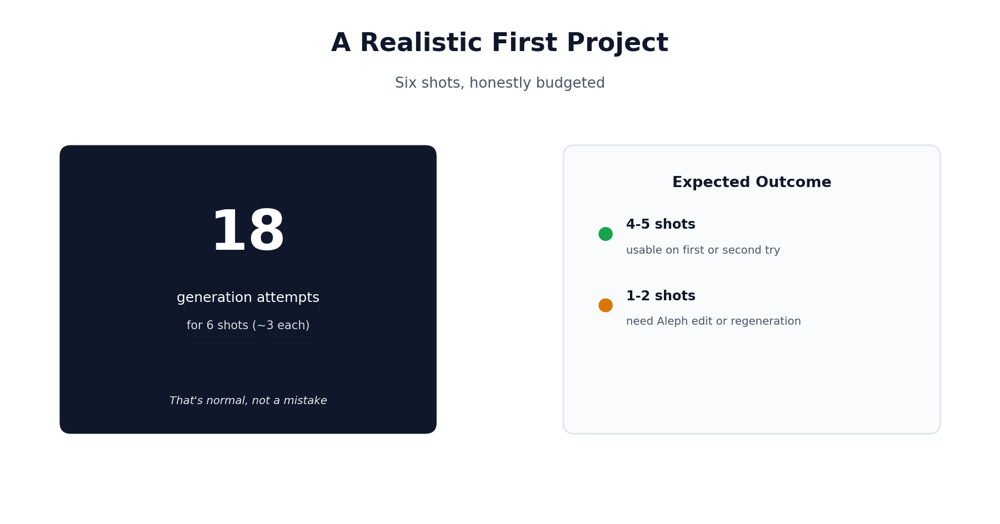

Runway has changed a lot since its early text-to-video days, and a fair number of tutorials still floating around online describe menus and models that no longer exist. Learning how to use Runway well in 2026 means starting with the current lineup — Gen-4.5 for generation, Aleph 2.0 for editing existing footage, and Act-Two for character performances — rather than a Gen-3-era workflow that's been retired. This guide walks through getting started, generating and editing video, a realistic first project with honest expectations, and Runway's own disclosed limitations. If you're still deciding whether Runway is the right tool for your use case in the first place, our [Runway vs. Sora](/compare/runway-vs-sora/) comparison covers that decision in depth — this guide picks up from there and focuses on actually using it well.

## What Runway Actually Is Now

Runway has grown beyond being just a video generation tool. The consumer-facing product most people mean when they say "Runway" is Runway Creative — the web and mobile app covering generation, editing, and character tools. Separately, Runway also offers a developer API (Runway Dev) and has expanded into broader world-model and robotics research, but neither of those is what this guide covers. Everything here focuses specifically on Runway Creative, the tool you'd actually open to make or edit a video.

## How to Access Runway — Web, iOS, and Android

Runway is available at runwayml.com with no credit card required to create a free account, and separately through dedicated iOS and Android apps for anyone who wants to generate or edit video from a phone. Signing in with the same account on any surface keeps your projects, assets, and credit balance in sync, so a project started on desktop can be picked up and finished on mobile without any extra setup. The mobile apps cover most of the core generation and editing tools, though a few advanced controls — precise camera path adjustments in particular — are easier to use with a mouse and a larger screen than on a phone.

## A Tour of Runway's Interface

Once you're signed in, the main dashboard shows your recent Projects, an Assets library for uploaded images and video, and a model or tool selector where you choose what you're doing — generating new video, editing existing footage, or working with a character. Each project keeps its generation history, so you can compare different attempts at the same shot side by side rather than losing earlier versions every time you try again.

A credit counter sits in a visible spot on every screen, which is worth glancing at before starting a longer or higher-resolution generation, since it's easy to lose track of usage across a long working session. The left-hand navigation switches between your main tools — generation, editing, and character work each get their own dedicated space rather than being crammed into one all-purpose editor, which keeps the interface less overwhelming than it might otherwise be given how much the platform now covers.

## Generating Video with Gen-4.5

Gen-4.5, released in December 2025, is Runway's current flagship model, and it responds far better to precise, shot-list-style direction than to vague mood descriptions. Telling it "cinematic, dramatic, beautiful lighting" leaves the model to guess at everything; specifying the lens, camera height, movement, and exact moment of action gets a result far closer to what you actually had in mind.

### Text-to-Video

Describe a scene in plain language, and Gen-4.5 generates a clip from scratch. This mode works best when you write the way you'd brief a camera operator — not just what's in the shot, but how the camera is positioned and moving, and what happens over the course of the clip rather than a single static description.

### Image-to-Video

Upload a still image and describe the motion or action you want applied to it, and Runway animates the scene while preserving the original image's composition, lighting, and style. This mode is particularly useful when you already have a specific look locked in — a product photo, a piece of concept art, a frame you've generated elsewhere — and just need it to move.

## Editing Existing Footage with Aleph 2.0

Aleph 2.0 is Runway's video-to-video editing tool, and it solves a different problem than Gen-4.5. Rather than generating a new clip from a text description, you upload footage you already have and describe a change — a different time of day, a swapped background, an added or removed object — and Aleph applies that edit while keeping the original motion, camera work, and structure intact. It's the right tool when you have a clip that's 90% right and needs one specific thing changed, rather than starting over with a fresh generation.

This distinction matters more than it might seem at first. Generating a brand-new clip to fix one small issue means gambling on everything else that was already working — the camera move, the pacing, the composition — all being recreated correctly a second time. Aleph avoids that gamble by only touching the specific element you describe, which makes it the more reliable choice whenever the bulk of a shot is already right and only one detail needs to change.

## Act-Two: Bringing a Character to Life

Act-Two is Runway's character performance tool, and it works differently from either generation or editing. You provide a reference performance — footage of yourself or another actor delivering expressions, movement, and timing — and Runway applies that performance to a character or avatar in your project. It's built for anyone who needs a character to emote and move convincingly without hand-animating every frame, effectively letting you "act" through a generated character rather than describing a performance in a text prompt and hoping the result matches what you pictured.

## Is Runway Gen 3 Still a Thing?

No, not as Runway's current model — Gen-3 Alpha and Turbo were real, well-regarded models in their time, but they've since been superseded by Gen-4 and then Gen-4.5. If a tutorial you're following references a Green Screen tool, an older Video Projects dashboard, or a Gen-3-specific menu, it's describing an interface that's since changed. The underlying concepts — text-to-video, image-to-video, iterative generation — still apply, but the actual menus and model names in the current app won't match what an older guide shows.

## Try Runway for Free: What You Actually Get

Runway's free tier gives you a limited pool of credits to test generation and editing without paying anything or entering payment details. It's enough to get a real feel for output quality and the interface, but the credit allowance runs out quickly if you're generating more than a handful of clips, especially at higher resolution or with longer runtimes — a single high-resolution Gen-4.5 generation can use a meaningful chunk of a free account's entire monthly allowance in one attempt.

Paid plans start around $15/month for meaningfully more credits, with higher tiers for regular or high-volume use, and a Team plan for 2 to 9 seats that pools credits across a group rather than allocating them per person. Full current pricing is always worth checking directly on [Runway's pricing page](https://runwayml.com/pricing) rather than trusting a number from an older article, since these figures shift periodically and several competing guides we reviewed while researching this piece already had outdated numbers.

## A Realistic First Project on Runway

Rather than describing features in the abstract, here's what a small, honest first project actually looks like. Say you want a six-shot sequence for a short product teaser. Budget for roughly three generation attempts per shot — eighteen generations total — since first attempts frequently miss on timing, framing, or a small physical detail that breaks the illusion. Expect one or two of those six shots to still need a regeneration or an Aleph edit even after your best attempts, since that's a normal part of the process rather than a sign you're doing something wrong. Treat your first project as calibration: you'll learn faster what Gen-4.5 responds well to by reviewing your own misses than by reading any guide, including this one.

## Runway's Honest Limitations

Runway itself [discloses a few real, specific limitations](https://help.runwayml.com) worth knowing before you rely on it for something time-sensitive. Effects can occasionally appear to precede their cause — a reaction showing up a beat before the action that caused it. Objects can appear or disappear across a clip's frames in a way that breaks continuity on close inspection. Actions can also succeed more often than they realistically should — a difficult physical task completing cleanly when a real attempt would more plausibly fail or stumble first. Faces and hands remain the two areas most likely to show visible artifacts across a longer clip, particularly during fast movement or when a hand interacts closely with an object. None of these are unique flaws to Runway specifically, but they're consistent enough to plan around rather than be surprised by mid-project — building in time for a second attempt on any shot involving hands, text, or a tightly timed physical action is a reasonable default rather than a sign something's gone wrong.

It's also worth being direct about audio: Runway generates picture only, not sound. If you need dialogue, sound effects, or music, that has to come from a separate tool entirely — the same gap we cover in more detail in our [Sora AI pricing review](/reviews/sora-ai-pricing-review/), since Sora's native audio generation was one of the features Runway still doesn't replicate.

## Practical Tips for Better Runway Results

A handful of habits separate people who get consistently usable output from people who fight the tool for every shot.

**Direct like a shot list, not a mood board.** Specific camera language — lens choice, height, movement, timing — consistently outperforms adjective-heavy, vibes-only prompts across every mode.

**Use your version history instead of starting over.** Every generation is saved, so it's usually faster to compare a few attempts side by side and pick the strongest one than to keep regenerating hoping for a lucky result.

**Reach for Aleph before a full regeneration.** If a clip is close but has one specific issue, editing it directly is often faster and more consistent than generating a brand-new clip from scratch and hoping it matches everything that was already working.

**Build a broader toolkit, not just Runway alone.** Video is one piece of a real content workflow — our [best AI tools for content creation](/best-tools/best-ai-tools-content-creation/) roundup covers where Runway fits alongside writing, design, and audio tools for a complete pipeline.

## Runway vs. Other Tools

If you're still weighing Runway against alternatives rather than committed to using it, that's a separate question from this guide — the comparison linked earlier in this piece covers the real tradeoffs against Sora specifically: pricing, native audio, editing depth, and which use cases each tool actually fits.

*This guide reflects Runway's features and interface as of August 2026. Runway updates its models and interface frequently, so exact menus and model names may shift over time — [Runway's official Academy](https://academy.runwayml.com) is the most reliable source if something in this guide no longer matches what you're seeing. Browse more of our AI tool guides from the [homepage](/).*

## Affiliate Disclosure

This article may contain affiliate links. If you sign up for Runway or another product through a link on this page, we may earn a commission at no extra cost to you. This helps support the research and testing that goes into guides like this one. Our opinions and recommendations are based on independent research and, where possible, hands-on use of the platform — affiliate relationships don't influence which products we cover or how we rate them.