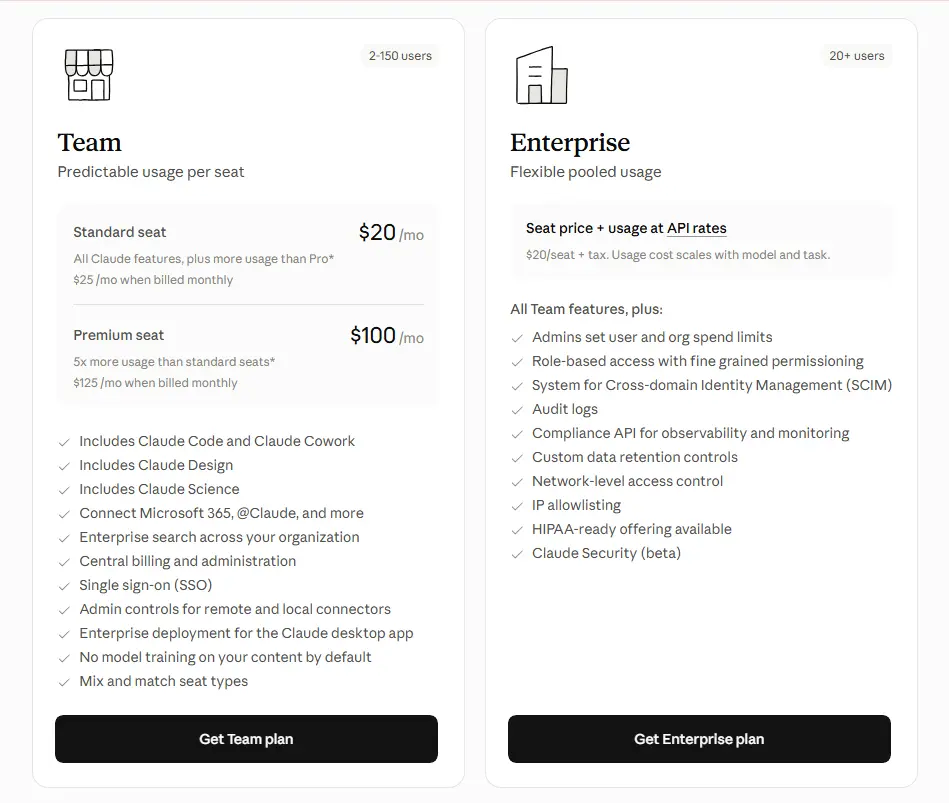

Anyone comparing AI assistants eventually runs into the same two questions: what does Claude cost, and is it actually any good? Short version, for a quick Claude pricing and review summary: Claude is Anthropic's AI assistant, free to start, with a Pro plan that runs around $20 a month (or closer to $17 if you pay yearly) that unlocks the stronger models and a much higher usage ceiling. Above that sit Max, Team, and Enterprise, aimed at heavier use or full organizations. As for whether it's good — Claude has built a solid reputation for writing quality, careful reasoning, and coding help, though it's not without its friction points. Usage limits, in particular, come up again and again in real user reviews. This guide goes through what Claude does well, where it stumbles, what each plan costs, and whether it's worth adding to your toolkit. If you'd rather browse everything we cover first, head back to the [homepage](/) for our full lineup of AI tool guides.

## What Is Claude AI?

Claude is a conversational AI assistant built by [Anthropic](https://www.anthropic.com), a company started by former OpenAI researchers who wanted to put safety at the center of how these models get built. It doesn't try to be a do-everything platform stuffed with plugins and dashboards. It's built around dialogue — you talk to it, it reasons with you, and the conversation is more or less the whole product.

Before going further into this Claude AI review, it's worth understanding what's happening behind the scenes. Anthropic uses something called Constitutional AI to train Claude's behavior. Instead of leaning entirely on human reviewers correcting the model after the fact, Claude is trained against a written set of principles that shape how it reasons, when it pushes back on a request, and how it explains its own limits. In day-to-day use, this tends to show up as more thoughtful refusals and a model that's a bit harder to manipulate into ignoring its own guardrails — a small detail on paper, but one that matters more than you'd expect once you're relying on it for actual work.

## Claude AI Tool Test: What It's Actually Like to Use

Reading about an AI tool only gets you so far. What matters is what happens once you sit down and start throwing real tasks at it.

For writing and editing, Claude is genuinely pleasant to work with. Hand it a rough draft or a paragraph that's gone sideways, and it tends to keep your original meaning intact while tightening the language — it doesn't flatten everything into that generic, over-polished AI voice you start recognizing after a while. Ask it to shift tone, say from formal to conversational, or from neutral to a bit more skeptical, and it usually gets the distinction without needing a paragraph of instructions to explain what you're after. That tonal control is one of Claude's less obvious strengths, and it matters a lot if you're producing marketing copy, client work, or anything where voice actually counts.

Long-form work is where Claude tends to pull ahead of some other chatbots. Ask it to draft something over a thousand words, or work through a brief with several moving parts, and it usually holds the thread the whole way through instead of drifting off-topic or forgetting what you told it three messages ago.

### Claude Desktop App Review

The interface deserves its own mention, honestly, because it's one of the quieter reasons people stick with Claude. There's no cluttered sidebar full of toggles, no dashboard demanding your attention every time you open it. Conversations are easy to follow, long responses are easy to read, and switching between models — Sonnet, Opus, Haiku — happens right in the chat window instead of buried three menus deep.

The desktop app carries that same simplicity into local work. It can read files sitting on your computer, help sort through documents, and hold context across a session without much setup on your part. It's not trying to be a control panel. It's trying to be a quiet place to think and get things done, and most of the time, it manages that.

## Claude Text Generator Performance: Writing, Coding, and Reasoning

What Claude does best is reason through a problem the way a sharp colleague would — not just spitting out something that sounds plausible, but actually following the logic of what you asked.

On the writing side, Claude produces content that reads like it was actually thought through, not assembled from a template. It avoids a lot of the repetitive phrasing that makes AI writing easy to spot after a while, and it's surprisingly good at brainstorming — open-ended questions often get answered with a clarifying question back, rather than a guess at what you meant.

On coding, it behaves less like autocomplete and more like a senior developer sitting next to you. It explains its reasoning, walks through debugging step by step, and treats code review as a conversation rather than just handing you a patched file. It won't replace a full IDE or a dedicated pair-programming setup, but for working through a stubborn bug or getting oriented in an unfamiliar codebase, it holds up well.

Then there's the large context window, which sounds technical but really just means one thing in practice: you can hand Claude a long document, a dense brief, or a full transcript, and it actually remembers the details instead of losing the plot halfway through. For research, document analysis, or long editing sessions, that's the difference between a tool you use occasionally and one you actually rely on.

## Claude Opus vs. Sonnet vs. Haiku: Which Model Should You Actually Use?

This trips up a lot of new users, and it's worth clearing up plainly, since the app itself doesn't always make the distinction obvious.

Claude comes in three model tiers, and they're built for different jobs rather than being a simple better-to-worse ladder:

- **Sonnet** is the one you'll use most. It's fast, capable, and handles the vast majority of everyday tasks well — writing, summarizing, coding, answering questions, drafting emails. For most people, most of the time, Sonnet is genuinely all you need.
- **Opus** is Claude's heaviest hitter, built for situations that call for real depth: multi-step analysis, tricky judgment calls, or problems that are just plain complicated. It's slower and usually reserved for paid plans, but on the hardest tasks, it earns its keep.
- **Haiku** is built for speed. It's lightweight, responds quickly, and fits simple or high-volume requests where getting an answer fast matters more than squeezing out every last bit of reasoning depth.

### Quick Decision Guide

| If your task is... | Use this model |
|---|---|
| Everyday writing, coding, quick research, general Q&A | Sonnet |
| Complex analysis, high-stakes decisions, multi-step reasoning | Opus |
| Simple, repetitive, or high-volume requests | Haiku |

A decent rule of thumb: start with Sonnet by default, and only reach for Opus when a task genuinely needs the extra thinking or when getting it wrong would actually cost you something. Most everyday work never has to leave Sonnet at all.

## Anthropic Claude Pros and Cons

No AI tool is perfect, and a fair Claude pricing and review breakdown means being upfront about both sides of the ledger.

**What Claude does well:**
- Writing that sounds natural, not robotic or templated
- Careful, genuinely thoughtful reasoning on complex or multi-step problems
- A calm, distraction-free interface that's easy to pick up fast
- A privacy-conscious approach to data handling, which matters more and more for business users
- Solid performance on long documents and extended conversations, without losing the thread

**Where it falls short:**
- No native image generation — you'll need a separate tool if visuals are part of your workflow
- Usage limits, especially on the free and lower-paid tiers, that can interrupt work at inconvenient moments
- A thinner third-party integration ecosystem than some competitors offer
- Occasional hallucination, same as any large language model — Claude tends to flag uncertainty more often than some peers, but it's not immune to stating something wrong with total confidence

## What Users Like and What Users Don't Like

Independent review platforms paint a genuinely useful, if slightly contradictory, picture of what using Claude is actually like day to day.

### What People Tend to Praise

People bring up Claude's writing and reasoning quality more than almost anything else — its ability to work through complex, multi-step tasks like academic research or architecture-heavy coding problems tends to stand out compared to other tools they've tried. Developers in particular mention real time saved on debugging and getting oriented in unfamiliar code, describing the experience less like autocomplete and more like having a careful second set of eyes. A lot of users also just find it easy to talk to — natural enough that it doesn't take heavy prompt engineering to get something that reads well.

### What People Tend to Dislike

Usage limits are, by a wide margin, the most repeated complaint. People on paid plans describe hitting a cap after a surprisingly small number of messages, then waiting hours before they can pick back up. Billing shows up as a sore spot too — some reviewers mention unexpected charges or unclear communication around subscription changes, which is the kind of thing that erodes trust fast. Support responsiveness comes up in a similar vein: when something goes wrong with an account or a charge, getting timely help isn't always easy. A smaller group of long-term users also mention performance feeling inconsistent — sharp one session, weaker the next.

### Why Claude's Ratings Vary by Platform

Compare Claude's scores across review sites and the gap can be pretty striking — often stronger where reviewers are judging day-to-day product capability, and noticeably weaker on general consumer review sites, where a bigger share of reviews are specifically about billing or cancellation headaches. That split makes sense once you think about who actually bothers to leave a review. A developer who used Claude to untangle a nasty bug has little reason to go write about it unless a site nudges them into it, while someone hit with a surprise charge or stuck waiting on support is often actively motivated to warn other people. Looking across a few platforms gives a far more honest picture than either extreme alone.

## Claude AI Pricing Plans

This is the part most people searching for a Claude pricing and review breakdown are really here for. Claude's plans are built around usage volume and model access rather than wildly different feature sets — the core experience stays basically the same, and what changes is how much of it you get.

| Plan | Price | What You Get |
|---|---|---|
| Free | $0/month | Chat on web, iOS, Android, and desktop, code generation, connect Slack and Google Workspace, extended thinking, built-in web search |
| Pro | $17/month billed annually (or $20/month billed monthly) | Everything in Free, plus Claude Code in your codebase, Cowork, Claude Design, higher usage limits, access to more Claude models, and memory across conversations |
| Max | From $100/month, billed monthly | Everything in Pro, plus up to 20x more usage, early access to advanced features, higher output limits, and priority access at high-traffic times |

Team and Enterprise plans work a bit differently, since they're priced per seat rather than as a flat individual subscription:

| Plan | Price | What You Get |
|---|---|---|
| Team | Standard seat: $20/mo billed annually ($25/mo monthly). Premium seat: $100/mo billed annually ($125/mo monthly, 5x more usage) | Claude Code, Cowork, Claude Design, Claude Science, central billing, SSO, admin controls for connectors |
| Enterprise | Custom — $20/seat plus usage billed at API rates | Everything in Team, plus admin-set spend limits, role-based access, SCIM, audit logs, IP allowlisting, and a HIPAA-ready offering |

Team plans start around 2 users and scale up, while Enterprise is generally built for larger organizations. Usage limits apply across every tier, and Anthropic notes that prices and plans are subject to change, so it's worth double-checking current figures on [Anthropic's official pricing page](https://www.anthropic.com/pricing) before you commit.

For most individual users, the real decision comes down to how often you're bumping into the limits of the plan below. Chat with Claude a few times a week and Free is genuinely enough. Use it daily for actual work and Pro tends to pay for itself pretty quickly. Heavy daily users — developers running long sessions especially — are the ones most likely to notice the jump Max makes.

If you've read our [HeyGen pricing and review](/reviews/heygen-pricing-review/) breakdown, you'll notice a similar pattern here: the headline price rarely tells the full story, and usage mechanics matter just as much as the plan name.

## Are Claude's Usage Limits as Bad as People Say?

Given how often this comes up in reviews, it deserves more than a passing mention.

Every Claude plan comes with a usage allowance that resets on a recurring window, usually measured in hours rather than a full monthly cycle the way some subscriptions work. On the Free plan, that ceiling is tight — part of why it works well for testing the waters but frustrates anyone hoping to lean on it daily. Pro raises the ceiling a lot, but it's still a ceiling, not unlimited access, and heavy users, particularly people running long coding sessions or extended research conversations, can and do hit it.

A few things affect how fast you burn through your allowance:

- **Model choice matters.** Using Opus for something Sonnet could easily handle eats through your window faster, since Opus is more resource-intensive per response.
- **Conversation length adds up.** Long, ongoing threads use more of your allowance than several shorter, separate ones, since the model has to reprocess the full context each time.
- **Large attachments count too.** Uploading long files or big batches of text for analysis draws down your capacity faster than a short text-only back-and-forth.

The honest answer here: usage limits are a real constraint, not an exaggerated complaint people are making up. If your work involves frequent, extended sessions, it's worth actually testing your usage pattern on Pro before assuming it'll hold up, and looking at Max if you keep finding yourself waiting out cooldowns.

## Is Claude AI Good? Who It's Best For

Pulling all of this together, here's a straightforward read on where Claude genuinely fits, and where it doesn't.

**Claude is a strong choice if:**
- You care more about writing quality and nuanced reasoning than raw feature breadth
- You regularly work with long documents, briefs, or research material that needs to stay coherent start to finish
- You'd rather have a calm, focused interface than a dashboard full of tools you'll never touch
- You want coding help that explains its reasoning, rather than a fully automated coding environment
- Data privacy and a safety-first company culture matter to how you choose software

**It's worth reconsidering if:**
- Built-in image generation is part of your regular workflow
- Your work involves long, frequent sessions where hitting a usage ceiling would genuinely disrupt things
- You depend heavily on a wide third-party plugin or integration ecosystem
- Predictable, always-on access matters more to you than squeezing out the best possible output

The fair verdict from this Claude pricing and review breakdown is that Claude earns its reputation honestly. It's not the flashiest AI assistant out there, and it isn't really trying to be. What it offers instead is careful, considered output and a genuinely pleasant experience to use, with the real trade-off being usage limits that heavier users need to plan around rather than some hidden flaw lurking underneath.

*This review reflects publicly available information and independent user feedback as of 2026. Pricing, usage limits, and features change periodically — always confirm current details on Anthropic's official pricing page before subscribing.*

## Affiliate Disclosure

This article may contain affiliate links. If you sign up for Claude or another product through a link on this page, we may earn a commission at no extra cost to you. This helps support the research and testing that goes into guides like this one. Our opinions and recommendations are based on independent research and, where possible, hands-on use of the platform — affiliate relationships don't influence which products we cover or how we rate them.