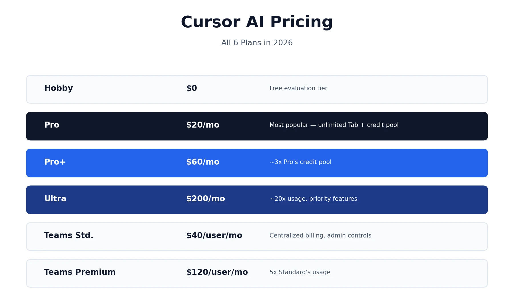
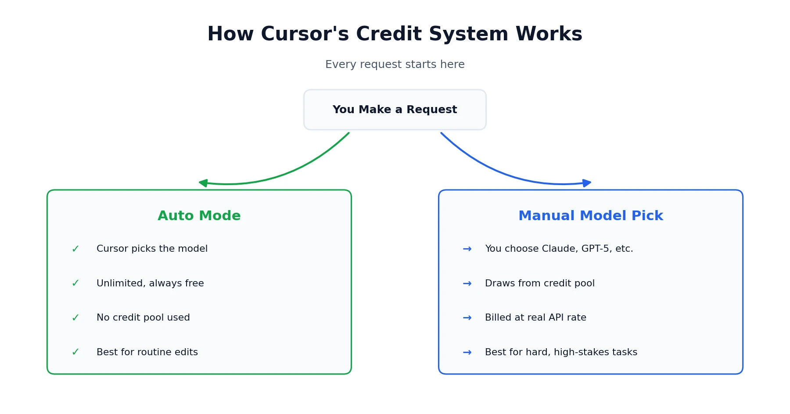
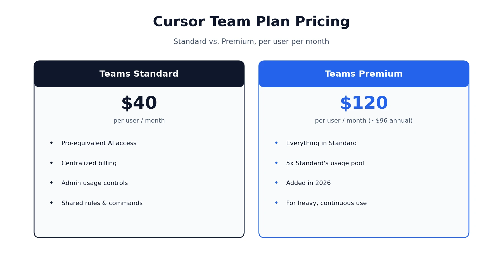

Anyone comparing AI coding tools eventually runs into the same question: what does Cursor AI pricing actually look like once you're past the homepage numbers? Short answer — Cursor runs on six plans in 2026: a free Hobby tier, Pro at $20/month, Pro+ at $60/month, Ultra at $200/month, and Team plans running $40 to $120 per user per month. On paper that's a pretty standard SaaS ladder. In practice, Cursor also runs on a credit system that decides how far your subscription actually stretches, and that detail matters more than the sticker price once you're leaning on premium AI models regularly. This guide walks through every plan, explains how the credit system works in plain English, and helps you figure out which tier actually fits how you code.

## What Is Cursor?

Cursor is an AI-first code editor built by Anysphere as a fork of Visual Studio Code. It keeps the familiar VS Code interface, extensions, and keyboard shortcuts, but rebuilds the editing experience around AI — multi-file editing, codebase-wide context, and an AI agent that can work across your project rather than just autocompleting a single line. Its core features include Composer (multi-file editing through natural language requests), Agent Mode (letting Cursor work more autonomously across your codebase), and Tab completion for fast, context-aware autocomplete.

## Cursor AI Pricing Plans in 2026

Here's the full lineup, current as of 2026. Monthly and annual pricing are shown together to save you the scroll.

| Plan | Monthly Price | Annual Price (per month) | What You Get |
|---|---|---|---|
| Hobby | Free | Free | Limited completions and slow premium requests, no credit card required |
| Pro | $20/month | ~$16/month | Unlimited Tab completions, $20 credit pool, unlimited Auto mode |
| Pro+ | $60/month | — | ~3x Pro's credit pool, same features |
| Ultra | $200/month | — | ~20x Pro's usage, priority access to new features |
| Teams Standard | $40/user/month | — | Pro-equivalent access plus centralized billing and admin controls |
| Teams Premium | $120/user/month | ~$96/user/month | 5x Teams Standard's included usage |
| Enterprise | Custom | Custom | Contact sales, org-wide controls |

If you've read our [Claude pricing and review](/reviews/claude-pricing-review/), this same "the headline number isn't the whole story" pattern shows up again here in Cursor AI pricing — the plan prices are simple, but what they actually buy you depends heavily on how you use the tool day to day.

### What's Included in the Free Hobby Plan?

Cursor's free tier requires no credit card and gives you a genuine way to test the editor before paying anything. It includes a limited number of completions and a small allowance of slower premium requests each month. That's enough to get a real feel for Composer, Agent Mode, and Tab completion on a side project, but it depletes quickly under daily professional use — the Hobby plan is built for evaluation, not as a long-term free alternative to Pro.

## Cursor Pro Cost: What You Actually Get for $20/Month

Since this is one of the most commonly asked questions about Cursor, it deserves a direct answer rather than just a table row. For $20 a month, Pro gives you unlimited Tab completions (Cursor's AI-powered autocomplete), a $20-equivalent monthly credit pool for premium model usage, and unlimited use of Auto mode, which doesn't draw from that pool at all.

For most individual developers working a normal day of coding, Pro is the right starting tier. It only becomes limiting if you're manually selecting frontier models like Claude Opus or GPT-5 for the majority of your work, rather than letting Auto mode handle routine requests — which is the single biggest factor in whether $20 feels like plenty or like it runs out fast.

## How Cursor's Credit System Actually Works

This is the part of Cursor's pricing that trips people up the most, and it's changed enough over the past year that a lot of older guides floating around online still describe the previous system.

Every paid plan includes unlimited **Auto mode** — Cursor picks a suitable model for your request on its own, and it doesn't touch your credit pool at all. Where the pool actually gets used is when you **manually pick a specific frontier model**, like Claude Sonnet or GPT-5, instead of letting Auto mode decide. Do that, and your usage draws from the credit pool at that model's real API rate.

In practice, a quick autocomplete or small edit barely makes a dent, while a big multi-file "max mode" refactor run on a manually selected premium model can chew through a real chunk of your monthly pool in one sitting. To put a number on it: on the Pro plan, a $20 credit pool has been reported to cover somewhere around 225 requests on a model like Claude Sonnet, but considerably more on lighter models like Gemini — the actual count swings a lot depending on which model you pick and how much context each request carries. Stick mostly to Auto mode and $20 tends to go a long way. Force a specific premium model for everything and you'll watch that pool shrink a lot faster than the sticker price suggests.

A few practical habits keep Cursor pricing predictable in real use:

- **Default to Auto mode** for routine edits, boilerplate, and small fixes
- **Reserve manual model selection** for tasks that genuinely need a specific model's reasoning strength
- **Check your usage dashboard mid-cycle** rather than waiting until you unexpectedly hit a wall
- **Watch context size**, since longer conversations and larger files draw down credits faster than short, targeted requests

### Are There Hidden Costs Beyond the Subscription?

Beyond the monthly plan price, a couple of things are worth budgeting for. If your team relies heavily on manually selected frontier models rather than Auto mode, actual monthly spend can run higher than the base plan price once credit pools are exhausted and you're waiting on the next cycle or upgrading tiers mid-month. There's also a real, if smaller, time cost in learning the difference between Composer, Agent Mode, and Auto — most new users take one to two weeks to get a real feel for when each mode is worth reaching for, which affects how efficiently your credit pool gets used early on.

## Cursor Premium Tier: Pro+ and Ultra Compared

Once Pro's credit pool consistently runs dry before the month resets, the next step up is Pro+ or Ultra, and it's worth being clear about what each one actually buys.

**Pro+** costs $60/month and includes roughly three times Pro's credit pool. It doesn't add new features — it's the same Pro experience with more headroom, aimed at developers who consistently hit Pro's limits but aren't running Cursor as their entire workday.

**Ultra** costs $200/month and includes roughly twenty times Pro's usage, plus priority access to new features as they roll out. This tier is really built for full-time, AI-native development — running background agents continuously, working through large codebases, and relying on frontier models for most interactions throughout the day. For anyone coding a few hours a day with occasional heavy sessions, Ultra is likely overkill; Pro+ covers that gap more sensibly.

## Cursor Team Plan Pricing: Standard vs. Premium

Team pricing works differently from the individual tiers, and it's worth separating the two options clearly since they serve different needs.

**Teams Standard** costs $40 per user per month and gives each developer Pro-equivalent AI access, plus organizational features: centralized billing on a single invoice, shared rules and commands across the team, and usage visibility for admins.

**Teams Premium**, added in 2026, costs $120 per user per month (roughly $96/month with annual billing) and includes five times Standard's included usage per seat. This tier makes sense for teams doing heavy, continuous AI-assisted development across the board rather than occasional use.

**Enterprise** pricing is custom and handled through sales, aimed at larger organizations that need deeper security controls, org-wide policy management, and dedicated support beyond what Teams offers.

## How Does Cursor's Pricing Compare to Alternatives?

Sticker price alone doesn't tell the full Cursor AI pricing story, but it's worth a quick anchor point before deciding. GitHub Copilot's entry tier generally starts cheaper than Cursor Pro, and Windsurf has historically positioned itself as a lower-cost alternative as well. Where Cursor tends to justify its price is in multi-file editing and codebase-wide context — capability that often requires Copilot's more expensive tiers to match, since Copilot's cheapest plans lean more toward single-line autocomplete than full-project reasoning.

Whether Cursor is genuinely "cheaper" or "pricier" than a given alternative really depends on which tier of that alternative you'd actually need to get comparable functionality, not just the lowest advertised number on either pricing page. A fair comparison means matching feature depth, not just matching monthly price.

## Is Cursor Worth the Cost?

Whether Cursor's pricing makes sense comes down to how much of your working day actually happens inside the editor, not just whether $20 sounds reasonable in isolation.

**It's a strong fit if:**
- You code several hours a day and rely on AI assistance regularly, not occasionally — the credit pool rewards consistent, routine use over sporadic bursts
- Multi-file refactoring and codebase-wide context are a real part of your workflow, since that's where Composer and Agent Mode deliver the clearest time savings
- You're comfortable defaulting to Auto mode and reserving premium models for tasks that genuinely need them, which keeps monthly cost close to the plan price
- You already use VS Code and want AI built into the editor rather than bolted on as an extension

**It's worth reconsidering if:**
- You code occasionally or work mostly on small, single-file projects where a lighter, cheaper tool would cover your needs just as well
- You need 100% offline functionality, since Cursor's AI features require an internet connection to reach the underlying models
- Budget is tight and a cheaper autocomplete-focused tool would cover your actual day-to-day needs without the extra cost
- You're working with highly sensitive code where any cloud processing of your codebase is a dealbreaker for compliance reasons

A conservative way to think about ROI: if Cursor saves even a couple of hours a week of development time, the $20/month Pro tier pays for itself many times over for most professional developers. That said, real value depends entirely on your own usage pattern — the free Hobby tier exists specifically so you can find out before paying anything.

### A Realistic Monthly Cost Scenario

For context: a solo developer coding most weekdays and mostly using Auto mode, with occasional manual Claude or GPT-5 requests for tricky problems, will typically stay comfortably inside the Pro plan's $20 credit pool. A developer running Agent Mode continuously across a large codebase, or a small team standardizing on premium models for every request, is the profile most likely to need Pro+ or even Ultra to avoid running dry mid-cycle. Understanding which profile you actually fit is the most useful thing you can do before committing to a tier above Pro.

## What Users Say About Cursor's Pricing

The most consistent theme in real user feedback isn't about Cursor's capability — it's about the shift from a simple, fixed request-count model to today's usage-based credit system. That change genuinely surprised a lot of long-time users, who describe the older "500 fast requests" model as predictable in a way the current credit pool isn't. Heavy agent-mode sessions on large codebases are the scenario most often cited for unexpectedly fast credit consumption.

At the same time, a meaningful share of users report that sticking to Auto mode for routine work keeps costs manageable and that the complaints cluster specifically around teams or individuals who default to manually selecting premium models for everything. If you've read our [HeyGen pricing and review](/reviews/heygen-pricing-review/), this pattern will feel familiar — a credit or usage-based system that rewards understanding the mechanics and penalizes treating it like a flat unlimited subscription. For further reading directly from the source, Cursor's own [pricing and credit documentation](https://cursor.com/pricing) lays out the current system in full, and it's worth checking directly since these figures do shift over time. You can also browse more of our tool breakdowns from the [homepage](/) if you're evaluating your broader AI development stack.

*This review reflects publicly available pricing information and independent user feedback as of 2026. Pricing, credit allocations, and plan features change periodically — always confirm current details on Cursor's official pricing page before subscribing.*

## Affiliate Disclosure

This article may contain affiliate links. If you sign up for Cursor or another product through a link on this page, we may earn a commission at no extra cost to you. This helps support the research and testing that goes into guides like this one. Our opinions and recommendations are based on independent research and, where possible, hands-on use of the platform — affiliate relationships don't influence which products we cover or how we rate them.