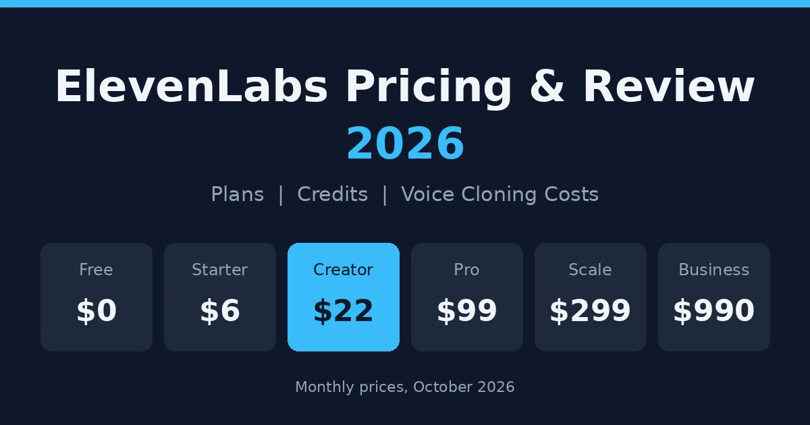
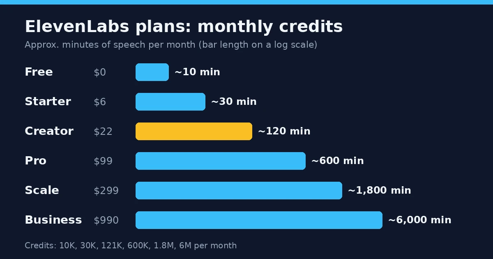
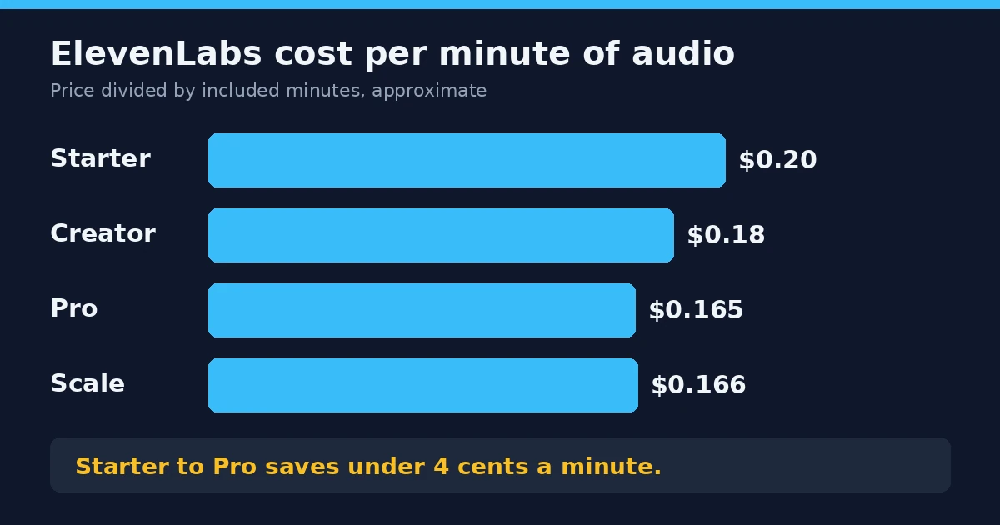
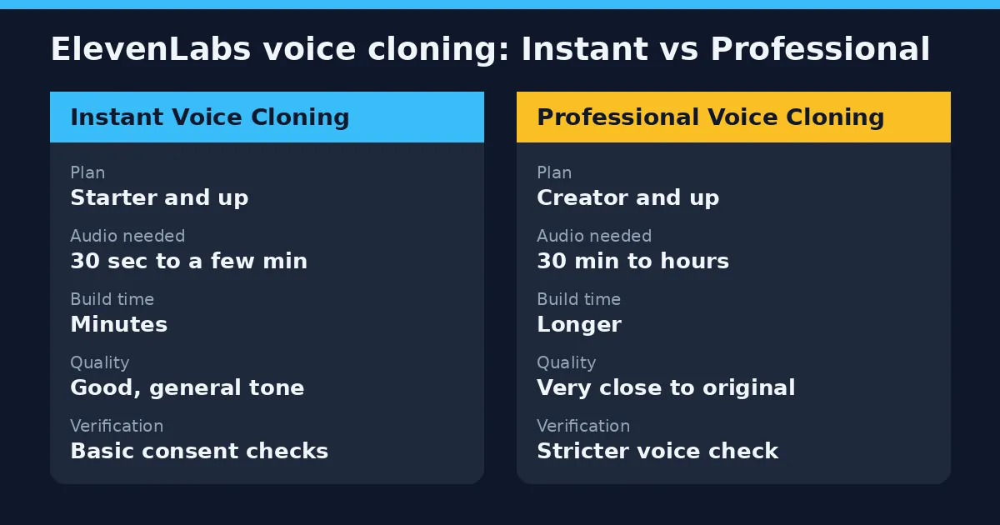

ElevenLabs is an AI voice platform. It turns text into speech, clones voices from short recordings, and dubs video into other languages. In this ElevenLabs pricing and review, the short version is that it starts free, paid plans run from $6 to $990 a month, and most serious creators end up on the $22 Creator plan. The voices are very good. The credits are what you need to watch.

Here's the thing about the price. The monthly number isn't really what you're paying for. You're buying credits, and credits go fast, especially when you redo lines. A plan that looks cheap on the pricing page can run dry by the third week.

So this page does the math for you. Which plan fits which project, what a minute of audio costs, what voice cloning needs, and where the complaints come from.

Everything here comes from [ElevenLabs' own pricing page](https://elevenlabs.io/pricing) and recent third-party write-ups. Prices change often, so check the official page before you pay.

## What Is ElevenLabs Used For?

It started as a plain text-to-speech tool and kept adding things.

The text-to-speech is still the main draw. You paste a script, pick a voice and get narration that sounds like a person. Then there's voice cloning, which makes a digital copy of a voice so nobody has to record for six hours. Dubbing translates video or audio into other languages while keeping a similar voice. There's also a project editor for long jobs like audiobooks, plus sound effects and voice agents for apps and support lines.

In practice, people use it for video voiceovers, audiobooks, podcasts, online courses, game narration and automated phone assistants. If you care more about on-screen AI avatars than voices alone, our [HeyGen pricing review](/reviews/heygen-pricing-review/) covers that side.

## ElevenLabs Plans at a Glance

Six self-serve plans, one custom tier. Here's the whole ladder before getting into the details.

| Plan | Monthly price | Annual (per month) | Credits per month | Voice cloning | Seats |
|---|---|---|---|---|---|
| Free | $0 | $0 | 10,000 | None | 1 |
| Starter | $6 | ~$5 | 30,000 | Instant | 1 |
| Creator | $22 ($11 first month) | ~$18 | 121,000 | Instant + Professional | 1 |
| Pro | $99 | ~$82 | 600,000 | Professional | 1 |
| Scale | $299 | ~$249 | 1.8 million | 3 Professional clones | 3 |
| Business | $990 | Varies | 6 million | 10 Professional clones | 10 |
| Enterprise | Custom | Custom | Custom | Custom | Custom |

If you've seen a $330 Scale plan or 500,000 credits on Pro somewhere, that's an old price list. Plenty of blogs never updated. When a blog and the official pricing page disagree, the pricing page wins, and that goes for this article too.

### How Much Is ElevenLabs Per Month?

Anywhere from $0 to $990 on the self-serve plans, with custom pricing above that. Most individuals pay between $6 and $22. Production work usually means $99.

One practical tip on billing. Paying yearly lowers the monthly rate on every paid plan, but you pay for the whole year up front. If you're new, spend a month or two at the regular price and see how fast you actually burn credits first.

### Starter Plan Price

Six dollars a month, or about $5 if you pay yearly. It's the cheapest way to get a commercial license, and it comes with Instant Voice Cloning and 30,000 credits. Shorts, reels and small side projects fit fine. Past half an hour of audio a month, it gets tight.

### Creator Plan Price

Twenty-two dollars a month, and new subscribers often get the first month for $11. You get around 121,000 credits, Professional Voice Cloning and better audio quality. Reviewers keep recommending it, mostly because it's the cheapest plan with the better clone.

### ElevenLabs Pro Price

Ninety-nine dollars a month for 600,000 credits, higher API limits and stronger output for production work. A community thread puts that at roughly eight to ten finished hours of audio. Audiobook authors, busy channels and teams using the API tend to end up here.

### Scale and Business Plans

Scale is $299 and Business is $990. What you're paying for is teamwork as much as volume: three seats and three Professional clones on Scale, ten of each on Business, plus faster real-time speech. Extra seats cost more.

### ElevenLabs Enterprise Pricing

There's no public price. Deals are negotiated around volume and usually include custom credits and seats, service agreements, single sign-on and compliance options. If your security team has opinions about vendors, this is the tier built for that.

## How Do ElevenLabs Credits Actually Work?

Credits are where most people get confused, so let's keep this simple.

On the standard models, one character of text costs about one credit. A thousand characters gets you close to a minute of speech. That's the rule of thumb, and it holds up well enough for planning.

The faster Flash and Turbo models cost less. Roughly half a credit per character. That stretches a plan a long way. One breakdown has Creator giving about 121 minutes on the standard multilingual model and close to double that on Flash. If you're making drafts or simple narration, Flash is the easy way to save.

Now the part that catches people. You're charged when audio is generated, not when you download it. Redo one sentence five times to get the tone right and you've paid for five. It's a small thing on a short clip. On a long chapter it adds up fast.

What about leftovers? On a paid plan, unused credits can roll over for up to two months, as long as you keep the subscription active. Cancel, or drop back to Free, and they expire. Upgrade and they carry into the next cycle, so a mid-month upgrade isn't as painful as it sounds. There's also a limit on how many credits a single generation can use, so very long scripts get split up.

And the free credits? People search for "ElevenLabs credits free" expecting a one-time bonus. It isn't. The 10,000 credits on the Free plan reset every month. Same allowance, every month, nothing more.

## What's Included in the ElevenLabs Free Plan?

The free plan is a test drive. Nothing more.

You get about 10,000 credits a month, which is roughly ten minutes of standard speech. You can use the voice library, and you don't need a credit card to sign up. That's enough to hear whether the voices suit your project.

What you don't get matters more. There's no commercial license and no voice cloning. Anything you publish has to credit ElevenLabs. API access is also limited to a couple of simultaneous requests, so it's not much use for building anything real.

So is the ElevenLabs subscription free? Only partly. And who's it for? Anyone who wants to try before paying. Listen to a few voices, run a sample script, see how the credits drain.

The moment your audio earns money, though, the free plan is out. Ads, client work, a monetized YouTube channel, all of it counts. You'll need Starter at the very least.

## ElevenLabs Audio Cost Per Minute

Here's a number most reviews never bother to work out. What does one minute of audio actually cost?

Roughly twenty cents on Starter. Eighteen on Creator. About sixteen and a half on Pro and Scale. Not much of a staircase, is it?

That's the catch with moving up. Starter to Pro saves you less than four cents a minute, so upgrading to "save money" mostly doesn't work. You upgrade because you've run out of credits, or you need the better clone, or you want API headroom. Not because it's cheaper.

A quick sense of scale. If you cut a handful of short clips a month, that's Starter territory. A weekly podcast, a few hundred minutes, means Pro. Audiobooks too. The middle is where Creator sits, and for a YouTuber putting out a few videos, it's usually plenty.

Then there's the part nobody plans for. Retakes. Rewrite a line, regenerate, tweak the pacing, regenerate again. All of it costs credits, and it can easily add a fifth or even a third to your total. So a plan that looks like a perfect fit on paper can be empty a week before renewal.

My rule would be to pad your estimate by about a quarter. Cheap insurance.

## ElevenLabs Voice Cloning Cost: Instant vs Professional

Cloning is why plenty of people subscribe in the first place. There's no separate charge per clone on the lower plans. What you can do depends on which tier you're paying for, and that's where the cost really sits.

### Instant Voice Cloning

Starts at Starter, the $6 plan. You upload a short clip, somewhere between thirty seconds and a couple of minutes, and a few minutes later there's a voice you can use. It gets the general sound right. The pace, the tone, the overall feel. What it tends to miss is the small stuff, the habits that make a voice sound like one particular person.

Fine for a short video with music under it. Over an hour of narration? Listeners may notice.

### Professional Voice Cloning

This one starts at Creator, $22. And it asks more of you. Half an hour of clean audio is the floor, and a few hours is better. It takes longer to build too. There's also a verification step that proves the voice is yours, which can feel like a hassle until you remember why it exists.

Reviewers keep saying the result is very hard to tell from the real speaker, even across long recordings. That's the whole appeal.

### Is It Worth Paying for Professional Cloning?

Depends how much audio you make. Narrate audiobooks or run courses, and the answer is usually yes, because you record once and skip the next fifty sessions. For the odd clip here and there, no. Starter's instant clone does the job.

Teams are a separate case. Need several branded voices? Scale includes three Professional clones, and Business includes ten.

## ElevenLabs API Pricing

Short version: you pay in dollars, but credits are still doing the counting behind the scenes.

Flash and Turbo are the cheap models, somewhere between half a credit and one credit per character. Test with those. Switch to the standard model once the script is locked.

The rate isn't what bites, though. Concurrency is. The free plan gives you two requests at once, which is fine for a prototype and falls over the first time a few people use your app together. Pro lifts that to about ten. Business adds low-latency speech, for apps that have to answer out loud in real time.

Agents are their own animal. One outside estimate puts them at roughly $0.10 to $0.30 a minute, but that bundles the voice, the language model and the platform, so it's a loose number. They do burn credits faster than anything typed into the web app, and a quick test call can cost more than you'd expect.

Not sure you need the API at all? If you're pasting scripts and downloading files, you don't. Build a tiny prototype, check what each request costs, then pick a plan. Credit-style math like this shows up in developer tools too, and our [Cursor AI pricing review](/reviews/cursor-ai-pricing-review/) walks through the same kind of usage maths.

## ElevenLabs Review: Voice Quality and Everyday Usability

Pricing only tells you half of it. The other half is whether the tool is actually good to use.

The voices are the reason people pay. Pacing, tone and emotion sound much less robotic than older text-to-speech tools. Technical terms are mostly handled well, and a mangled word can usually be fixed with a small tweak. Long scripts hold together too, without sliding into a flat, tired delivery. One YouTuber who uses it for tutorial voiceovers describes the result as clear, natural and professional. That's a decent endorsement for dry technical content.

Getting started is easy. You paste a script, pick a voice, generate and download. You don't need any audio-editing experience.

The weak spot is editing. If one line sounds off, you usually can't just nudge it. You regenerate it, and that costs credits again. On a thirty-second clip it hardly matters. On a long chapter you'll feel it.

So the voices are excellent, the workflow is simple, and the editing is basic. That's most of the review.

## What Users Like and What Users Don't Like

Read enough reviews and the same points keep coming up, on both sides.

### What People Tend to Praise

The voices come first, every time. People say they sound natural, and they say it more often than they mention price or features.

Cloning is the next big one. The professional version gets the most credit, mostly from people who narrate long recordings and don't want to sit in front of a microphone for hours.

Then there's the convenience. Text-to-speech, dubbing, sound effects and agents all live under one login, so you aren't juggling four tools. And the commercial license starts at the first paid plan, which means you can earn money from your audio without paying for a premium tier. That one gets less attention than it deserves.

### What People Tend to Dislike

Credits are the loudest complaint. They vanish faster than people expect, especially on long projects or when retakes pile up.

Editing comes second. Fixing a line means regenerating it, and regenerating costs more credits.

Some Starter users also resent that the better clone sits one plan up, at Creator.

Technical users have their own gripes. One [G2 reviewer](https://www.g2.com/products/elevenlabsio/pricing) found setup hard going if you're not a developer. Another said the newer v3 editor is confusing and noted that the API can't be used with v3. That's a real limitation if your workflow depends on it.

## Why ElevenLabs Reviews and Reddit Opinions Vary

Read around and you'll notice the mood changes depending on where the review is posted.

Feature-focused sites like G2 lean positive. Reviewers there praise quality, ease of use and price. Reddit is blunter, and the same question keeps coming up: is credit-based pricing still worth it once your volume grows?

You can see it in the thread titles on [r/ElevenLabs](https://www.reddit.com/r/ElevenLabs/). One appeared after a pricing change, asking how people felt about the new setup. A later one asked whether ElevenLabs is still worth the money in 2026. A rule of thumb gets repeated a lot: around $22 a month suits casual use, and around $99 suits real production.

None of this is a contradiction. A casual creator making a few clips a week and a developer pushing thousands of requests through the API are using the same product in completely different ways. Of course they reach opposite verdicts.

So read both kinds of feedback together. The G2 reviews tell you what the tool does well. The Reddit threads tell you where the bill starts to hurt.

## Hidden Costs to Watch For

The plan price is rarely the final bill.

Retakes come first. A script you budgeted at 10,000 credits can quietly turn into 14,000 once you've re-rolled a few lines. Then there's running dry mid-month. Your options are a top-up or an upgrade, and the gap between Creator and Pro is wide.

Teams get hit differently. Scale and Business include a fixed number of seats and Professional clones, and extra seats cost more, so a growing team pays above the headline number. API and agent usage can also eat credits far faster than anything typed into the web app.

One cost never shows up on an invoice. A Professional clone needs clean, varied recordings of the voice, and gathering them takes real time.

## A Realistic Monthly Cost Scenario

Numbers on a pricing page only help if you can picture your own month. Here are two.

Take a solo YouTuber with four ten-minute videos a month and a Professional clone of their own voice. That's about 40 minutes of finished audio, so Creator at $22 looks right. Then real life happens. Retakes, a couple of promo clips, a few test runs. Usage creeps toward 60 or 70 minutes. Creator covers around 120, so the plan holds, with room to spare.

Now a small studio. A weekly podcast, a monthly audiobook chapter, two people sharing the account. That can pass 600 minutes without anyone trying. Pro at $99 is the minimum. Once a second and third teammate need their own seats and clones, it's Scale at $299.

That isn't a bad deal. It just means budgeting from the sticker price alone will probably leave you short.

## Is ElevenLabs Worth It?

For most people who care how their audio sounds, yes. The voices are the best reason to pay, and the cloning is strong enough that audiobook authors and course creators keep coming back to it. If you're localizing video, or you want to stop recording every script yourself, it earns its price quickly.

It's a worse fit if your volume jumps around, because credit limits can catch you mid-month. It's also a worse fit if you revise a lot, since every regeneration costs credits again. And if you just need cheap, bulk narration where realism doesn't matter much, you'll probably be happier with something else. Pairing voiceovers with AI video? Our [Sora AI pricing review](/reviews/sora-ai-pricing-review/) covers one of the video tools people combine with a voice platform.

For most solo creators, Starter is a low-risk way in. Creator is the plan to grow into once Professional cloning matters. Heavy producers and developers should work out their credit use first and only step up to Pro or beyond when the numbers back it up.

A few habits keep the bill down. Use Flash models for drafts. Lock your script before you generate anything. Take yearly billing only once you're sure you'll stay. And spend leftover credits inside the two-month rollover window, so none of them go to waste.

## ElevenLabs Alternatives and Free AI Voice Generators

ElevenLabs isn't the only option. Murf, Play.ht, [Fish Audio](https://fish.audio), Resemble AI, Cartesia and Descript all get mentioned whenever people start comparing.

Pricing is where they differ most. [Murf](https://murf.ai) charges by audio duration. Play.ht counts characters, same as ElevenLabs. Sounds like a small detail, and it isn't. A tool that looks cheaper on its pricing page can cost you more once your scripts get long or you start redoing lines.

Free generators? They exist. Most come with strings attached: short limits, few languages, flat voices. Plenty also leave out commercial rights, which kills them for anything that earns money. ElevenLabs' own free plan has the same catch. Great for a test, useless for paid work.

So which one is best? If realism and cloning matter most, ElevenLabs is the one reviewers usually name. If you're counting pennies, look elsewhere. Either way, don't take anyone's word for it. Put one script through two or three tools and play the results on the same phone or laptop speakers your audience will use.

## The Bottom Line

ElevenLabs is worth it if the voices are what you care about. The quality is excellent, the cloning is the best reason to pay, and the entry plans are cheap enough to try without much risk.

The trouble starts when your usage doesn't match your credits. Long scripts, lots of retakes, a team sharing one account. That's when a $22 plan quietly becomes a $99 one. So this ElevenLabs pricing and review comes down to one habit: work out your monthly audio before you pick a tier, not after.

My advice would be to start small. Starter or Creator, a month at the regular price, and watch how fast the credits go. Then decide whether yearly billing, or a bigger plan, makes sense. Our [homepage](/) has more AI tool coverage if you're building a wider stack.

One last thing. Prices and credit limits change, so check [ElevenLabs' official pricing page](https://elevenlabs.io/pricing) before you pay.

*This review is based on publicly available pricing information and independent user feedback as of October 2026. Pricing, credit allocations and features are subject to change. Always confirm current details on ElevenLabs' official pricing page before subscribing.*

## Affiliate Disclosure

This article may contain affiliate links. If you sign up for ElevenLabs or another product through a link on this page, we may earn a commission at no extra cost to you. This helps support the research and testing that goes into guides like this one. Our opinions and recommendations are based on independent research and, where possible, hands-on use of the platform — affiliate relationships don't influence which products we cover or how we rate them.