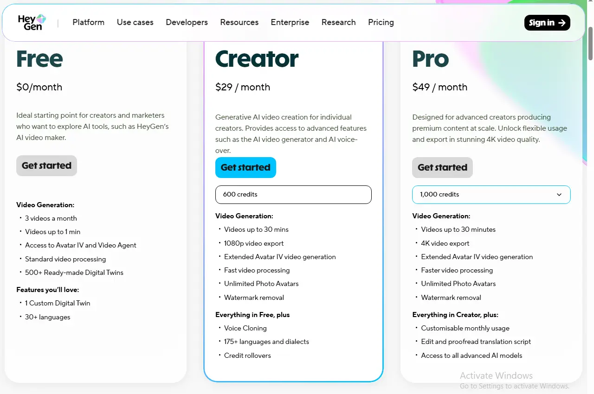

If you've been comparing AI avatar tools, chances are HeyGen pricing and review questions keep popping up in your research — and for good reason. HeyGen's plans start at $0 a month and stretch up to custom enterprise contracts, with a Creator plan at $29 a month, a Pro plan starting around $49, and a Business plan at $149 a month plus a per-seat fee. On paper, that looks simple. In practice, HeyGen runs on a credit system that decides how much video you can actually produce, and that detail changes the real cost more than the sticker price does. This HeyGen pricing and review guide walks through every plan, explains how the credit math works, shares what actual users say about the platform, and helps you decide whether the investment fits your workflow.

## HeyGen Plans at a Glance

HeyGen currently offers five subscription tiers, and honestly, each one is built around how much video you're producing rather than any neat "basic vs. premium" split.

| Plan | Monthly Price | Annual Price (per month) | Monthly Credits | Max Resolution | Video Length |
|---|---|---|---|---|---|
| Free | $0 | $0 | 3 videos (no watermark-free option) | 720p | Up to 1–3 minutes |
| Creator | $29 | ~$24 | 600 credits | 1080p | Up to 30 minutes |
| Pro | From $49 | ~$79 (at higher tiers) | 1,000+ credits (scales with price) | 4K | Up to 30 minutes |
| Business | $149 + $20/seat | ~$119 + seats | 1,000–1,500 credits | 4K | Up to 60 minutes |
| Enterprise | Custom | Custom | Custom | 4K | Unlimited |

One thing worth flagging about that table: HeyGen has tweaked its credit allocations more than once over the past year, so what you see on the Creator plan today might not match what you find next month. That single number affects nearly every other decision in this guide, so it's genuinely worth pulling up HeyGen's current pricing page before you commit to anything.

Going annual knocks the effective monthly cost down on every paid tier — usually somewhere in the 15–20% range. The catch is you're paying the full year up front, which locks you in even if your production needs change halfway through. If you're new to HeyGen, it's smarter to run a month or two at the standard rate first, see how fast you burn through credits, and only then decide if annual billing actually pencils out.

## How Do HeyGen Credits Actually Work?

This is where most people get tripped up, and it deserves its own section because the headline price really doesn't tell the whole story.

Every paid plan comes with a pool of credits, and different features draw from that pool at wildly different speeds. Standard "Avatar III" videos are cheap to produce and, for most plans, close to unlimited in practice. The higher-fidelity "Avatar IV" model — the one with more natural facial movement and realistic gestures — chews through credits far faster. Video translation with full lip-sync lands somewhere in between, and plain audio dubbing without lip-sync is usually the lightest option on the menu.

Here's roughly how the burn rate shakes out:

- Avatar III videos: around 3 credits per minute
- Avatar IV videos: around 20 credits per minute
- Lip-synced translation: around 5 credits per minute
- Audio-only dubbing: around 2 credits per minute

### Credits-to-Minutes Quick Reference

To make that more concrete, here's roughly what a typical Creator plan allocation gets you in finished video, depending on which model you're using:

| Feature Used | Approximate Minutes on Creator Plan |
|---|---|
| Avatar III video | Several hours of footage |
| Avatar IV video | Roughly 10–30 minutes total |
| Lip-synced translation | Roughly 40–120 minutes total |

That gap matters more than it looks at first glance. A plan advertising "unlimited videos" is technically correct for standard avatar output, but the premium Avatar IV model — which is usually the one brands actually want for client-facing work — is capped hard by the credit pool. A team pumping out weekly Avatar IV clips for social or sales outreach can blow through a month's allowance faster than they'd expect.

A few other quirks worth knowing about how HeyGen credits behave:

- On the Creator and Pro plans, unused credits roll over rather than resetting every billing cycle — a feature HeyGen added after users complained about wasted allowance. Always double-check this against your specific plan, since it has changed before and may not apply to every tier.
- Re-rendering after an edit costs credits all over again, at the full rate, even if you're just fixing a typo in the script.
- 4K exports and premium avatar styles burn through credits faster than standard 1080p output does.
- API usage runs on a completely separate billing track from the web subscription, with its own pay-as-you-go pricing.

If your plans lean heavily on Avatar IV or frequent translation work, it's worth sketching out your expected monthly output against these numbers before picking a tier. Otherwise, you may end up upgrading sooner than you planned.

## What's Included in the Free Plan?

HeyGen's free plan is genuinely useful for testing the waters, but it's built for evaluation, not for real production work. It typically includes:

- A small number of videos per month (usually around 3)
- A short maximum video length per clip
- 720p export resolution
- A watermark on every exported video
- Access to a limited library of stock avatars and voices
- No credit card required to sign up

That watermark alone rules the free plan out for anything client-facing or public. Think of it more as a way to check whether the avatar quality and editing workflow actually fit your style before you commit to a paid tier — not as something you'd rely on long-term.

## HeyGen Review: Video Quality and Studio Usability

Pricing only tells half the story, so it's worth spending some time on how HeyGen actually holds up in day-to-day use — that's really the other half of any honest HeyGen pricing and review comparison.

The avatar quality, especially on the Avatar IV model, is a real step up from older AI avatar tools. Lip movement syncs naturally with generated speech, facial expressions shift subtly instead of looking frozen, and body movement — while not perfect — avoids the stiff, robotic feel that plagued earlier avatar generators.

The editing studio itself is approachable even if you've never touched video editing before. You drop in a script, pick from a large library of AI voices across dozens of languages, layer in b-roll or media overlays, and preview the whole thing before spending any credits on a final render. That preview step matters quite a bit, given how much re-renders eat into your allowance.

Rendering speed does vary by plan. Free and entry-level accounts share standard processing queues, which can mean longer waits during busy periods, while Pro and Business subscribers get priority rendering that usually wraps up in minutes rather than dragging on. For teams working against a deadline, that difference alone can justify the upgrade.

## What Users Like and What Users Don't Like

Looking across independent review platforms, a fairly consistent picture emerges of what real HeyGen customers appreciate — and where they get frustrated.

### What People Tend to Praise

- **Ease of use.** Reviewers consistently mention how quickly they picked up the platform and started producing usable video, even with zero prior editing experience.
- **Avatar realism.** The quality of the avatars, especially on the newer models, comes up again and again as a standout compared to earlier-generation AI video tools.
- **Speed versus traditional production.** Plenty of users treat HeyGen as a stand-in for hiring camera crews, actors, and editors, since a finished avatar video can go from script to export in minutes.
- **Multilingual reach.** The ability to translate and dub into dozens of languages gets cited often as a big time-saver for teams handling localized content.

### What People Tend to Dislike

- **Confusing credit consumption.** This is by far the most repeated complaint. Users are regularly surprised by how quickly credits disappear, especially once Avatar IV or translation features enter the picture regularly.
- **Re-render costs.** Several reviewers note their frustration that even small edits trigger a full re-render, burning credits again instead of offering some lighter correction option.
- **"Unlimited" wording disputes.** Because standard avatar videos are unlimited but premium features aren't, some users feel the marketing oversells what a plan actually delivers.
- **Free-tier watermark pressure.** New users testing the free plan often feel nudged toward upgrading fast once they see how limiting the watermark and video cap really are for actual use.

## Why HeyGen's Ratings Vary by Platform

If you check review sites, you'll probably notice HeyGen's score looks quite different depending on where you look — generally strong on platforms like G2, where reviews tend to focus on product features and everyday usability, and noticeably lower on sites like Trustpilot, where more reviews are written specifically about billing experiences and cancellations. That gap isn't necessarily a contradiction. It usually just reflects who's writing the review and why: satisfied daily users tend to leave feature-focused reviews on professional software platforms, while people who had a rough billing experience are more likely to go looking for a consumer review site specifically to vent about it. Reading both types together gives you a fuller picture than trusting either score on its own.

## Hidden Costs and Per-Seat Pricing

The published HeyGen pricing plans don't always tell the full financial story. A few costs tend to surface only after you've already committed to a plan.

**Extra credits.** Once you burn through your monthly allowance, you generally have two options: wait out the next billing cycle's reset, or buy a top-up credit pack. Depending on your tier, that top-up might not even be available as a standalone purchase — some tiers require a full plan upgrade instead.

**Per-seat charges on Business.** The Business plan's listed price typically covers just one user. Every additional teammate added to the workspace usually adds its own monthly fee. A five-person team can end up paying noticeably more than the advertised starting price once seats get factored in.

**Custom avatar production.** Building a high-quality custom avatar or digital twin usually requires the Business tier or above, plus decent source footage of the person being cloned. HeyGen's plan may cover the avatar creation itself, but getting clean footage to train it often means extra time or production cost that falls outside HeyGen's bill entirely.

**API costs.** If you're integrating HeyGen into your own app or automating video generation at scale, API pricing runs completely separately from the web subscription, on a pay-as-you-go basis. High-volume automated workflows can rack up costs here fast, independent of whatever web plan you're already paying for.

## A Realistic Monthly Cost Scenario

To put this in perspective: a five-person marketing team on the Business plan, needing a couple of extra seats plus the occasional custom avatar slot, will often land somewhere between $200 and $250 a month in practice — noticeably above the $149 headline price. That doesn't make the plan a bad deal necessarily; it just means budgeting off the sticker price alone will probably leave you short.

## Can You Cancel or Get a Refund?

This is a question a lot of people search for before signing up, and it rarely gets covered in pricing breakdowns, so it's worth addressing head-on.

Canceling a HeyGen subscription is straightforward through account settings, but the cancellation only kicks in at the end of your current billing cycle — you keep access until then rather than losing it the moment you click cancel. Downgrading to a cheaper tier works similarly: you generally need to cancel your current plan first and let it expire before you can buy the lower tier, rather than switching over instantly.

On refunds, HeyGen's general policy is that payments are non-refundable, on the reasoning that content generation uses real computing resources whether or not the finished video hit your expectations. That said, refund requests do get reviewed case by case within a short window after purchase — typically around two weeks, though the exact window can shift depending on whether you bought directly through HeyGen or through an app store, since app store purchases follow Apple's or Google's own refund rules instead of HeyGen's.

It's also worth knowing that unused credits are generally forfeited once you cancel or once a billing cycle wraps up, so there's no stockpile to fall back on if you pause and come back later. Given how HeyGen has shifted its credit structure before, it's a good habit to periodically double-check your plan's terms on the official site, since usage policies can change between billing cycles.

## Is HeyGen Pricing Worth the Cost?

Whether HeyGen's pricing makes sense really comes down to matching your production habits to the credit math, not just picking a plan by name.

**It's a strong fit if:**

- You're a solo creator or small team producing a handful of avatar videos per month and don't need heavy premium-avatar volume
- You're localizing content into multiple languages and want to skip the cost of manual translation and re-recording
- You're replacing traditional video production — cameras, actors, editors — with a subscription that pays for itself quickly through avoided production costs
- You need Business-tier features like SSO, 4K export, or team collaboration for a distributed marketing team

**It's worth reconsidering if:**

- Your video volume is unpredictable, since credit ceilings can catch you off guard mid-month
- You expect frequent revisions, since every re-render costs credits all over again
- You're producing mostly Avatar IV content at high volume, where costs can climb fast once you exceed your included credits
- Predictable, flat-rate budgeting matters more to you than flexibility across features

The honest takeaway from this HeyGen pricing and review breakdown is that the platform genuinely delivers strong value for the use cases it was built around — solo creators, localization teams, and businesses replacing traditional production. Where it gets expensive is when usage patterns don't line up with the credit allocation, so it's worth running the math on your own expected output before locking in a tier.

*This review is based on publicly available pricing information and independent user feedback as of 2026. Pricing, credit allocations, and features are subject to change — always confirm current details on HeyGen's official pricing page before subscribing.*

## Affiliate Disclosure

This article may contain affiliate links. If you sign up for HeyGen or another product through a link on this page, we may earn a commission at no extra cost to you. This helps support the research and testing that goes into guides like this one. Our opinions and recommendations are based on independent research and, where possible, hands-on use of the platform — affiliate relationships don't influence which products we cover or how we rate them.