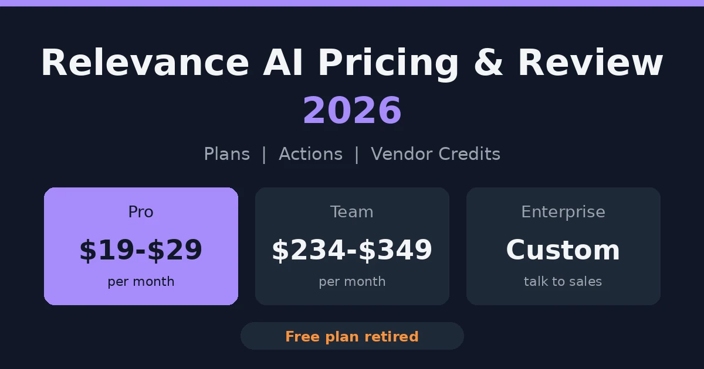
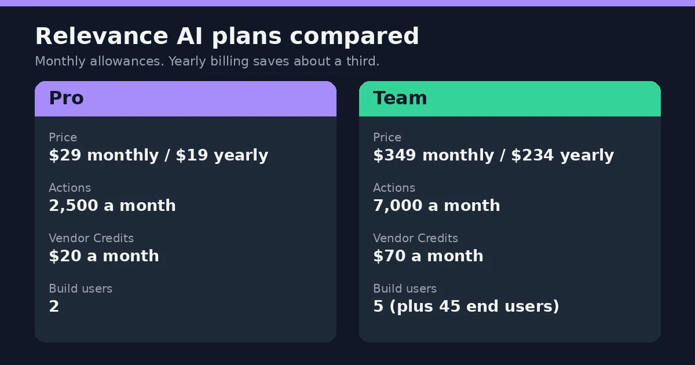
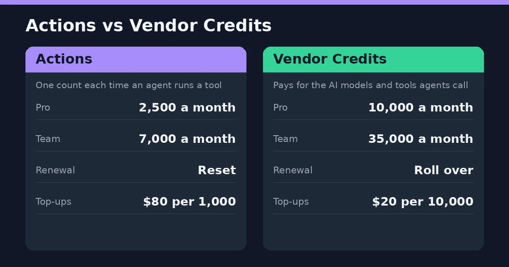
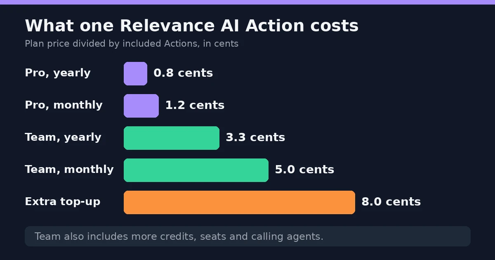

Relevance AI is a platform for building AI agents that do real work, like researching leads or sorting support tickets. For this Relevance AI pricing and review, the numbers first. Pro is $19 a month on yearly billing, or $29 month to month. Team is $234 yearly, $349 monthly. Enterprise is custom. The free plan is gone. It's a good builder. What you pay depends on how often your agents run.

Here's what trips people up. [The public pricing page](https://relevanceai.com/pricing) shows Enterprise and nothing else. Pro and Team prices sit in the docs. Hence the mess of conflicting numbers online.

So this page sorts it out. Plans, Actions, credits, and who actually gets value from it.

The prices come from [Relevance AI's own docs](https://relevanceai.com/docs/get-started/pricing), and they change fairly often. Check before you buy.

## What Is Relevance AI?

Think of it as a workshop for building AI helpers. You tell an agent what its job is, hand it a few tools, and let it run. A typical one might dig up details on a sales prospect before a call. Another might read incoming support tickets and decide who should see them.

Where it gets interesting is the Workforce feature. Instead of one agent doing everything, you chain several together. One finds the information, the next writes the email, a third handles the follow-up.

The company [began in Australia in 2020](https://techcrunch.com/2025/05/06/relevance-ai-raises-24m-series-b-to-help-anyone-build-teams-of-ai-agents/) and now has offices in Sydney and San Francisco. Sales and go-to-market teams are who it talks to most.

You can build simple agents without writing code, and there's even a tool called Invent that drafts one from a plain description. Anything fancier, though, usually needs someone who's comfortable with technical setups.

## Relevance AI Plans at a Glance

Three plans. The free one is gone, so you're paying for something either way.

| Plan | Monthly | Yearly (per month) | Actions per month | Vendor Credits per month | Build users |
|---|---|---|---|---|---|
| Pro | $29 | $19 | 2,500 | $20 | 2 |
| Team | $349 | $234 | 7,000 | $70 | 5 |
| Enterprise | Custom | Custom | Custom | Custom | Unlimited |

Pay yearly and you save about a third. Worth knowing: these prices live in the docs, not on the public pricing page. Double-check them inside your account before you commit.

### Pro Plan Price

$29 a month, or $19 on a yearly plan. It's built for one person building agents, someone in sales ops, say, or a developer testing ideas. You get 2,500 Actions and two build users, and you can plug in your own API keys to skip the credit charges. No calling or meeting agents, though, and no analytics dashboard.

### Team Plan Price

Here it's $349 a month, or $234 yearly. For that, 7,000 Actions, five people building and 45 more using what they build. Calling and meeting agents arrive at this level, plus the analytics dashboard and priority support. Unused credits roll over, which is handy. Basically the plan for a group that shares its agents.

### Enterprise Plan Pricing

No public number. You [talk to sales](https://relevanceai.com/book-a-demo). The deal covers custom Actions and credits, unlimited users, and the heavy security stuff: SSO, role-based access, audit logs. There's a dedicated account manager too. If your IT team has strong opinions about vendors, this is probably where you end up.

## Is Relevance AI Free?

Not anymore. It used to be. The old Free plan gave 200 Actions a month and a one-time pile of credits, and plenty of articles still describe it that way.

The docs now say the Free plan is retired. New signups can't get it, and existing accounts lost it too. Every organization needs a paid plan.

If your team was on Free, the account and your work are still there. You upgrade to Pro or Team to get back in.

So when a review says "start free and see," check the date on it. It's probably out of date. The cheapest way in today is Pro on yearly billing, at $19 a month.

## How Do Actions and Vendor Credits Work?

Relevance AI meters your usage two ways. Since September 2025 it's been Actions and Vendor Credits, where before there was a single credit pool.

An Action is counted each time an agent runs a tool. Send one email, that's an Action. Update a CRM record, another. Your plan includes a set number each month: 2,500 on Pro, 7,000 on Team.

Vendor Credits are the other meter. They pay for the AI models and tools your agents call, and Relevance AI says it passes those costs through at wholesale, with no markup. Pro includes 10,000 a month, worth $20. Team includes 35,000, worth $70.

Here's a trick worth knowing. Bring your own API keys from a provider like OpenAI or Anthropic, and the model costs go to your account instead. Credits barely get touched.

What happens to leftovers? Vendor Credits roll over for as long as you stay subscribed. Plan Actions don't. They reset at every renewal. If you buy extra Actions, though, those carry forward.

Which meter runs out first? Depends on the agent. Lots of small tool runs tend to drain Actions. Heavy model use drains credits. Watch both for the first month or so. If credit systems like this are new to you, our [ElevenLabs pricing and review](/reviews/elevenlabs-pricing-review/) shows how another AI platform handles credits.

## Relevance AI Cost Per Action (and Top-Ups)

Here's a number no one else bothers to work out. What does one Action cost?

Divide each plan's price by the Actions it includes. Pro comes to about a penny: 0.8 cents on yearly billing, 1.2 cents monthly. Team is pricier per Action, roughly 3.3 cents yearly and 5 cents monthly. Odd, right? Team is the bigger plan.

It's not a fair fight, though. Team also brings more credits, more seats and calling agents. You're paying for the bundle.

Now the top-ups. Extra Actions cost $80 per 1,000, or 8 cents each. That's seven to ten times what Pro's included Actions cost. So running out is expensive.

Here's where it gets interesting. On monthly billing, Pro at $29 plus four top-ups is $349 for 6,500 Actions. Team costs $349 for 7,000, plus $50 more in credits and extra seats. Team wins easily. On yearly billing it flips sooner, after about three top-ups.

Rule of thumb: if you're buying top-ups most months, you're on the wrong plan. Move up.

## Hidden Costs to Watch For

The plan price isn't the whole bill.

Top-ups come first. Run out of Actions and extra ones cost $80 per 1,000. That adds up fast on an always-on agent. Usage limits matter on other AI tools too, and our [Cursor AI pricing review](/reviews/cursor-ai-pricing-review/) shows how one of them handles it.

Then there's the second meter. Heavy model use drains Vendor Credits, and credits are a separate pool from Actions. Bring your own API keys and the model charges move to your OpenAI or Anthropic bill. Cheaper, maybe, but it's still money, and it shows up somewhere else.

Time is the cost people forget. Reviewers keep saying anything beyond a basic agent takes real setup, and some put it at weeks. Someone has to build it, test it and keep it running.

Sales teams hit one more snag. Competing vendors point out that Relevance AI doesn't come with prospect data, so lead lists and email tools can mean extra subscriptions.

## Relevance AI Review: Ease of Use and Learning Curve

Simple agents are easy. That's the consistent verdict. You build in a visual editor, pick tools, and there's a marketplace with 400-plus templates, so you rarely start from a blank page. One [G2 reviewer](https://www.g2.com/products/relevance-ai/reviews) called it really simple to work with, and a tool called Invent can draft an agent from a plain-English description.

Then things get harder. Branching logic, custom API connections and multi-agent setups need real technical know-how. One G2 reviewer liked being able to add custom Python code, which tells you something about the audience. Another said the onboarding was confusing at first, and it took a while to find where things were.

That's the catch with "no-code". It's true for the first agent. It's less true for the fifth.

So who's comfortable here? Someone in ops or sales ops who likes tinkering, or an engineer who wants a head start. Someone expecting a plug-and-play tool may find it frustrating.

## Relevance AI Integrations (Including HubSpot)

It connects to [more than 2,000 apps](https://relevanceai.com/docs/integrations/introduction), and you can add custom API connections if an app isn't listed. Every paid plan gets 1,000-plus app triggers, which start an agent when something happens elsewhere.

What about HubSpot? Reviewers list it among the standard CRM connections, alongside Google Sheets, Notion and Slack. One competitor warns that two-way syncing usually takes some setup, because you decide what data goes where.

Salesforce is different. Its triggers, along with Snowflake and Zendesk, are Enterprise-only.

So check your CRM before you pick a plan.

## What Users Like and Don't Like

G2 gives it 4.3 out of 5 from about 20 reviews. That's a small pool, but the same themes keep coming up.

### What People Tend to Praise

Flexibility, mostly. You can build the process you actually have, and some reviewers like that they can drop in their own Python code.

Templates get a mention too. With 400-plus to start from, nobody's staring at a blank screen.

Then there's control over costs. Bring your own API keys and model charges go through your own account. Handy if your company already pays OpenAI or Anthropic.

### What People Tend to Dislike

Price is the loudest complaint. One G2 reviewer called it very expensive, with most features locked in higher tiers.

Next, the learning curve. Onboarding confused a few people, and some found the interface busy.

And costs that creep. Agents that run all day can burn through Actions and credits faster than expected.

## Why Relevance AI Reviews Vary

Read a few reviews and they can sound like different products. In a way, they are.

The pricing changed in September 2025, when one credit pool became Actions and Vendor Credits. Anything written before that describes a different bill. Then the Free plan was retired. G2's own price box still shows $199 and $599 tiers, which no longer match the docs.

Users differ too. A sales ops person building a lead-research agent has a different week than an engineer wiring up custom code. Same tool, opposite verdicts.

So check the date on any review, and ask what the writer was actually building.

## Relevance AI vs n8n and Other Alternatives

Folks put these tools side by side all the time. They aren't built for the same job.

### Relevance AI vs n8n

[n8n](https://n8n.io) is a workflow builder. You chain the steps yourself, decide every condition, and you can run it on your own servers. Technical teams like that.

Relevance AI works the other way round. The agent decides what to do next, and you pay per Action. A process that never changes? n8n is probably the neater pick. A task where the agent has to think it through? Relevance AI.

### Relevance AI vs Lindy

[Lindy](https://www.lindy.ai/) goes after assistant-style jobs in sales, ops and support. Its own write-up says to prototype in Relevance AI and move stable workflows over to Lindy. Handy advice, but it's coming from Lindy.

### Other Alternatives Worth a Look

[Zapier](https://zapier.com/) is the quick one for plain app-to-app automations. SalesRobot does LinkedIn outreach, nothing to build. 11x sells a ready-made AI sales rep. Those last two are sold by the sites behind competing reviews, so go in skeptical.

## Relevance AI Login, Demo and Documentation

Logging in is simple. You sign in through the [Relevance AI app](https://app.relevanceai.com/), and the same screen handles new signups. Your plan, Actions and credits show in a counter at the bottom left, which is also where you upgrade or buy top-ups.

Want a demo? The Enterprise route goes through a [booking page](https://relevanceai.com/book-a-demo), and it's also how you get a real quote.

Stuck on something? The [docs](https://relevanceai.com/docs) are thorough, there's a community forum, and Team plans and above get priority support.

## Is Relevance AI Worth It?

Depends who you are.

It's worth it if you want to build your own agents and don't mind tinkering. A sales ops person, an ops lead, or an engineer who wants a head start will get the most out of it. Pro at $19 a month on yearly billing is a cheap way to find out, and the template library means you're not starting cold.

It's a harder sell if you want something plug-and-play. Anything past a basic agent takes real setup, and some reviewers say weeks. It also gets expensive if your agents run all day, because extra Actions cost $80 per 1,000.

Sales teams should check what they'd still need to buy. LinkedIn outreach and prospect data don't come built in. If video is part of your outreach, our [HeyGen pricing review](/reviews/heygen-pricing-review/) covers one option.

And with the free plan gone, you can't try it for nothing anymore. Start on Pro, track your Actions for a month, and only then think about Team. Weighing other AI tools too? Our [Sora AI pricing review](/reviews/sora-ai-pricing-review/) covers another one.

## The Bottom Line

The short version of this Relevance AI pricing and review: it's a solid agent builder, and the price depends on how hard you run it.

Pro at $19 a month on yearly billing is a cheap way to find out if it fits. Track your Actions for a month before you think about Team. And if you're buying top-ups most months, you're on the wrong plan. Our [homepage](/) has more AI tool coverage if you're building a wider stack.

Prices live in [the docs](https://relevanceai.com/docs/get-started/pricing), not on the pricing page, and they change. Check before you pay.

*This review is based on publicly available pricing information and independent user feedback as of October 2026. Pricing, plan limits and features are subject to change. Always confirm current details on Relevance AI's official documentation before subscribing.*

## Affiliate Disclosure

This article may contain affiliate links. If you sign up for Relevance AI or another product through a link on this page, we may earn a commission at no extra cost to you. This helps support the research and testing that goes into guides like this one. Our opinions and recommendations are based on independent research and, where possible, hands-on use of the platform — affiliate relationships don't influence which products we cover or how we rate them.