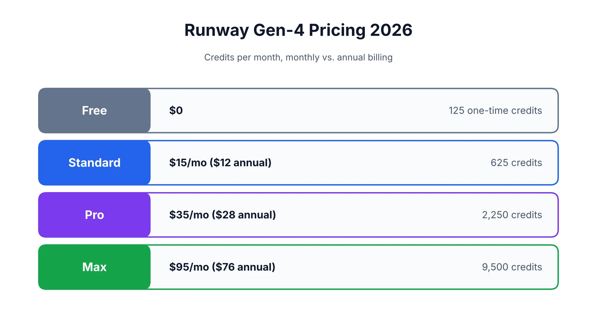
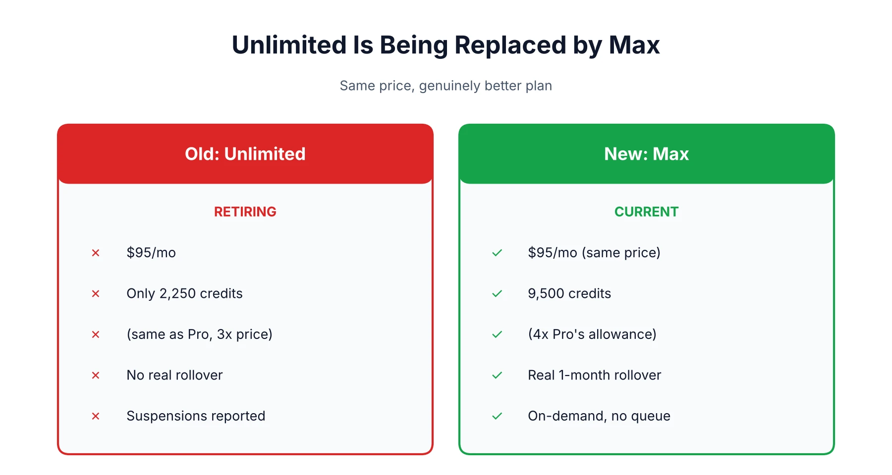
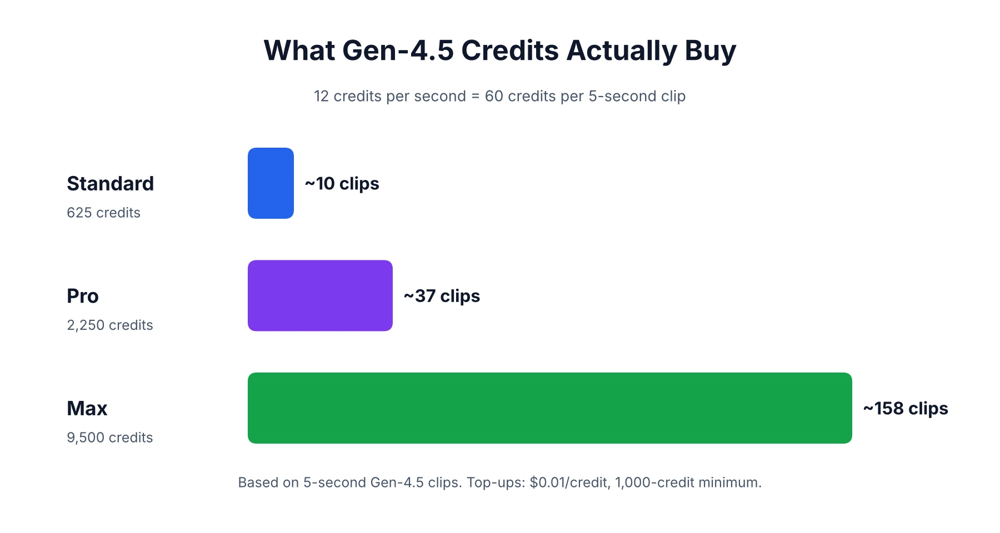

Runway's pricing page has changed meaningfully in 2026, and a lot of "Gen-4 pricing" content still online hasn't caught up — several sources still describe an Unlimited plan that Runway is actively retiring this month. This review covers the current, verified plan structure, including the transition from Unlimited to the new Max tier, exactly what Gen-4.5 costs per second of generated video, and an honest look at what reviewers — including some genuinely critical ones — actually think of the output quality. Getting this right matters more than usual right now, since anyone budgeting around an old Unlimited price point is about to see their actual plan change regardless of what an outdated article says. If you're deciding whether Runway is the right tool at all rather than just what it costs, our [Runway vs. Sora](/compare/runway-vs-sora/) comparison covers that decision separately, and our [homepage](/) has the rest of our AI tool coverage if you're evaluating a broader stack.

## What Is Runway Gen-4?

Runway is an AI video platform, and Gen-4 (now succeeded by Gen-4.5) is its flagship generation model, covering text-to-video, image-to-video, and character-consistent generation. For the full walkthrough of actually using the interface — generating, editing with Aleph, and Act-Two's performance capture — see our [how-to guide](/how-to/how-to-use-runway/) rather than repeating that ground here; this review focuses specifically on what it costs and whether it delivers.

## Runway Pricing Plans in 2026

Runway's current lineup, verified directly against [Runway's official pricing page](https://runwayml.com/pricing) and Help Center as of this writing:

| Plan | Monthly | Annual (per month) | Credits/mo | Rollover |
|---|---|---|---|---|
| Free | $0 | $0 | 125 (one-time) | — |
| Standard | $15 | $12 | 625 | No |
| Pro | $35 | $28 | 2,250 | No |
| Max | $95 | $76 | 9,500 | Yes, 1 month |
| Enterprise | Custom | Custom | Custom | Custom |

One detail worth flagging clearly: Runway's own pricing page presents the annual-billing figures ($12/$28/$76) as the primary listed prices, with monthly billing ($15/$35/$95) as the higher alternative — worth checking which framing you're actually looking at before assuming a lower number applies to month-to-month billing.

## The Unlimited-to-Max Transition, Explained

This is genuinely current news, not a stale carryover from an older article: Runway is retiring its Unlimited plan and replacing it with a new Max tier, with existing Unlimited subscribers scheduled to migrate automatically around September 1, 2026.

The reason this matters is that Unlimited was a genuinely confusing, poorly designed plan. Despite costing nearly 3x the price of Pro, it carried the exact same 2,250 monthly credit allowance — the only real addition was an "Explore Mode" offering unmetered generation at a relaxed, lower-priority rate. Users on [Reddit's r/runwayml](https://www.reddit.com/r/runwayml/) caught this discrepancy directly, and a number of reports describe accounts being suspended for "heavy use" specifically on a plan literally named Unlimited, with Runway citing script-like usage patterns even from users who said they weren't automating anything.

Max fixes the core problem: for the same $95/$76 price point, it offers 9,500 credits — roughly 4x Pro's allowance — plus genuine one-month credit rollover, though it drops the old Explore Mode's queued, relaxed-rate generation entirely in favor of on-demand generation with no queue and no cap on simultaneous jobs. If you're currently paying for Unlimited, the migration to Max is a straightforward upgrade in real terms, not a downgrade dressed up as a rename.

## How Much Does Runway Gen-4.5 Cost Per Second?

Gen-4.5 costs exactly 12 credits per second of generated video, which makes the actual cost math simple to work out on any plan. A 5-second clip runs 60 credits; a 10-second clip runs 120 credits. On the Standard plan's 625 monthly credits, that works out to roughly 10 full 5-second clips a month before you'd need to buy additional credits or upgrade. Pro's 2,250 credits stretch to around 37 five-second clips, and Max's 9,500 credits cover roughly 158.

If you run out mid-month, Runway sells top-up credits separately at a stated starting rate of $0.01 per credit, with a 1,000-credit minimum purchase — meaning a 5-second Gen-4.5 clip costs roughly $0.60 in purchased-credit terms, and a 10-second clip around $1.20, before accounting for any regional taxes.

That per-clip math is worth running against your own expected output before picking a plan, rather than guessing at which tier "feels" right. A solo creator producing a handful of short social clips a week will likely never touch Standard's 625-credit ceiling, while someone generating longer, multi-shot sequences for client work can burn through Pro's allowance faster than the sticker price suggests — the same credit-math gap that's shown up across nearly every AI tool with usage-based pricing we've reviewed, not something unique to Runway.

## Editing and Character Tools Draw Credits Too

It's worth noting that Gen-4.5 generation isn't the only thing pulling from your monthly credit pool. Aleph, Runway's video-to-video editing tool, and Act-Two, its character performance feature, both consume credits as well, typically at rates that scale with the length and complexity of the footage being processed rather than a flat per-use charge. Anyone budgeting a plan tier purely around Gen-4.5 generation costs without accounting for editing work later in the same project is likely to underestimate real monthly usage.

## Runway Gen-4 vs. Gen-2: What Actually Changed

Gen-2 was an earlier Runway model generation, focused on shorter clips with noticeably less consistency and physical realism than what's available now. Gen-4, and the current Gen-4.5 that succeeded it, represent a substantial jump — better prompt-following, more convincing physical motion, and meaningfully improved character consistency across a single clip, which was one of Gen-2's clearest weak points. If you're comparing the two directly because of an old bookmark or an outdated guide, the short version is that Gen-4-and-later is a different tier of capability entirely, not an incremental update.

## Is Runway Gen-4 Actually Good? What Reviewers Say

This is genuinely contested, and it's worth presenting honestly rather than picking a side. Curious Refuge, a filmmaking-focused review outlet that runs its own structured benchmark methodology, scored Gen-4 just 4.3 out of 10 overall in a detailed evaluation, with cinematic realism scoring particularly low at 3.3/10. Their specific criticisms are concrete rather than vague: hands frequently render as indistinct shapes rather than recognizable fingers, output quality noticeably degrades after roughly the first two seconds of a clip, the model shows an unwanted tendency toward slow-motion movement, and group or crowd scenes can collapse into indistinct blobs of color rather than distinguishable figures. Notably, even this critical review still recommended Runway as a platform overall, specifically citing tools like Aleph, Frames, and its background removal features as genuinely strong, separate from raw generation quality.

Other reviewers report a considerably more positive experience, particularly when using Gen-4.5 rather than the original Gen-4, and when working with simpler, well-directed shots rather than complex crowd or hand-heavy scenes. The honest takeaway: Runway's generation quality is real but inconsistent, performing noticeably better on some shot types than others, and a serious evaluation should test your own specific use case — a product close-up versus a crowd scene versus a hand-heavy action shot will all give you a very different impression of the same model.

## Correcting a Common Myth: Does Runway Generate Audio?

No — and this is worth stating plainly since at least one ranking page currently claims otherwise. Runway generates video only. There's no native dialogue, sound effect, or lip-sync audio generation built into the platform, despite a claim circulating that Gen-4 includes "generative audio and lip-sync in 29+ languages." If audio is part of your workflow, it has to come from a separate tool entirely — the same gap covered in more detail in our [Sora AI pricing review](/reviews/sora-ai-pricing-review/), since native audio was one of the few things Sora did that Runway still doesn't replicate.

## Runway Gen-4 vs. Veo 3: Quick Context

Since this comes up often enough to address directly: Runway and Google's Veo 3 aren't a simple better-or-worse pair, they're built with somewhat different priorities. Runway leans more heavily into its broader creative toolkit — Aleph for editing, Act-Two for character performance — while Veo integrates tightly with Google's existing ecosystem and tools. A full head-to-head deserves its own dedicated comparison rather than a few paragraphs inside a pricing review, but if cost is your main question here, Runway's plans are laid out in full above.

## Is Runway Gen-4 Worth the Price?

The honest answer depends heavily on which plan actually fits your output volume, and on being clear-eyed about the quality inconsistency covered above.

**It's a reasonable fit if:**
- Standard's roughly 10 clips a month covers genuinely occasional use without needing to upgrade
- Your work leans toward simpler, well-directed shots rather than crowd scenes or extreme hand close-ups
- You value Runway's broader editing toolkit (Aleph, Act-Two) as much as raw generation quality

**It's worth reconsidering if:**
- You were specifically eyeing the old Unlimited plan — Max now covers that need better at the same price
- Your work is hand-heavy, features crowds, or needs consistent quality past the first couple seconds of a clip
- You need any built-in audio or dialogue generation, which the platform doesn't offer natively

For a broader view of where Runway fits alongside other tools in a real content workflow, our [best AI tools for content creation](/best-tools/best-ai-tools-content-creation/) roundup covers the wider toolkit most creators actually end up using.

*This review reflects Runway's pricing and features as of August 2026. Pricing and plan structures are actively changing this month with the Unlimited-to-Max migration, so confirm current details directly with [Runway's Help Center](https://help.runwayml.com) before subscribing.*

## Affiliate Disclosure

This article may contain affiliate links. If you sign up for Runway or another product through a link on this page, we may earn a commission at no extra cost to you. This helps support the research and testing that goes into guides like this one. Our opinions and recommendations are based on independent research and, where possible, hands-on use of the platform — affiliate relationships don't influence which products we cover or how we rate them.