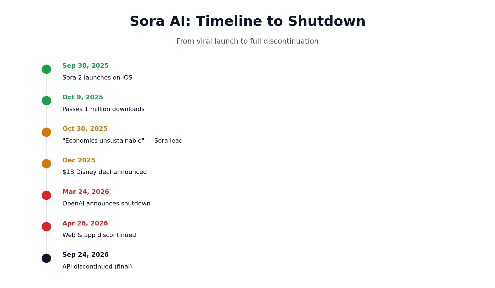
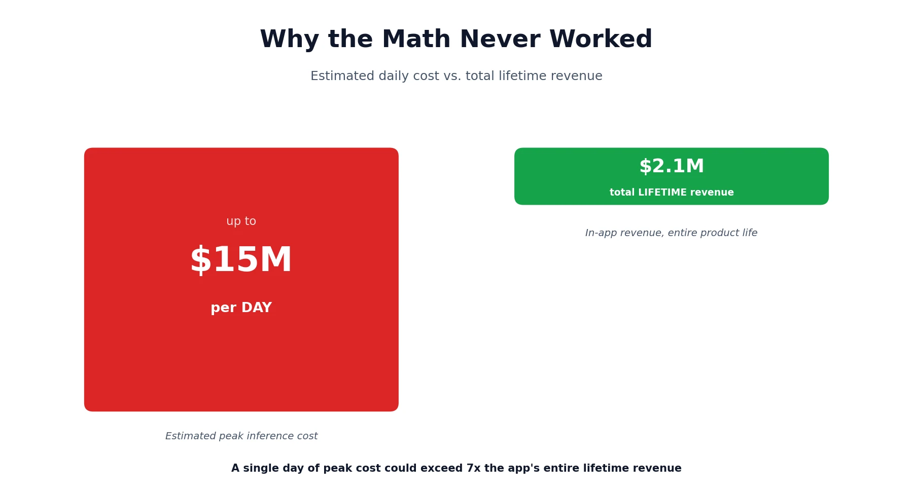
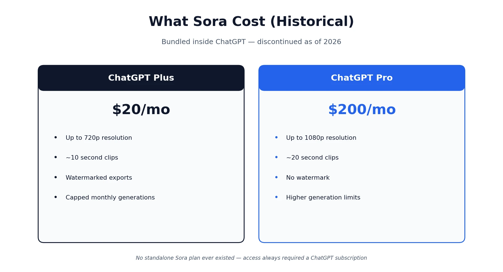

If you're searching for Sora AI pricing right now, here's the direct answer before anything else: **Sora is discontinued.** OpenAI shut down the web and app experiences on April 26, 2026, and the underlying API is scheduled to follow on September 24, 2026. A surprising number of pricing guides still online — some updated within the last few weeks — describe the OpenAI Sora cost structure as if it's a live product you can sign up for today. It isn't. This page covers what Sora actually cost while it was available, including its price per second and per-video generation cost, why OpenAI pulled the plug, and where to go instead if you landed here looking for a working AI video tool.

## Is Sora Still Available in 2026?

No — as of today, Sora's consumer app and web experience are already gone, and the API has three weeks left before it's gone too. OpenAI's own Help Center confirms a two-stage shutdown: the web and app experiences were discontinued on April 26, 2026, and the Sora API is scheduled to be discontinued on September 24, 2026. Once that second date passes, there will be no way to access Sora in any form, through any plan.

This matters more than it might seem, because a genuinely large share of the content still ranking for Sora pricing queries doesn't mention this at all — several pages published or updated *after* the April shutdown still walk through "current" pricing tiers as if nothing happened.

## Why Did OpenAI Shut Down Sora?

OpenAI shut down Sora primarily because it was losing an enormous amount of money relative to what it earned. Reporting from the Wall Street Journal put Sora's operating costs at around $1 million per day at its peak, with some independent analyst estimates running as high as $15 million per day once GPU time across all active users was factored in. Against that, the app generated only about $2.1 million in lifetime in-app purchase revenue — a gap that OpenAI's own Sora lead publicly acknowledged, calling the economics "completely unsustainable" just weeks after launch.

Cost wasn't the only factor. User engagement fell sharply — downloads dropped roughly 66% from their November 2025 peak by the time the shutdown was announced. At the same time, the company was redirecting compute and research focus toward coding tools, enterprise products, and a broader robotics push, with OpenAI's own product head, Fidji Simo, telling staff the company "cannot miss this moment because we are distracted by side quests." The decision also unraveled a $1 billion Disney investment announced in December 2025, built around a three-year licensing deal allowing Sora to generate videos featuring more than 200 Disney, Marvel, and Pixar characters — a deal signed just two months after Sora's own product lead had already called the app's economics unsustainable in public.

## What Did Sora Cost While It Was Live?

Sora was never sold as its own subscription — the OpenAI Sora cost was always bundled inside a ChatGPT plan, with two Sora Pro pricing tiers (Plus and Pro) offering meaningfully different capability.

| Plan | Price | Resolution | Clip Length | Watermark |
|---|---|---|---|---|
| ChatGPT Plus | $20/month | Up to 720p | Around 10 seconds | Yes |
| ChatGPT Pro | $200/month | Up to 1080p | Around 20 seconds | No |

The Plus tier came with a capped number of priority generations per month before falling back to a slower queue — commonly cited at around 50 priority videos per month, backed by a broader pool of roughly 1,000 monthly generation credits — while the Pro tier — the higher of the two Sora pro pricing tiers — offered substantially higher limits, faster processing, and the ability to run several generations concurrently, with around 10,000 monthly credits reported. A single high-resolution, full-length clip consumed a disproportionate share of that allowance compared to a short, low-resolution one, so the effective number of usable videos per month varied depending on which settings a subscriber leaned on. There was no free tier at any point, and no way to buy Sora access without an underlying ChatGPT subscription.

Pricing wasn't static over Sora's short life, either. In its earliest weeks, before the ChatGPT Plus/Pro structure settled in, OpenAI briefly let power users buy extra generations directly — $4 for roughly 10 additional videos beyond a 30-per-day free limit — a stopgap Bill Peebles introduced explicitly because, in his words, the economics were already "completely unsustainable" at the free usage levels OpenAI had originally set.

## How Much Did Sora 2 Cost Per Video?

So how much is Sora 2, broken down to the most granular level? Based on independent analyst estimates, generating a single 10-second Sora 2 clip cost OpenAI itself somewhere around $1.30 to $1.50 in raw compute, according to figures from Cantor Fitzgerald analyst Deepak Mathivanan that were echoed as reasonable by other industry analysts. That works out to an OpenAI Sora price per second of roughly $0.13 to $0.15 — a genuinely useful way to compare generative video cost against other AI video tools, since most competitors price per-second rather than per-clip. That estimate assumed roughly 40 minutes of total GPU time per generation, spread across multiple GPUs running in parallel, at a rental cost of just under $2 per hour per GPU.

For subscribers, the effective cost per video looked different depending on how much of their monthly allowance they actually used. A Pro subscriber generating only a handful of videos a month paid a very high effective price per clip once the $200 subscription was divided across low usage; someone maximizing their monthly generations brought that effective per-video cost down substantially. Either way, the underlying sora generative video cost was consistently far more expensive to produce than equivalent text output, since Sora had to process spatial and temporal data across dozens of frames per second rather than generating a linear sequence of words. That basic cost imbalance between video and text generation is a big part of why the economics never closed, regardless of how OpenAI structured pricing on the subscriber side.

## What Does Reddit Say About Sora AI Pricing?

Given how often "sora ai pricing reddit" comes up as its own search, it's worth answering honestly rather than assuming a single consensus. Discussion across communities like r/OpenAI and r/singularity split into two distinct phases. Early on, right after launch, the conversation centered almost entirely on availability — how to get an invite, whether Android users were being left behind, and how quickly the daily free-generation limit ran out. Later, once OpenAI introduced paid add-ons and then folded Sora into the ChatGPT Plus and Pro tiers, sentiment shifted toward frustration that a feature many assumed would eventually get its own affordable standalone plan instead required a full $20 or $200 ChatGPT subscription just to access. Once the shutdown was announced in March 2026, the tone shifted again — less about pricing complaints and more about users scrambling to export their existing videos and characters before the cutoff, and a fair amount of resigned commentary about the broader pattern of hyped AI products getting pulled once the underlying economics didn't hold up.

There's no official Sora pricing calculator that ever existed on OpenAI's side — a few third-party sites built rough estimators using the leaked credit-cost figures discussed above, but nothing OpenAI itself published or endorsed.

## What Happens to Sora Content and Accounts Now?

Existing Sora users can export their videos and images from the Sora library up until the relevant cutoff dates, following steps OpenAI has published on its Help Center. OpenAI has stated it hasn't yet decided whether it will offer a further export window after the official shutdown dates pass, and says it will notify users by email if one becomes available. Once all deadlines pass, any remaining user data will be permanently deleted, so anyone with content still sitting in Sora should not wait to download it.

## The Sora Shutdown Timeline

For anyone trying to piece together exactly what happened and when, here's the sequence based on verified reporting:

- **September 30, 2025** — The Sora 2 app launches on iOS, invite-only in the US and Canada, pulling in 56,000 downloads on day one.
- **October 3, 2025** — Sora reaches the #1 spot on the US App Store, ahead of Google Gemini and ChatGPT.
- **October 9, 2025** — The app passes 1 million downloads, a faster pace than ChatGPT's own early growth.
- **November 5, 2025** — Sora launches on Android, expanding to the US, Canada, Japan, and several other markets.
- **Winter 2025–2026** — Downloads and in-app spending decline sharply from their launch peak, with the app falling out of the App Store's top 100 by early 2026.
- **March 24, 2026** — OpenAI announces it's discontinuing Sora across the mobile app and API.
- **April 26, 2026** — The Sora web and app experiences are officially shut down.
- **June 2026** — A pro-rated refund window opens for eligible subscribers.
- **September 24, 2026** — The Sora API is scheduled to shut down permanently, ending the product entirely.

## Did OpenAI Offer Refunds to Sora Subscribers?

Yes, at least partially. OpenAI opened a pro-rated refund window starting in June 2026 for subscribers who felt they were paying specifically for Sora access rather than the broader ChatGPT subscription it was bundled into. Because Sora was never billed as a standalone product, the refund process worked through ChatGPT support channels rather than a dedicated Sora billing team, and eligibility depended on how a subscriber's usage and billing history looked. Reaction across creator communities — Reddit's r/SoraAi and various AI filmmaking Discord servers among them — was largely one of scrambling rather than relief, with a wave of posts asking how to migrate character setups and in-progress projects to other platforms before the final API cutoff.

## Best Sora Alternatives Now That It's Discontinued

If you're here because Sora no longer works for you, a few tools cover different pieces of what it used to do well. Unlike Sora's pricing plans, which were always bundled into a broader ChatGPT subscription, each of these tools sells video generation as its own dedicated product:

- **Runway Gen-4** — the strongest choice if you need multi-shot creative control or are producing ad-style content that requires consistency across cuts, an area where Sora was historically weaker. Plans start around $15/month.
- **Kling 2.0** — the best option if you need longer single-shot clips; it supports generations well beyond Sora's roughly 20-second cap, with paid plans starting around $10/month for a limited monthly credit pool.
- **Google Veo** — the most practical choice if your workflow already lives inside Google Workspace or you're producing content bound for YouTube, thanks to tighter platform integration. Access comes bundled into Google's AI subscription tiers rather than sold standalone.
- **Luma Dream Machine** — a solid pick for stylized or animated output rather than strict photorealism, with a usable free tier and paid plans starting around $10 a month.

None of these tools are a perfect one-to-one replacement for Sora, since each was built with different strengths in mind — the right pick depends on whether your priority is photorealism, clip length, creative control, or platform integration. Worth budgeting a bit of trial time with two or three of these rather than committing to one immediately, since none replicate Sora's exact combination of character consistency and prompt-following closely enough to assume a like-for-like swap.

## Lessons From Sora's Shutdown

Sora's rise and shutdown is a genuinely useful case study in AI video economics, not just a footnote. It reached the top of app store charts and racked up millions of downloads within weeks, proving there was real consumer appetite for the format. But strong initial demand didn't translate into revenue anywhere close to covering the compute cost of generating video at scale — a gap that's structurally harder to close for video than for text, given how much more expensive each generation is to produce.

The broader signal for the AI video space: a compelling demo and even genuine viral traction aren't the same as a sustainable product. Expect the tools that survive this next stretch to be the ones with either dramatically more efficient generation costs, a pricing model that actually covers compute at scale, or a clearer path to enterprise revenue rather than free-flowing consumer novelty use.

*This review reflects publicly available information as of August 2026, based on OpenAI's official Help Center and independently reported figures on Sora's operating costs and shutdown timeline. For the most current status, check [OpenAI's official Sora discontinuation notice](https://help.openai.com/en/articles/20001152-what-to-know-about-the-sora-discontinuation) directly. If you're comparing other AI video tools, our [HeyGen pricing review](/reviews/heygen-pricing-review/) and [HeyGen vs. Synthesia](/compare/heygen-vs-synthesia/) comparison cover a different corner of the AI video space still very much active. Browse more of our AI tool guides from the [homepage](/).*

## Affiliate Disclosure
 
This article may contain affiliate links. If you sign up for a product through a link on this page, we may earn a commission at no extra cost to you. This helps support the research and testing that goes into guides like this one. Our opinions and recommendations are based on independent research — affiliate relationships don't influence which products we cover or how we rate them.